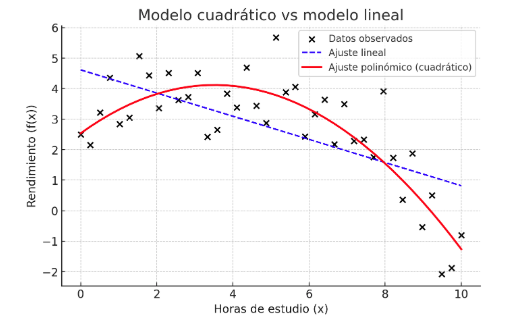
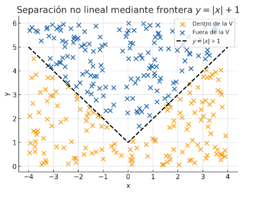

## Funciones como modelos matemáticos

Una **función** es una regla que asigna a cada valor de entrada un único valor de salida. En notación matemática, escribimos

$$
f: X \to Y,\qquad f(x)=y,
$$

Esta definición, aunque abstracta, se entiende mejor con ejemplos cotidianos. Pensemos en la **temperatura de una ciudad en función de la hora del día**. Cada hora corresponde a un valor concreto de temperatura: a las 8 de la mañana, 15 °C; a las 3 de la tarde, 27 °C. Otro ejemplo es el cálculo de la **nota media en función de las horas de estudio**: más horas invertidas suelen traducirse en una mayor calificación. En ambos casos, existe una relación consistente entre lo que entra en el modelo (tiempo, horas de estudio) y lo que sale (temperatura, nota).

En inteligencia artificial, esta idea se convierte en el núcleo de los algoritmos. Un **modelo de aprendizaje automático** puede entenderse siempre como una función que transforma entradas en salidas. Las entradas pueden ser muy variadas: una imagen representada como un conjunto de píxeles, un texto convertido en una secuencia de números o un vector de características que describe a un usuario. La salida, a su vez, puede ser una etiqueta (“gato” o “perro”), una predicción numérica (el precio de una vivienda) o una probabilidad (la confianza de que un correo sea spam).

Es importante entender algunos conceptos asociados a esta definición. Al conjunto $X$ se le denomina **dominio** (el conjunto de entradas para las que la función está definida) e $Y$ es el **codominio** (el conjunto de posibles salidas permitidas por la definición de la función). La **imagen** o **recorrido** de $f$ es el conjunto de salidas que realmente se obtienen al aplicar $f$ a todo su dominio:

$$
\mathrm{Im}(f)=\\{f(x):x\in X\\} \subseteq Y.
$$

Pensar con claridad en dominio, codominio e imagen evita ambigüedades. Si modelamos la **nota de un examen** en función de las **horas de estudio**, un dominio razonable sería $X=[0,\infty)$ (no hay horas negativas) y un codominio $Y=\mathbb{R}$ si permitimos cualquier número real como resultado. En la práctica, sabemos que las notas están acotadas, así que la imagen efectiva quedará en un intervalo, por ejemplo $[0,10]$, que es un subconjunto del codominio elegido. Esa diferencia entre “lo permitido por definición”, $Y$, y “lo que realmente ocurre”, $\mathrm{Im}(f)$, es útil al diseñar y analizar modelos.

En inteligencia artificial, esta misma estructura describe cualquier modelo. El **espacio de características** hace de dominio: si representamos cada ejemplo como un vector con $d$ atributos numéricos, solemos escribir $X\subseteq\mathbb{R}^d$. El codominio depende de la tarea.

En **regresión**, se toma típicamente $Y=\mathbb{R}$ y la imagen son valores reales (por ejemplo, precios). 

En **clasificación binaria**, podemos definir $Y=\\{0,1\\}$ y la función $f$ devuelve una etiqueta, o bien $Y=[0,1]$ si $f$ devuelve una **probabilidad**; en el caso multiclase, es común trabajar con $Y=\mathbb{R}^K$ antes de la capa *softmax* (logits) o con el **símplex de probabilidad**

$$
\Delta^{K-1}=\\{p\in\mathbb{R}^K:p_i\ge 0,\ \sum_{i=1}^K p_i=1\\}
$$

cuando la salida ya son probabilidades normalizadas.

Esta lectura como “máquina de transformar entradas en salidas” se visualiza con el **gráfico de la función**: cada punto $(x,f(x))$ muestra cómo una entrada concreta se convierte en una salida. En una dimensión, si el gráfico es una recta, la relación es lineal; si es curvilínea, la transformación es no lineal. En más dimensiones, la función define una **superficie** en la que cada punto del espacio de características tiene asociada una salida; en IA, esa superficie actúa como **frontera de decisión** o **paisaje de predicción** sobre la nube de datos.

Dominar estos conceptos básicos —dominio, codominio, imagen y representación gráfica— prepara el terreno para lo que viene a continuación: estudiar **cómo cambian** las funciones (derivadas), cómo **se ajustan** para acercarse a los datos (gradiente y optimización) y cómo **acumulan** información (integrales y expectativas). Esa es, en esencia, la ruta que conecta las funciones con el aprendizaje automático.

>**Para reflexionar...**
>
>**Si defines un clasificador con salida de probabilidad como $f:X\to[0,1]$, ¿qué ventajas te da declarar explícitamente ese codominio frente a decir solo $f:X\to\mathbb{R}$? ¿Cómo condiciona esa decisión el diseño de la función de pérdida y la interpretación de los resultados?**

## Funciones lineales y modelos simples

Una de las funciones más sencillas y al mismo tiempo más influyentes en la historia de las matemáticas aplicadas es la **función lineal**. Su expresión general es

$$
f(x) = mx + b,
$$

donde $m$ representa la pendiente y $b$ la ordenada en el origen. Esta fórmula, que en apariencia es elemental, encierra la idea de describir un fenómeno mediante una **recta**. La pendiente nos dice cómo cambia la salida cuando la entrada varía: un $m$ positivo implica que $f(x)$ crece con $x$, un $m$ negativo que decrece. El término $b$ fija el punto donde la recta corta al eje vertical, es decir, el valor de salida cuando la entrada es cero.

Desde un punto de vista geométrico, la función lineal establece una relación de proporcionalidad entre las variables. Es el primer modelo que nos permite **predecir**: si conocemos la pendiente y la ordenada en el origen, podemos anticipar la salida para cualquier entrada. Este carácter predictivo convierte a la recta en el prototipo de los modelos de inteligencia artificial más básicos.

Un ejemplo paradigmático es la **regresión lineal**. En este caso, la recta no se traza a mano, sino que se ajusta a un conjunto de datos observados. Imaginemos que recogemos información sobre el número de horas de estudio y las notas obtenidas en un examen. Al representar los puntos en el plano, vemos que siguen una tendencia creciente: a más horas, mejores notas. La regresión lineal busca la recta que mejor se aproxima a esa nube de puntos, de forma que podamos usarla como regla predictiva para nuevos casos.

Esta idea se traslada sin fricción a más dimensiones. Cuando cada ejemplo está descrito por varias características, escribimos

$$
\hat y=\mathbf{w}\cdot\mathbf{x}+b=\sum_{j=1}^{d}w_j,x_j+b,
$$

que ya no es una recta sino un **hiperplano** en $\mathbb{R}^d$. El vector $\mathbf{w}$ actúa como una brújula: señala la dirección de mayor aumento de la predicción, y su norma controla la sensibilidad del modelo a cambios en las entradas. Aquí, $\mathbf{x}$ es el vector de características de cada ejemplo, $\mathbf{w}$ es el vector de coeficientes y $b$ el término de sesgo. En cualquier caso, la idea sigue siendo la misma: combinar linealmente las entradas para obtener una salida.

### Limitaciones de lo lineal frente a lo real

Las rectas son transparentes, rápidas y sorprendentemente eficientes cuando la relación es aproximadamente proporcional o cuando la dimensionalidad es alta pero la estructura subyacente es simple. Sin embargo, su **expresividad** es limitada en algunos escenarios. Vamos tres limitaciones concretas.

**La primera grieta** aparece cuando la relación subyacente **se curva**. Piensa de nuevo en las horas de estudio y la nota: al principio, cada hora extra marca una diferencia notable; sin embargo, a partir de cierto punto, añadir más horas apenas mejora el resultado. Esa **saturación** es natural en muchos procesos (aprendizaje, rendimiento físico, respuesta biológica). Una recta no puede abrazar esa forma en “S” o en “techo”; forzará un compromiso: irá por el medio, acertará en promedio y fallará en los extremos. La salida práctica es **cambiar la mirada sobre las entradas** para devolver la linealidad “por dentro”: introducir curvatura mediante nuevas características. Si trabajamos con una sola variable, basta con ampliar el diseño a potencias o transformaciones suaves, por ejemplo

$$
\phi(x)=\big(x,\ x^2\big)\quad \text{o}\quad \phi(x)=\big(\log x,\ \sqrt{x}\big),
$$

de modo que el modelo siga siendo lineal en los parámetros, pero capaz de dibujar curvas en el plano. En la práctica, esta idea se generaliza con polinomios, splines o funciones base que permiten aproximar formas suaves sin abandonar la estructura lineal del entrenamiento.

> **Ejemplo:**
>
> Imagina que recoges pares “horas de estudio → nota” en un curso con calificación máxima 10. Para pocas horas, cada hora extra ayuda mucho; a partir de cierto umbral, añadir más horas apenas cambia la nota porque ya rozas el máximo. Si intentas explicar esta relación con una recta, te obligas a que “una hora más” siempre valga lo mismo, lo cual contradice la experiencia.
>
> Piensa en una tendencia idealizada como esta: para $h$ horas,
>
> * de $0$ a $4$ horas, la nota sube casi una unidad por hora;
> * entre $4$ y $8$ horas, la mejora por hora se reduce;
> * más allá de $8$ horas, la curva se aplana cerca de $10$.
>
> Una recta $f(h)=mh+b$ puede aproximar “el promedio” de esa curva, pero cometerá dos tipos de error: infravalorará a quien estudia poco (porque la curva real arranca más empinada) y sobrevalorará a quien estudia mucho (porque la curva real se aplana). Además, extrapolará notas imposibles $f(h)>10$ si $h$ crece lo suficiente, algo que el fenómeno real nunca hace.
>
> La solución no es abandonar el marco lineal, sino **enriquecer la representación** para que la linealidad viva “por dentro”. Con una sola variable puede bastar añadir curvatura al espacio de características. Por ejemplo, construir
> 
>$$
> \phi(h)=\big(1,\ h,\ h^2\big)
> $$
>
> y ajustar un modelo lineal en esas nuevas coordenadas:
>
> $$
> \hat y = w_0 + w_1h + w_2h^2,\qquad w_2<0.
> $$
>
> Tambien pueden usarse transformaciones con **funciones logarítmicas** que funcionan bien en estos casos
>
> La enseñanza es doble. Una recta es un excelente punto de partida por su claridad e interpretabilidad, pero cuando el fenómeno presenta **saturación** conviene cambiar de coordenadas (polinomios, transformaciones suaves) o usar una forma con techo natural. Así evitamos sesgos sistemáticos y mantenemos las predicciones dentro de rangos plausibles.
>

**El segundo límite** aparece cuando los efectos no son meramente **aditivos**, sino que **interactúan**. Un modelo lineal puro asume que cada característica suma su contribución de manera independiente: duplicar “horas de estudio” siempre suma lo mismo, sea cual sea la “calidad del material”, y aumentar “ingresos” tiene el mismo efecto prediciendo gasto, tengas “20” o “60” años. En muchos fenómenos reales, la influencia de una variable **depende del valor de otra**. Esa dependencia cruzada se captura introduciendo **términos de interacción** en el propio espacio de características. Si $\mathbf{x}=(x_1,x_2)$, añadimos una nueva columna $x_1x_2$ y ajustamos

$$
\hat y = w_1 x_1 + w_2 x_2 + w_{12}(x_1x_2) + b.
$$

Interpretativamente, $w_{12}$ mide cómo cambia el efecto de $x_1$ cuando varía $x_2$ (y viceversa). Con un único gesto —multiplicar columnas— el modelo lineal aprende efectos “si... entonces...” y sinergias que una suma simple nunca podría reflejar. Este mismo principio se extiende a más variables y a interacciones de orden superior cuando el fenómeno lo exige.

> **Ejemplo**
>
> Supón que queremos predecir la **nota** a partir de las **horas de estudio** y de si el alumno usa **material de calidad**. Definimos una variable $q$ que vale $0$ si el material es básico y $1$ si es de calidad.
>
>| Horas (h) | Calidad (q) | Nota |
>|-----------|-------------|------|
>| 1         | 0           | 4.5  |
>| 2         | 0           | 6.0  |
>| 3         | 0           | 7.0  |
>| 1         | 1           | 5.6  |
>| 2         | 1           | 7.9  |
>| 3         | 1           | 9.8  |
>
> Al dibujar los puntos, verás **dos rectas**, una para $q=0$ y otra para $q=1$. La clave es que **no son paralelas**: con material de calidad, **cada hora extra rinde más**. Eso es una **interacción**: el efecto de “horas” depende del valor de “calidad”.
>
> Un modelo lineal **sin** interacción,
>
> $$
> \hat y=b+w_1h+w_2q
> $$
>
> solo permite **desplazar** la recta de $q=0$ a $q=1$ (cambia la altura), pero **no** cambiar su **pendiente**. Intentará encajar ambas nubes con **paralelas**, y fallará sistemáticamente en uno de los dos grupos.
>
> Para capturar la interacción basta añadir el término producto:
>
> $$
> \hat y=b+w_1h+w_2q+w_3(h\cdot q).
> $$
>
> Ahora, si $q=0$, la pendiente es $w_1$; si $q=1$, la pendiente pasa a ser $w_1+w_3$. El modelo aprende que con material de calidad, **cada hora cuenta más** (pendiente mayor). Misma herramienta lineal, pero en un **espacio de características enriquecido**: hemos convertido un “no puedo” en un “sí, con interacción”.

**El tercer tropiezo** es geométrico: **la separación no lineal**. En clasificación, un modelo lineal dibuja un hiperplano que divide el espacio en dos mitades. Si los datos forman dos racimos alargados en direcciones opuestas, un hiperplano los separa con elegancia. Pero si los positivos rodean a los negativos en un **anillo concéntrico**, ninguna recta —ni ningún hiperplano— logrará trazar una frontera limpia. La salida, de nuevo, consiste en **re-describir el espacio** para que la frontera “curva” se haga lineal en coordenadas adecuadas. En dos dimensiones, basta añadir la variable radial $r^2=x_1^2+x_2^2$ y trabajar con $\phi(x)=(x_1,x_2,r^2)$: en este nuevo sistema, una superficie plana (lineal en $x_1,x_2,r^2$) puede cortar el anillo con precisión. Esta es la intuición que hay detrás de los **métodos de base** (crear características no lineales a mano), los **kernels** (crear productos internos no lineales sin construir explícitamente las nuevas variables) y las **redes neuronales** (encadenar escorados lineales con funciones de activación que curvan la frontera de decisión).

> **Ejemplo**
>
> Imagina un conjunto de puntos en el plano. Los que están **cerca del origen** (formando un pequeño círculo central) son de la clase A, y los que están **alrededor**, formando un **anillo** que rodea al centro, son de la clase B. Si dibujas una recta cualquiera, siempre cortará ambas regiones: es imposible dejar el centro a un lado y el anillo al otro con una frontera **lineal**. Esa es la limitación.
>
> La clave para resolverlo no es abandonar lo lineal, sino **cambiar de coordenadas**. En el plano $(x_1,x_2)$ introduce una nueva característica que capture la **distancia al origen**:
>
> $$
> r^2 = x_1^2 + x_2^2
> $$
> 
>
> Ahora describe cada punto con $\phi(x) = (x_1, x_2, r^2)$. En este espacio enriquecido, una regla **lineal** del tipo
>
> $$
> w_1 x_1 + w_2 x_2 + w_3 r^2 + b = 0
> $$
>
>  puede representar, en el plano original, una frontera **circular** (cuando el término en $r^2$ domina). Clasificar “por dentro vs. por fuera” se convierte en algo tan simple como **umbralizar** $r^2$: puntos con $r^2$ pequeño son A, con $r^2$ grande son B. La decisión vuelve a ser lineal, pero en las variables adecuadas.
>
> Esta es la idea que subyace a muchas técnicas: crear **características no lineales** que “desenreden” la geometría del problema (polinomios, funciones radiales), usar **kernels** para lograr ese efecto sin construir las variables explícitamente, o dejar que una **red neuronal** aprenda automáticamente esas transformaciones a través de capas con activaciones no lineales. En todos los casos, el objetivo es el mismo: encontrar un espacio donde una frontera lineal sea suficiente, aunque en las coordenadas originales la separación parezca imposible.

En las tres situaciones el hilo conductor es el mismo: lo lineal es un punto de partida claro, eficiente e interpretable. Cuando la realidad lo supera —porque se curva, porque mezcla efectos, o porque exige fronteras con forma— no abandonamos la disciplina, la **extendemos**. Cambiamos de coordenadas, enriquecemos el espacio de características o introducimos no linealidad en el propio modelo para que la “recta” vuelva a ser suficiente... pero ahora en el lugar correcto.

Hay dos caminos habituales para salvar estas barreras sin abandonar la claridad del marco lineal. Uno es el **ingeniería de características**, que consiste en crear transformaciones de las entradas (polinomios, logaritmos, productos cruzados) para que la relación vuelva a ser “lineal en los parámetros”. El otro es introducir **no linealidad** en el propio modelo, como se ve con el uso de términos cuadráticos, logaritmos o como hacen las funciones de activación en redes neuronales, en la que cada capa aplica una transformación lineal y, a continuación, una transformación no lineal que permite curvar la frontera de decisión y modelar patrones más ricos.

Pensar primero en rectas no es una limitación, es una **ventaja pedagógica y práctica**: da una referencia clara, ofrece una base geométrica sólida (hiperplanos, proyecciones, distancias) y conecta de forma directa con cómo se entrenan los modelos mediante gradiente. A partir de ahí, cuando lo lineal ya no alcanza, las extensiones no lineales resultan mucho más comprensibles.

>**Para reflexionar...**
>
>**¿Qué preferirías ante un conjunto de datos real: empezar con un modelo lineal bien interpretado y aumentar complejidad solo si es necesario, o saltar directamente a un modelo muy flexible? ¿Cómo influye esa elección en la explicabilidad, el riesgo de sobreajuste y el coste computacional?**

En cualquier caso, aunque la introducción de **funciones no lineales** (cuadráticas, exponenciales, logarítmicas o funciones de activación en redes neuronales) permite modelar fenómenos más realistas, la función lineal sigue siendo esencial: no solo como base histórica y conceptual, sino porque muchas técnicas más complejas se construyen sobre combinaciones lineales de entradas, enriquecidas después con transformaciones no lineales.

>**Para reflexionar...**
>
>**¿Por qué crees que la regresión lineal, siendo un modelo tan simple, sigue utilizándose hoy en día como herramienta fundamental en estadística y aprendizaje automático? ¿Qué aporta su simplicidad frente a modelos más sofisticados, y en qué momentos sus limitaciones se hacen evidentes?**

## Funciones no lineales en la modelización

Como se ha comentado, la realidad rara vez sigue una recta. Muchos fenómenos crecen rápido al principio y luego se frenan, otros se disparan a un ritmo que aumenta con el tiempo, y no pocos dependen del producto de varias variables más que de su suma. Para captar estas formas, entran en escena las **funciones no lineales**. Tres familias aparecen una y otra vez en modelización: exponenciales, logarítmicas y polinómicas. Cada una aporta una “curvatura” distinta y una forma de pensar diferente.

### El crecimiento exponencial: cuando el ritmo de cambio se acelera

La **función exponencial** (o su prima, la función potencial) es fundamental para describir procesos cuyo **ritmo de cambio** es directamente proporcional al valor que ya poseen. Esta relación se formaliza en expresiones como $g(t)=g_0 a^t$ (o $g(t)=g_0 e^{kt}$), donde el crecimiento es *multiplicativo*, no aditivo. Duplicar el tiempo $t$ no añade una cantidad fija; en su lugar, multiplica el resultado. Esta naturaleza multiplicativa explica por qué ciertos conteos de la era digital —como descargas virales, visualizaciones en una red social o usuarios activos— parecen "despegar" repentinamente: durante las primeras fases, la base es pequeña y el crecimiento es lento, pero a medida que el valor actual aumenta, el ritmo de cambio se acelera de forma dramática. La clave es que el incremento por unidad de tiempo también crece progresivamente, dando a la curva su característica forma de **curva de palo de *hockey*** que se dobla hacia arriba. Para identificar este tipo de comportamiento, una regla rápida es observar la gráfica: si, al representar los datos en su escala natural, la curva se dobla hacia arriba cada vez más rápido, sugiere una forma exponencial.

> **Ejemplo**:
> Imagina un modelo de IA que predice la adopción de una tecnología. Si el crecimiento fuera **lineal** (aditivo), se añadirían 100 usuarios cada día, sin importar cuántos haya ya. Si el crecimiento es **exponencial** (multiplicativo) con una tasa de $10\%$:
>
> * Día 1 (100 usuarios): el incremento es $10\% \cdot 100 = 10$ usuarios.
> * Día 10 (aprox. 236 usuarios): el incremento es $10\% \cdot 236 \approx 24$ usuarios.
> * Día 20 (aprox. 673 usuarios): el incremento es $10\% \cdot 673 \approx 67$ usuarios.
> El número de usuarios ganados cada día es cada vez mayor, demostrando que **la tasa de cambio crece con el valor**.

### Función logarítmica: rendimientos decrecientes

La **función logarítmica** es la compañera natural de la exponencial y nos ayuda a describir fenómenos donde los incrementos tienen **rendimientos decrecientes**. En una función como $h(x) = \log(x)$, el valor crece continuamente, pero cada paso aporta menos que el anterior: pasar de 1 a 10 supone un gran salto, pero pasar de 1000 a 1010 apenas cambia el resultado.

Esto refleja situaciones muy comunes en la realidad, donde lo que importa no es el cambio absoluto sino el **cambio proporcional**. Por ejemplo, duplicar las ventas de 1 000 € a 2 000 € tiene el mismo efecto relativo que pasar de 10 000 € a 20 000 €, aunque las cifras sean distintas.

#### Escala logarítmica: comprimir para ver mejor

Cuando los datos varían en órdenes de magnitud muy distintos, una **escala lineal** deja de ser útil: los valores grandes “aplastan” visualmente a los pequeños. En esos casos, usamos una **escala logarítmica**, que representa multiplicaciones como sumas y “comprime” los valores grandes, haciendo más fácil ver patrones.

Imagina que medimos el número de usuarios de distintas redes sociales, desde una aplicación local con 1.000 usuarios hasta una plataforma global con 1.000 millones. En una escala lineal, el primer valor ni siquiera se distinguiría: todos los puntos pequeños se agrupan cerca del cero. Pero si representamos los datos en **escala logarítmica**, cada salto de multiplicación (de mil a un millón, de un millón a mil millones) se convierte en una misma distancia.

En términos matemáticos, el logaritmo transforma relaciones **multiplicativas** en **aditivas**. Esto es especialmente útil en IA cuando tratamos con variables que crecen exponencialmente, como el tamaño de un dataset, el número de parámetros de un modelo o el coste de entrenamiento. Usar una escala logarítmica permite comparar y analizar el comportamiento de algoritmos en distintos órdenes de magnitud sin que los valores grandes dominen el gráfico.

Por ejemplo, una relación de este tipo:

$$
y = cx_1^{\alpha}x_2^{\beta}
$$

se transforma mediante logaritmos en:

$$
\log y = \log c + \alpha\log x_1 + \beta\log x_2
$$

De esta forma, una ecuación basada en productos pasa a expresarse con sumas, lo que permite usar métodos lineales para analizarla. Además, el coeficiente $\alpha$ se interpreta fácilmente: indica **cuánto cambia $\log y$ (o el porcentaje de cambio de $y$)** cuando $\log x_1$ cambia una unidad, es decir, cuando $x_1$ se multiplica por un factor constante.

> **Ejemplo**
>
> En una tarea de entrenamiento de redes neuronales, el **error** del modelo puede disminuir de 1.0 a 0.1 y luego a 0.01. En una escala lineal, los dos últimos cambios parecen pequeños, pero en realidad cada uno representa una mejora de **diez veces**. Si usamos una escala logarítmica en el eje vertical, cada reducción por un factor de 10 se ve como una misma distancia, revelando que la mejora es constante en términos relativos.

> **Para reflexionar…**
>
> **¿Por qué crees que los avances en IA suelen representarse en gráficos logarítmicos, tanto en rendimiento como en número de parámetros?**
> *Piensa cómo esta escala permite comparar progresos que se multiplican por miles sin perder legibilidad y cómo refleja mejor el ritmo exponencial del desarrollo tecnológico.*

#### El logaritmo en el tratamiento de probabilidades y errores

Hasta ahora hemos visto que la función logarítmica transforma crecimientos multiplicativos en sumas, y que comprime valores muy grandes haciendo más fácil su manejo. Esta propiedad cobra un significado especialmente útil cuando pasamos al terreno de la **Inteligencia Artificial**, donde muchas veces los modelos trabajan con **probabilidades**.

Las probabilidades son números comprendidos entre 0 y 1. Esto significa que, por definición, están **acotadas**: nunca pueden ser menores que 0 ni mayores que 1. Sin embargo, muchos modelos matemáticos —especialmente los lineales— funcionan mejor en espacios donde las variables pueden tomar cualquier valor real, positivo o negativo. Para salvar ese obstáculo se utiliza una transformación que traslada las probabilidades al eje real completo: la **función logit**.

$$
 \mathrm{logit}(p) = \log\left(\frac{p}{1 - p}\right)
$$

Esta función convierte probabilidades cercanas a 0 en valores negativos grandes, probabilidades cercanas a 1 en valores positivos grandes, y deja las probabilidades próximas a 0.5 cerca del 0. En otras palabras, el logit “desacota” la probabilidad y la transforma en una **escala simétrica** alrededor del cero.

Esta idea es clave en la **regresión logística**, un modelo clásico de clasificación binaria. Allí no se predice directamente una probabilidad, sino el logit de esa probabilidad, que sí puede ajustarse mediante una combinación lineal de variables. Luego, al aplicar la función inversa (la sigmoide), se recupera la probabilidad final. Gracias a este cambio de perspectiva, el modelo sigue siendo lineal en su interior, aunque trabaje con probabilidades no lineales en su salida.

La utilidad del logaritmo no termina ahí. En la práctica de la IA, las operaciones con probabilidades suelen implicar **productos de muchos términos pequeños**. Multiplicar números próximos a cero puede hacer que el resultado se vuelva tan pequeño que se pierda precisión numérica (lo que se conoce como *underflow*). El logaritmo resuelve este problema: al transformar productos en sumas, evita la acumulación de errores de redondeo y hace los cálculos más estables.

Un ejemplo claro aparece en la **función de log-verosimilitud**, que evalúa qué tan bien se ajusta un modelo a los datos observados. En lugar de multiplicar las probabilidades de cada observación (una operación que se vuelve rápidamente inmanejable), se suman sus logaritmos, lo que preserva la información y simplifica el cálculo.

Imagínate que tu modelo de *spam* calcula la probabilidad de que una secuencia de 100 palabras ocurra en un correo no deseado. La probabilidad conjunta $P_{total}$ es el producto de las probabilidades individuales $p_i$:

$$
P_{total} = p_1 \times p_2 \times p_3 \times \dots \times p_{100}
$$

Si cada probabilidad individual $p_i$ es, por ejemplo, $10^{-5}$ (una probabilidad de una en cien mil), al multiplicarlas 100 veces obtienes:

$$
P_{total} = (10^{-5})^{100} = 10^{-500}
$$

Aquí está la clave: el valor $10^{-500}$ es tan increíblemente pequeño que excede la capacidad de representación de la aritmética de punto flotante de la mayoría de los ordenadores (que solo pueden manejar números hasta aproximadamente $10^{-308}$). El ordenador no es capaz de almacenar $10^{-500}$ y, en su lugar, lo redondea al **cero absoluto**. Este fenómeno se llama **_underflow_** y, cuando ocurre, **pierdes toda la información** de tu cálculo. El modelo no puede diferenciar entre una verosimilitud muy baja y una verosimilitud prácticamente nula.

El logaritmo resuelve mágicamente este problema gracias a una de sus propiedades más útiles:

$$
\log(a \cdot b) = \log(a) + \log(b)
$$

En lugar de calcular el producto inestable, calculamos el **logaritmo de la probabilidad total** (la log-verosimilitud):

$$
\log(P_{total}) = \log(p_1 \times p_2 \times \dots \times p_{100})
$$

Aplicando la propiedad logarítmica, la secuencia de multiplicaciones inestables se convierte en una simple **suma estable**:

$$
\log(P_{total}) = \log(p_1) + \log(p_2) + \dots + \log(p_{100})
$$

Volviendo al ejemplo numérico, si tomas el logaritmo de $10^{-5}$ (que es $-5$), y sumas este valor 100 veces:

$$
\log(P_{total}) = \sum_{i=1}^{100} \log(10^{-5}) = \sum_{i=1}^{100} (-5) = -500
$$

El resultado es el valor **$-500$**, un número perfectamente manejable y estable. Al transformar los productos en sumas, el logaritmo no solo evita el _underflow_ y la pérdida de información, sino que también **simplifica la complejidad computacional**, lo que es esencial para optimizar modelos a gran escala. Una vez calculado este valor, para obtener la probabilidad real de vuelta, solo tienes que aplicar la **función matemática inversa** del logaritmo, que es la **exponenciación**. Es importante tener en cuenta que el valor final, $10^{-500}$, sigue siendo un número increíblemente pequeño y **aún excede la capacidad de representación del ordenador**, por lo que seguirá siendo redondeado a cero si intentas almacenarlo. Sin embargo, el objetivo principal del *logaritmo* **nunca fue obtener un $P_{total}$ almacenable**, sino **garantizar que el proceso de optimización intermedio fuera preciso**. Al trabajar con el valor estable de **$-500$** durante, por ejemplo, el entrenamiento de un modelo, el sistema puede comparar y ajustar los pesos con precisión. Solo aplicas la exponenciación al final si necesitas reportar el valor de la probabilidad en el formato tradicional, pero para la optimización interna, trabajarás siempre con el valor logarítmico.

> **Para reflexionar...**
> 
> **Si el logaritmo transforma productos en sumas para ganar estabilidad, ¿qué problema numérico similar al _underflow_ ayuda a mitigar la suma logarítmica en el extremo opuesto del espectro (con números muy grandes) y por qué es igualmente importante en el *Deep Learning*?**
> *Considera el fenómeno del _overflow_ (cuando un número es demasiado grande para ser representado) y cómo el logaritmo ayuda a mantener la escala de los resultados dentro de un rango manejable.*

### Funciones polinómicas: curvatura e interacciones en los modelos

Las **funciones polinómicas** son una de las herramientas más simples y potentes para introducir **curvatura** en una relación entre variables. Frente a las funciones lineales, que solo pueden representar rectas, las polinómicas permiten describir comportamientos más realistas: curvas con máximos, mínimos, o trayectorias que se doblan suavemente.

Podemos imaginar una situación cotidiana. Supón que medimos el rendimiento académico de un estudiante en función de las horas de estudio. Al principio, cada hora adicional produce una mejora notable; sin embargo, llega un punto en el que el cansancio hace que el rendimiento crezca cada vez menos e incluso decaiga. Este tipo de comportamiento no puede representarse con una recta, pero sí con una **parábola**, es decir, con una función de segundo grado:

$$
f(x) = w_0 + w_1 x + w_2 x^2,
$$

donde el signo del coeficiente $w_2$ controla la forma de la curva. Si $w_2 < 0$, la función tiene una concavidad hacia abajo, y describe bien un proceso con **rendimientos decrecientes**.

Lo interesante es que, aunque la gráfica sea curva, el modelo sigue siendo **lineal en sus parámetros** ($w_0$, $w_1$, $w_2$). Esto significa que las técnicas lineales de estimación (como los mínimos cuadrados) siguen aplicándose sin dificultad. Es un detalle crucial, porque permite extender los modelos lineales sin abandonar su simplicidad matemática.

En problemas con varias variables, los términos polinómicos permiten capturar **interacciones** entre características. Si añadimos un término como $x_1x_2$, estamos diciendo que el efecto de una variable depende del nivel de otra. Por ejemplo, en un modelo que predice la probabilidad de compra, el impacto de la “publicidad” puede depender del “nivel de ingresos”: no basta con sumar ambos efectos por separado, hay que considerar cómo se potencian entre sí.

Esta combinación —una estructura algebraica lineal “por dentro” pero con forma curva “por fuera”— constituye una de las claves de la modelización moderna. Permite representar relaciones no lineales de manera sencilla, sin renunciar a los métodos de ajuste y análisis del álgebra lineal.

> **Para reflexionar…**
> **Si un modelo lineal es tan fácil de ajustar, pero a menudo demasiado rígido, ¿por qué no hacerlo más flexible añadiendo términos polinómicos?**
> *Piensa cómo al introducir curvatura o interacciones aumentamos la capacidad del modelo para adaptarse a los datos, pero también el riesgo de sobreajustar —de explicar demasiado bien lo que ya hemos visto, y no tan bien lo nuevo.*

### Transformaciones de funciones: ver el problema desde otro ángulo

Una de las ideas más poderosas —y menos intuitivas al principio— en el trabajo con datos es que **no siempre es el modelo lo que debe cambiar, sino el modo en que representamos los datos**. Las funciones no lineales como el logaritmo o la exponenciación no sirven solo para evitar problemas numéricos (como el *underflow*) o para describir fenómenos de crecimiento acelerado: son, sobre todo, **herramientas para transformar la perspectiva del problema**.

En esencia, transformar una variable significa **buscar un sistema de coordenadas donde la relación entre las variables sea más simple**. No se trata de “forzar” al modelo, sino de **darle una geometría más adecuada**, una en la que una recta o una separación lineal basten para capturar el patrón subyacente. Cuando se acierta con la transformación, el aprendizaje posterior se vuelve más fácil, más rápido y más estable.

#### Reducción de asimetrías y valores extremos

En la práctica, muchas variables del mundo real presentan distribuciones muy asimétricas. Pensemos, por ejemplo, en los ingresos mensuales de una población: la mayoría gana cifras cercanas al promedio, pero unos pocos individuos tienen valores extremadamente altos. Si representamos estos datos tal cual, esos pocos valores “tirarán” del modelo, haciendo que se ajuste más a ellos que al resto.

Una solución común es aplicar la transformación logarítmica $\log(x+1)$, que **comprime la escala** de los valores grandes y **reduce la influencia de los valores extremos**. En lugar de tratar los cambios absolutos, el modelo pasa a concentrarse en los cambios relativos. Así, un incremento del 10% tiene el mismo peso, tanto para un valor pequeño como para uno grande. Esta simple transformación puede convertir una relación altamente curvada en una línea casi recta.

#### Estandarización y equilibrio de escalas

Otra transformación esencial en IA es la **estandarización**, que convierte cualquier variable en una versión centrada y escalada según su media y desviación típica:

$$
z = \frac{x - \mu}{\sigma}
$$

De este modo, todas las variables comparten la misma escala y contribuyen de manera equilibrada al proceso de aprendizaje. Esto es especialmente importante en algoritmos basados en gradientes, donde una variable con valores mucho más grandes que las demás puede dominar el ajuste y dificultar la convergencia. La estandarización garantiza que **todas las características “avancen” al mismo ritmo** durante el entrenamiento.

> **Ejemplo:**
> Imagina que quieres predecir el **gasto mensual en datos móviles** ($y$) a partir del **número de vídeos vistos** ($x$). Si representas los datos en una escala lineal, verás que los usuarios intensivos —que ven cientos de vídeos— distorsionan la relación: el modelo tiende a sobreajustarse a ellos y pierde precisión en el resto.
>
> Sin embargo, si transformas las variables y trabajas con $(\log x, \log y)$, la nube de puntos se alinea casi perfectamente. De pronto, la relación se vuelve lineal: cada aumento del 10 % en el número de vídeos implica, aproximadamente, un aumento del 10 % en el gasto. Has pasado de un patrón irregular a uno predecible sin cambiar de modelo: **la misma recta ahora explica mucho más, porque la ves desde las coordenadas adecuadas**.
>

#### Transformar antes de modelar

Elegir una buena transformación es, en realidad, una forma de **preprocesamiento inteligente**. Al comprimir, centrar o escalar los datos, ayudas al modelo a “ver” estructuras más limpias. Esto puede ser suficiente para usar un modelo lineal simple, o bien preparar el terreno para introducir **no linealidades** más adelante (por ejemplo, mediante funciones de activación en una red neuronal). En ambos casos, la transformación actúa como un puente entre los datos brutos y la forma matemática que el modelo necesita para aprender con eficacia.

> **Para reflexionar…**
>
> **Cuando una relación parece “explosiva” o caótica en escala lineal, ¿por qué representarla en escala logarítmica suele revelar una estructura más simple y estable? ¿Qué te dice eso sobre la naturaleza del fenómeno?**
>
> *Piensa en cómo muchas relaciones reales —crecimiento poblacional, propagación de información o rendimiento acumulado— son multiplicativas por naturaleza. El logaritmo convierte esos procesos en aditivos, lo que permite analizarlos con herramientas lineales más sencillas y comprensibles.*

## Funciones de activación: dar flexibilidad a los modelos

### Funciones definidas por tramos: la primera ruptura de la linealidad

Hasta ahora hemos trabajado con funciones **lineales**, como $f(x) = 2x + 1$, que tienen una pendiente constante. Esto significa que su comportamiento es siempre el mismo: si aumentas $x$ en una unidad, la función crece exactamente 2 unidades, sin importar en qué punto estés.

Las funciones lineales son predecibles, elegantes y fáciles de manejar, pero también muy limitadas. En la vida real, casi nada responde con la misma intensidad ante cualquier cambio: un sistema puede reaccionar fuerte al principio y luego estabilizarse, o bien no responder hasta superar cierto umbral.

Para capturar este tipo de comportamientos necesitamos **romper la linealidad**. Y la forma más sencilla de hacerlo no tiene porque ser con curvas complicadas, sino introduciendo **funciones definidas por tramos**, es decir, funciones que se comportan de una manera en una región del dominio y de otra distinta en otra.

Por ejemplo, consideremos la función

$$
f(x) =
 \begin{cases}
 x, & \text{si } x \ge 0 \\
 -x, & \text{si } x < 0
 \end{cases}
$$

A la izquierda del cero la pendiente es negativa, y a la derecha, positiva. Si la representamos gráficamente, vemos una especie de “V” abierta hacia arriba.

Esta función no es lineal, pero tampoco es complicada: está formada por dos **tramos lineales** unidos en un punto de cambio.

Esta idea de que una función puede comportarse de modo diferente según el tramo del eje en el que estemos es fundamental en el aprendizaje automático. En cierto sentido, es el primer paso hacia la **no linealidad controlada**, que es justo lo que las redes neuronales explotan para modelar patrones complejos.

Las funciones definidas por tramos aparecen en multitud de contextos reales. Por ejemplo, el **impuesto sobre la renta** se calcula con una tarifa que cambia por tramos: a partir de cierto nivel de ingreso, el porcentaje de impuestos aumenta. También un **sensor de luz** puede tener una salida que vale cero hasta que la iluminación supera un umbral, y luego empieza a crecer linealmente.

Matemáticamente, estas funciones representan un comportamiento que **cambia de régimen**. En IA, ese cambio de régimen permite distinguir entre zonas donde una característica tiene efecto y zonas donde no.

> **Para reflexionar…**
> **¿Por qué una función con tramos lineales puede considerarse no lineal? ¿Qué tipo de fenómenos crees que podrían describirse mejor con una función que cambia de comportamiento en distintos rangos del eje?**
> *Piensa en un músculo que solo se activa a partir de cierta tensión, o en un sensor que “despierta” cuando la señal supera un umbral. Esa discontinuidad en la respuesta es lo que una función definida por tramos puede modelar perfectamente.*

### Ejemplo: Problemas "separables" y "no separables" linealmente

Imagina que queremos diseñar un modelo que recomiende si un estudiante debe **asistir a clases de refuerzo en matemáticas**. Usamos dos características:

- $x$: número de horas de estudio semanal.
- $y$: nota media actual.

Los alumnos con **pocas horas de estudio y baja nota** forman un grupo (clase “sí, necesita refuerzo”), mientras que los que **estudian mucho y tienen buena nota** forman otro (clase “no necesita refuerzo”). Al representarlos en el plano $(x_1, x_2)$, los dos grupos aparecen a ambos lados de una **frontera lineal**: cuanto más estudia alguien y mejor nota obtiene, menos probable es que necesite ayuda extra.

Matemáticamente, una frontera del tipo

$$
y = -x
$$

separa perfectamente las dos regiones. El modelo puede resolver este problema con una **única regla lineal**, sin necesidad de transformaciones complejas.

Ahora cambiemos de contexto. Imagina el siguiente ejemplo donde las distintas observaciones se situan el plano tal y como vemos en la siguiente gráfica.

En este escenario es imposible separar ambos grupos con una sola recta. Ne cesitamos una funcion en forma de "V" que resuelva el problema. Eso lo podriamos conseguir con una funcion definida por tramos. En este caso seria

$$
f(x) =
 \begin{cases}
 x+1, & \text{si } x \ge 0 \\
 -x+1, & \text{si } x < 0
 \end{cases}
$$

En otras palabras, al **componer funciones lineales por tramos** conseguimos una **frontera no lineal**.
Y esa es precisamente la idea detrás de las **funciones de activación**: usar pequeñas piezas lineales separadas por puntos de quiebre para construir superficies complejas que los modelos lineales, por sí solos, no pueden trazar.

## Doblar el espacio: la geometría detrás de las funciones por tramos

Hasta ahora hemos visto las funciones de activación desde una perspectiva algebraica, como fórmulas o curvas. Pero hay una interpretación aún más intuitiva y poderosa: las funciones por tramos, como el valor absoluto, **doblan el espacio** en el que viven los datos.

Cuando un modelo es puramente lineal, toda transformación que aplica —por muchas capas que tenga— puede representarse como **una única matriz**. Es decir, el modelo solo puede **rotar, escalar o trasladar** los datos, pero nunca curvarlos ni separarlos si están entrelazados.
Geométricamente, esto significa que el modelo vive en un mundo **plano**, donde todo se mueve con reglas de proporcionalidad estricta.

Imagina que tienes una hoja de papel con los puntos azules y naranjas distribuidos de forma que ninguna línea recta pueda separarlos (como en el patrón "V"). Mientras el papel esté plano, no hay nada que hacer: ninguna recta podrá dividirlos correctamente. Pero si **doblas el papel**, puedes hacer que las regiones de distinto color queden en lados opuestos de la nueva superficie.

Eso es exactamente lo que hace una **función no lineal**: transforma el espacio de entrada para que una frontera que antes era imposible (por ejemplo, una línea recta) **se vuelva posible en el nuevo espacio transformado**.

Matemáticamente, cada activación introduce una **curvatura local**: La función $|x|$ dobla el plano como si lo cerrara por la mitad en el eje vertical.

> **Para reflexionar…**
> **¿Qué te dice este ejemplo sobre los límites de las líneas rectas como herramientas de clasificación?**
> *Piensa en cómo, con solo un par de “pliegues” o cambios de tramo, una función puede aprender a distinguir regiones que antes eran imposibles de separar. Las funciones de activación en redes neuronales hacen exactamente eso, solo que en espacios de muchas más dimensiones.*

### De las funciones por tramos a las funciones de activación

A lo largo de este recorrido hemos visto que las **funciones definidas por tramos** permiten resolver problemas que una función lineal no puede. En esencia, lo que hacen es **aplicar una regla distinta según la zona del dominio**, generando curvas o quiebros donde antes solo había rectas. Este simple gesto —cambiar de comportamiento según el valor de la entrada— es la base de lo que en aprendizaje automático llamamos **funciones de activación**.

En el fondo, una función de activación es una **versión suavizada o parametrizada** de esas funciones por tramos. Su objetivo no es otro que introducir **no linealidad controlada** en las redes neuronales, de forma que estas puedan modelar relaciones complejas. Sin activaciones, las capas lineales se “colapsarían” en una sola, y todo el modelo sería equivalente a una única transformación lineal.

#### La ReLU: simplicidad y efectividad

La **ReLU** (*Rectified Linear Unit*) es la heredera directa de la función $y = |x|$ que acabamos de estudiar, pero con una particularidad: solo deja pasar los valores positivos y “apaga” los negativos. Se define como:

$$
\mathrm{ReLU}(x) = \max(0, x)
$$

En otras palabras, la ReLU es una **función lineal por tramos** que vale cero en la mitad negativa y crece de forma lineal en la positiva. Este comportamiento convierte a la ReLU en una forma sencilla y muy eficiente de introducir no linealidad: conserva lo lineal donde importa y evita que los valores negativos influyan. Es como tener un “interruptor” matemático que decide cuándo una neurona se activa.

#### Funciones suavizadas: Sigmoide y Tangente hiperbólica

Existen otras funciones de activación que no quiebran de manera brusca, sino que **suavizan la transición** entre regiones. La más conocida es la **sigmoide**, definida como:

$$
\sigma(x) = \frac{1}{1 + e^{-x}}
$$

La sigmoide convierte cualquier número real en un valor entre 0 y 1, lo que la hace ideal para representar **probabilidades**. Su forma es una S suave: para valores grandes de $x$ se aproxima a 1, y para valores muy negativos, a 0.

Una variante muy usada es la **tangente hiperbólica**:

$$
\tanh(x) = \frac{e^{x} - e^{-x}}{e^{x} + e^{-x}}
$$

que tiene un rango entre -1 y 1, y mantiene una forma similar, aunque centrada en el origen. Estas funciones aportan una transición más gradual que la ReLU, evitando saltos bruscos y facilitando el aprendizaje cuando los datos requieren continuidad o simetría.

#### Una misma idea con distintos matices

Todas las funciones de activación comparten un principio común: **aplicar un comportamiento diferente en distintos tramos del dominio**. La funcion **ReLU** lo hace con un quiebre claro y simple. Por su parte la funcion **sigmoide** y la **tangente hiperbólica** lo logran con una curva suave y continua.

El resultado, en todos los casos, es el mismo: la posibilidad de doblar el espacio, generar fronteras curvas, y representar relaciones complejas de una forma que las funciones puramente lineales nunca alcanzarían.
