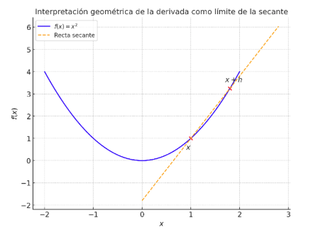
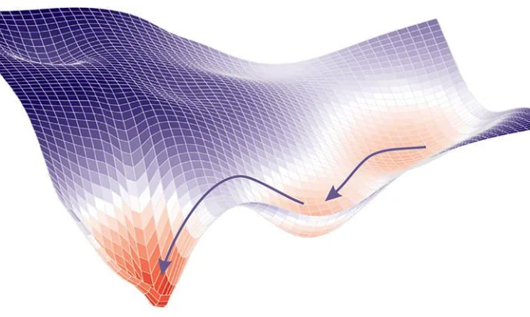

# Diferenciación de funciones. Concepto de gradiente

## La derivada como herramienta de cambio

La derivada es una de las ideas más potentes del cálculo porque pone números a algo que percibimos a simple vista: **cómo cambia una cantidad cuando varía otra**. Si una función relaciona una entrada $x$ con una salida $f(x)$, la derivada nos dice qué tan rápido se modifica $f(x)$ cuando damos un pequeño paso en $x$.

Cuando hablamos de cómo cambia algo, usamos palabras como “aumenta”, “disminuye” o “se mantiene constante”. En la vida diaria, eso basta. Pero en matemáticas necesitamos una manera **precisa** de describir ese cambio. La herramienta que permite hacerlo es la **derivada**, y su definición formal se basa en el concepto de **límite**.

Imaginemos una función $f(x)$, que asigna a cada número $x$ un valor $f(x)$. Si queremos saber **cómo cambia** $f(x)$ cuando $x$ varía un poco, podemos comparar dos valores de la función: el valor en $x$ y el valor en $x+h$, donde $h$ es una pequeña diferencia.

La variación de la función entre esos dos puntos es $f(x+h) - f(x)$, y el cambio correspondiente en $x$ es $h$. Si dividimos ambos, obtenemos la **tasa de variación media**:

$$
\frac{f(x+h) - f(x)}{h}
$$

Este cociente nos dice cuánto cambia la función por cada unidad que cambia $x$, pero solo de forma aproximada, ya que depende de un $h$ concreto.
Para conocer el cambio **instantáneo** en un punto —es decir, la pendiente exacta de la función en $x$— debemos observar qué ocurre **cuando $h$ se hace cada vez más pequeño**, acercándose a cero.

Ese es precisamente el papel del **límite**. La **derivada de $f$ en el punto $x$**, que se escribe $f'(x)$, se define como:

$$
f'(x) = \lim_{h \to 0} \frac{f(x+h) - f(x)}{h}
$$

Esta expresión resume la idea de cambio instantáneo: no nos interesa el salto entre dos puntos lejanos, sino la tendencia que sigue la función cuando la diferencia entre ellos es infinitesimal.

Geométricamente, este límite nos da la **pendiente de la recta tangente** a la curva de $f$ en el punto $(x, f(x))$. Si la derivada es positiva, la función sube; si es negativa, baja; y si vale cero, la función se aplana momentáneamente.

Un ejemplo sencillo es el de una recta $f(x)=2x+1$. Su pendiente es siempre $2$, y la derivada, en cualquier punto, es constante: $f'(x)=2$. En cambio, si tomamos una parábola como $f(x)=x^2$, la pendiente no es la misma en todas partes: en $x=1$ la curva sube con pendiente $2$, en $x=2$ sube con pendiente $4$, y en $x=-1$ baja con pendiente $-2$. La derivada $f'(x)=2x$ refleja exactamente esa variación.

Las **reglas de derivación** nos permiten calcular rápidamente estas pendientes locales sin tener que volver a la definición con límites. Algunas de las más básicas son:

- La derivada de una constante es $0$, porque no cambia nunca.
- La derivada de $x^n$ es $nx^{n-1}$, lo que nos da la regla general para potencias.
- La derivada de una suma es la suma de derivadas: $(f+g)'=f'+g'$.
- La derivada de un producto o un cociente tiene sus propias fórmulas, que veremos con calma más adelante.

Lo importante es comprender la idea de fondo: **derivar es medir la velocidad del cambio local**. Igual que en física la velocidad instantánea nos dice qué tan rápido se mueve un objeto en un momento preciso, la derivada de una función nos dice qué tan rápido sube o baja en un punto concreto.

Geométricamente, si ampliamos mucho la curva alrededor de un punto, esta se parece a una línea recta. Esa recta es la **tangente**, y su pendiente es el valor de la derivada en ese punto. En inteligencia artificial esta idea se vuelve crucial, porque los algoritmos de optimización necesitan saber hacia dónde “moverse” y con qué rapidez ajustar los parámetros. El gradiente, que veremos más adelante, no es otra cosa que la generalización de esta pendiente a funciones de varias variables.

> **Para reflexionar...**
>
> Cuando piensas en la derivada como una pendiente local, ¿cómo cambia tu forma de ver una función? ¿Qué significa, en términos de comportamiento de un modelo, que la pendiente sea muy grande en una zona concreta o que se anule en otra?

## La derivada como sensibilidad y herramienta de aprendizaje

La derivada, además de ser una herramienta que refleja como cambia una función, en el contexto de la inteligencia artificial es una forma de medir **sensibilidad**. Si tenemos una función $f(x)$, su derivada $f'(x)$ en un punto nos dice cuánto cambia la salida al variar ligeramente la entrada. En términos más cotidianos, es como comprobar cuánto afecta girar un poco un mando de volumen: ¿el sonido cambia mucho o apenas nada? Esa idea es la misma en los modelos de IA: la derivada nos indica cuánto se altera la predicción del modelo si modificamos un poco uno de sus parámetros. Una derivada grande implica que ese parámetro influye fuertemente en el resultado; una derivada pequeña, que apenas lo hace.

La derivada también actúa como **herramienta de ajuste**. De hecho es la base del concepto de  **optimización**, que en matemáticas viene a significar habitualmente **encontrar los valores máximos o mínimos de una función**

En este contexto, la derivada actúa como una especie de guía. Al observar el signo de la derivada podemos saber hacia qué lado movernos para que el valor de la función disminuya. Si la derivada es positiva, significa que la función está creciendo, por lo que conviene moverse en la dirección contraria. Si la derivada es negativa, la función está decreciendo, y moverse en esa dirección nos acerca al mínimo.

El proceso de **optimizar** una función puede imaginarse como el de una pequeña bola que rueda por una colina. En cada punto, la inclinación del terreno (la derivada) le indica hacia dónde moverse. La bola seguirá desplazándose mientras haya pendiente, hasta detenerse en el punto más bajo, donde la derivada se hace cero. Ese punto de equilibrio corresponde al **mínimo de la función**.

Por tanto, la derivada no solo describe el cambio, sino que **nos orienta para encontrar los puntos de equilibrio de una función**, donde ya no hay variación. Más adelante, cuando estudiemos cómo aprenden los modelos de inteligencia artificial, veremos que esos procesos de entrenamiento se basan exactamente en esta misma idea: **ajustar valores para reducir un error**, descendiendo poco a poco por una función, guiados en todo momento por el valor de su derivada.

> **Para reflexionar...**
> ¿Por qué crees que la derivada tiene que hacerse cero en un punto máximo o mínimo?
> Visualízalo: solo cuando la pendiente de la curva desaparece, la función deja de cambiar. Ese punto de “reposo” es el lugar donde la función alcanza su mejor valor posible

## La regla de la cadena: cómo derivar funciones compuestas

En muchas situaciones, una cantidad no depende directamente de una sola variable, sino de otra que, a su vez, depende de una tercera. Dicho de otro modo: las funciones pueden estar **encadenadas**. La **regla de la cadena** nos permite calcular cómo cambia una función cuando sus variables están relacionadas de esta manera.

Imaginemos que tenemos dos funciones, una dentro de otra:

$$
y = f(u) \quad \text{y} \quad u = g(x)
$$

Si sustituimos la segunda en la primera, obtenemos una función compuesta:

$$
y = f(g(x))
$$

En este caso, $y$ depende de $u$, y $u$ depende de $x$. Si queremos saber **cómo varía $y$ cuando cambia $x$**, debemos tener en cuenta ambas relaciones al mismo tiempo. Aquí es donde entra en juego la regla de la cadena, que establece que:

$$
\frac{dy}{dx} = \frac{dy}{du} \cdot \frac{du}{dx}
$$

Es decir, el cambio total de $y$ respecto a $x$ se obtiene **multiplicando el cambio de $y$ respecto a $u$** por el **cambio de $u$ respecto a $x$**.

Esta regla refleja una idea sencilla: si $y$ cambia cuando cambia $u$, y $u$ cambia cuando cambia $x$, entonces el cambio de $y$ con respecto a $x$ es el resultado acumulado de ambos efectos.

>
> **Ejemplo:**
> Supongamos que la temperatura $T$ depende de la altitud $h$ (a mayor altitud, menor temperatura), y que la altitud depende de la distancia $x$ recorrida en una montaña (al avanzar, subimos). Si queremos saber **cómo cambia la temperatura con respecto a la distancia recorrida**, debemos combinar ambos efectos: el cambio de temperatura con la altitud, y el cambio de altitud con la distancia.
>
> La regla de la cadena nos da precisamente esa combinación. Matemáticamente sería:
>
> $$
> \frac{dT}{dx} = \frac{dT}{dh} \cdot \frac{dh}{dx}
> $$
>
> Así, si sabemos que la temperatura desciende $6.5$ grados por cada kilómetro de altitud ($dT/dh = -6.5$) y que la altitud aumenta $0.3$ km por cada kilómetro horizontal ($dh/dx = 0.3$), entonces:
>
> $$
> \frac{dT}{dx} = (-6.5) \times 0.3 = -1.95
> $$
>
> Esto significa que la temperatura disminuye $1.95$ grados por cada kilómetro que avanzamos.
>

#### Interpretación geométrica

Desde un punto de vista gráfico, la regla de la cadena puede verse como **una composición de pendientes**. Cada derivada mide una inclinación local: la primera ($du/dx$) indica la pendiente de una función intermedia, y la segunda ($dy/du$) mide la pendiente de la función exterior. Su producto nos da la pendiente combinada, o dicho de otra forma, **la inclinación final resultante del encadenamiento de ambas funciones**.

> **Para reflexionar...**
> ¿Por qué tiene sentido que las pendientes se multipliquen y no se sumen?
> Piensa que el cambio de $y$ con respecto a $x$ se produce “a través” de $u$. Cada pequeño cambio en $x$ se amplifica o atenúa según cómo $u$ reaccione, y luego según cómo $y$ responde al cambio en $u$. El efecto total es el resultado encadenado de ambos.

## Derivadas parciales y gradiente

Hasta ahora hemos considerado funciones de una sola variable, pero en la práctica de la inteligencia artificial la mayoría de los problemas son **multivariables**. Un modelo depende de muchos parámetros, y la función de error que queremos minimizar (la que mide la diferencia entre predicciones y datos reales) depende de todos ellos a la vez.

En este contexto hablamos de **derivadas parciales**. Para una función de dos variables $f(x,y)$, la derivada parcial respecto a $x$ se escribe $\tfrac{\partial f}{\partial x}$ y nos dice cómo cambia $f$ si variamos $x$ manteniendo fijo $y$. De forma análoga, $\tfrac{\partial f}{\partial y}$ mide el cambio al variar $y$ manteniendo fijo $x$. La idea se extiende a tantas variables como necesitemos: cada derivada parcial captura la **sensibilidad local** de la función a un solo parámetro, con los demás congelados.

Al reunir todas esas derivadas parciales en un único objeto obtenemos el **gradiente**:

$$
\nabla f(x_1,x_2,\dots,x_n)=
\left( \frac{\partial f}{\partial x_1},\frac{\partial f}{\partial x_2},\dots,\frac{\partial f}{\partial x_n} \right).
$$

El gradiente no es un número, sino un vector, y tiene una interpretación geométrica muy clara: **apunta en la dirección en la que la función crece más rápidamente.** Dicho de otro modo, si en el espacio de variables das un paso en la dirección del gradiente, $f$ aumentará lo máximo posible; si avanzas en la dirección contraria, $f$ disminuirá lo más rápido posible.

Esta idea tiene una aplicación directa en el aprendizaje automático. Cuando un modelo “aprende”, lo que realmente está haciendo es **ajustar poco a poco sus parámetros** para que el error entre sus predicciones y los datos reales sea cada vez menor. Para lograrlo, el modelo utiliza un método llamado **descenso de gradiente**. El gradiente no es más que una extensión del concepto de derivada cuando la función depende de muchas variables. Indica **en qué dirección la función crece más rápido**, igual que una pendiente nos dice hacia dónde sube una montaña.

El truco consiste en hacer lo contrario: **movernos en la dirección contraria al gradiente**, es decir, “cuesta abajo”, hacia donde la función disminuye. En este caso, la función que queremos hacer bajar es la **función de error**, que mide qué tan mal está funcionando el modelo.

Cada vez que el modelo da un paso en esa dirección, los parámetros se ajustan un poco y el error se reduce. Si repite este proceso muchas veces, va descendiendo suavemente por la superficie del error, igual que una bola que rueda por una colina hasta detenerse en el punto más bajo posible. Ese punto representa el momento en que el modelo ha aprendido lo mejor que puede a partir de los datos. En la siguiente gráfica puedes ver de modo intuitivo como funciona el descenso del gradiente

> **Para reflexionar...**
>
> ¿Por qué crees que en lugar de buscar directamente el mínimo, los algoritmos de aprendizaje se conforman con seguir paso a paso la dirección opuesta al gradiente? ¿Qué ventajas tiene moverse con esta brújula local en problemas con miles o millones de parámetros?

