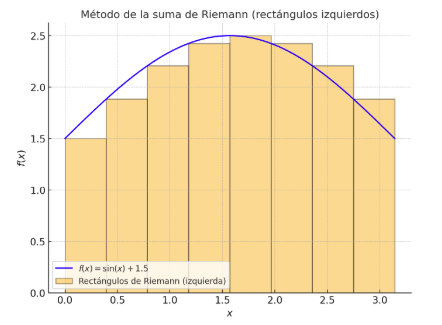

# Cálculo integral y acumulación de información

## La conexión esencial: El teorema fundamental del Cálculo

Si la derivada mide el cambio puntual, la integral hace lo contrario: mide la **acumulación**. Una forma sencilla de verlo es pensar en la integral como una **suma continua**. Si tenemos una función $f(x)$, su integral entre $a$ y $b$ representa la suma de todos los valores de $f(x)$ en ese intervalo, multiplicados por incrementos diminutos de $x$. En términos geométricos, la integral es el **área bajo la curva** de $f(x)$ entre dos puntos.

Un ejemplo cotidiano es la relación entre velocidad y distancia. La velocidad varía a cada instante, pero si integramos la velocidad a lo largo del tiempo, obtenemos la distancia total recorrida. Así, la integral convierte una información local (qué tan rápido va un objeto en cada momento) en una información acumulada (cuánto camino ha recorrido en total).

Más allá que intuitivamente diferenciación e integración se presenten como operaciones inversas —una midiendo la velocidad instantánea de cambio y la otra la acumulación total—, la formalización de esta profunda dualidad recae en el **Teorema Fundamental del Cálculo (TFC)**. Este teorema es, sin duda, la pieza central del análisis matemático y actúa como el puente teórico que justifica por qué el cálculo del **gradiente** (derivada en múltiples dimensiones) es una herramienta efectiva para minimizar el **error acumulado** (integral) en el aprendizaje automático.

El TFC se descompone habitualmente en dos partes que demuestran la íntima relación entre los conceptos de tasa de cambio y área acumulada. La **Primera Parte del TFC** establece la conexión conceptual. Postula que si se define una función de área $A(x)$ como la integral de una función $f(t)$ desde un punto fijo $a$ hasta $x$, el ritmo al que crece esa área acumulada es, precisamente, la función original. En otras palabras, la derivada de la integral indefinida de una función nos devuelve la función en sí:

$$
\frac{d}{dx} \left[ \int_a^x f(t)\,dt \right] = f(x)
$$

Esta formulación verifica que la derivación "deshace" la integración, estableciendo una relación inversa directa.

Por su parte, la **Segunda Parte del TFC** proporciona la herramienta computacional más importante para la práctica. Nos permite calcular la integral definida —el valor exacto de la acumulación entre dos puntos $a$ y $b$— a través de la **antiderivada** o primitiva $F(x)$, una función cuya derivada es $f(x)$. En lugar de recurrir al tedioso límite de las sumas de Riemann para calcular el área, simplemente evaluamos la primitiva en los límites de integración y restamos los resultados:

$$
\int_a^b f(x)\,dx = F(b) - F(a)
$$

En el contexto de la inteligencia artificial, esta dualidad es fundamental. La **función de pérdida** o de error de un modelo, que intentamos minimizar, representa el error **acumulado** (o sumado, que es la versión discreta de la integral) sobre el conjunto de datos. El algoritmo de **Descenso de Gradiente** requiere la derivada parcial de esa función de pérdida. El TFC garantiza la coherencia de este proceso: el ajuste local de los parámetros que viene determinado por el gradiente (tasa de cambio instantáneo) se convierte en un mecanismo riguroso para la optimización del error total (acumulación).

> **Ejemplo**:
> Considere un sensor que mide la tasa de consumo de energía eléctrica $P(t)$ de un centro de datos a lo largo del tiempo $t$. Queremos conocer la energía total $E$ consumida entre la hora $t_1$ y $t_2$. Aunque $P(t)$ varía continuamente, el TFC nos permite encontrar una función primitiva $F(t)$, donde $F'(t) = P(t)$, para calcular el total de forma precisa: $E = \int_{t_1}^{t_2} P(t)\,dt = F(t_2) - F(t_1)$.

## Integración numérica: Estrategias de aproximación en el cálculo

El cálculo integral, en su forma analítica, busca la solución exacta de la acumulación de una función mediante el hallazgo de su antiderivada. No obstante, en la mayoría de las aplicaciones prácticas de la ciencia y la ingeniería, incluyendo las matemáticas avanzadas, las funciones que se deben integrar son tan intrincadas o residen en espacios con tantas variables que hacen imposible o extremadamente costosa la solución mediante fórmulas cerradas. Este escenario nos obliga a recurrir a los **métodos de integración numérica**, un conjunto de técnicas diseñadas para obtener una aproximación suficientemente precisa del valor de la integral con un coste computacional manejable.

### Cuadratura numérica y la limitación determinista

Los métodos más tradicionales y fundamentales para la integración numérica se denominan **cuadraturas**. Son métodos de naturaleza **determinista**, lo que significa que la precisión de la aproximación está directamente vinculada al número de puntos o divisiones utilizadas, y el error puede ser acotado y predicho.

La idea central de la cuadratura es reemplazar el cálculo del área exacta bajo la curva de la función $f(x)$ por la suma de las áreas de formas geométricas sencillas que se ajustan a la curva en el intervalo $[a, b]$. Esta idea es la base del método más tradicional: la **Suma de Riemann**. 

El procedimiento para calcular una Suma de Riemann es directo y se basa en una aproximación geométrica que sigue el siguiente algoritmo:

1.  **Partición del Intervalo:** Se divide el intervalo $[a, b]$ en $N$ subintervalos más pequeños, no necesariamente de igual tamaño, aunque para simplificar el proceso, habitualmente se elige una partición uniforme, donde cada subintervalo tiene un ancho $\Delta x = \frac{b-a}{N}$.
2.  **Selección del Punto de Muestra:** Dentro de cada subintervalo, se elige un punto de muestra arbitrario, denotado como $x_i^*$. Este punto es crucial, ya que es el que determina la altura del rectángulo de aproximación. Si se elige el extremo izquierdo, se tiene la suma izquierda; si es el derecho, la suma derecha; y si es el punto medio, la suma media.
3.  **Cálculo del Área del Rectángulo:** Para cada subintervalo $i$, se construye un rectángulo cuya altura es el valor de la función en el punto de muestra, $f(x_i^*)$, y cuya base es el ancho del subintervalo, $\Delta x$. El área de este rectángulo es $A_i = f(x_i^*) \cdot \Delta x$.
4.  **Cálculo de la Suma:** Finalmente, la Suma de Riemann $S_N$ se obtiene al sumar las áreas de todos los $N$ rectángulos formados:

$$
S_N = \sum_{i=1}^N f(x_i^*) \Delta x
$$

Esta suma $S_N$ proporciona una estimación del área total bajo la curva.

La genialidad de las Sumas de Riemann radica en que proporcionan la definición formal de la integral. La aproximación del área solo se vuelve **exacta** cuando el número de subintervalos $N$ tiende al infinito, lo que a su vez provoca que el ancho de cada subintervalo $\Delta x$ tienda a cero. La integral definida $\int_a^b f(x)\,dx$ se define rigurosamente como el límite de la Suma de Riemann:

$$
\int_a^b f(x)\,dx = \lim_{N \to \infty} \sum_{i=1}^N f(x_i^*) \Delta x
$$

Esta definición subraya que la integral no es más que la acumulación de la función a lo largo de un intervalo, donde los incrementos en la variable independiente ($\Delta x$) son infinitesimalmente pequeños (convirtiéndose en el $dx$ de la notación integral).

En el contexto de los métodos numéricos, los métodos de cuadratura clásicos, como la Regla del Trapecio, son esencialmente **mejoras** a la Suma de Riemann. En lugar de usar la altura de un solo punto de muestra para crear un rectángulo (un polinomio de grado cero), usan los extremos del subintervalo para crear un trapecio (un polinomio de grado uno) o parábolas (grado dos), logrando una aproximación mucho más precisa con el mismo número de particiones.

> **Ejemplo**:
> Considere la función $f(x) = x^2$ en el intervalo $[0, 2]$. Si utilizamos una Suma de Riemann simple con solo $N=4$ rectángulos de ancho $\Delta x = 0.5$ y elegimos el extremo derecho como punto de muestra $x_i^*$, la suma sería: $S_4 = 0.5 \cdot [f(0.5) + f(1.0) + f(1.5) + f(2.0)] = 0.5 \cdot [0.25 + 1.0 + 2.25 + 4.0] = 3.75$. Este valor es una primera aproximación al área real (que es $\frac{8}{3} \approx 2.667$).

> **Para reflexionar...**
>
> **Las Sumas de Riemann demuestran que la integral es la suma de infinitos rectángulos de ancho cero. ¿Qué dificultad práctica intrínseca presenta la necesidad de que $N$ tienda a infinito para alcanzar la exactitud en una simulación o un cálculo numérico?**
> *Reflexiona sobre cómo esta necesidad de infinitud en el proceso es precisamente lo que hace que la integración analítica sea insustituible a nivel teórico, y cómo los métodos de Monte Carlo atacan esta barrera de forma completamente diferente a la simple suma de rectángulos.*

Sin embargo, estos métodos deterministas se encuentran con un severo problema al aumentar el número de variables de la función, un fenómeno conocido como la **maldición de la dimensionalidad**. Si para alcanzar una precisión adecuada en una función unidimensional necesitamos $N$ evaluaciones, para una función de $d$ variables necesitaríamos $N^d$ puntos, pues se requeriría crear una cuadrícula uniforme en todo el espacio. El coste crece de manera exponencial, volviendo inútil el método para problemas con más de unas pocas dimensiones.

> **Ejemplo**:
> Imagine que queremos calcular el volumen de una piscina de forma irregular. Si usamos la Regla del Trapecio en una sola dimensión (la profundidad a lo largo de un segmento), podríamos dividir el segmento en 100 puntos. Si la piscina tiene una forma tridimensional (largo, ancho y profundidad), y queremos usar 100 puntos de evaluación por cada dimensión para crear una cuadrícula, necesitaríamos $100 \times 100 \times 100 = 1.000.000$ de puntos. Para espacios de diez dimensiones, el número de puntos es inabordable.

### Integración estocástica: El poder del muestreo Monte Carlo

Entiendo perfectamente. El concepto de la **Integración Estocástica** o **Monte Carlo** es potente, pero el salto de la cuadratura determinista a la estadística probabilística puede ser abstracto. Simplificaremos la explicación, manteniendo la precisión matemática, y usaremos la analogía de un experimento de la vida real para hacerlo más accesible.

## La Solución Estocástica: El Principio de Monte Carlo

Cuando el espacio de una función se vuelve excesivamente grande (la temida alta dimensionalidad), los métodos de cuadratura, que exigen evaluar la función en una cuadrícula de puntos que crece exponencialmente, se vuelven inútiles. La solución, por sorprendente que parezca, no está en más puntos, sino en usar la **aleatoriedad** de manera inteligente. Esto es el núcleo de la **Integración Estocástica**, liderada por los **Métodos de Monte Carlo (MC)**.

El método de Monte Carlo rompe con la necesidad de examinar cada rincón del espacio y, en su lugar, utiliza el **muestreo aleatorio** para obtener una estimación. La integral, que representa la acumulación o el valor promedio de una función sobre un vasto dominio, se estima lanzando "dardos" al azar en ese dominio y midiendo el promedio de los resultados obtenidos.

### La Ley de los Grandes Números como base matemática

La confianza que depositamos en este método no es mágica, sino que está sustentada por la **Ley de los Grandes Números**. Esta ley fundamental de la estadística nos asegura que si repetimos un experimento aleatorio un número suficientemente grande de veces, el promedio de los resultados observados converge al valor esperado teórico de ese experimento.

Trasladado a la integración, si la integral que queremos calcular puede interpretarse como el **valor esperado** $\mathbb{E}[g(X)]$ de una función $g(x)$, el método de Monte Carlo nos permite aproximarlo a través de un promedio simple:

$$
\mathbb{E}[g(X)] \approx \frac{1}{N} \sum_{i=1}^N g(x_i)
$$
Aquí, $\{x_i\}$ son las **muestras aleatorias** extraídas del dominio de integración, y $N$ es el número total de muestras. La integral se transforma de un complejo problema de suma continua en un simple problema de promedio.

La gran ventaja de este enfoque, y por lo que es la piedra angular de la IA en alta dimensionalidad, es que la **precisión de la estimación solo depende del número de muestras ($N$) y no del número de dimensiones ($d$)** del espacio. No importa si la función tiene $100$ o $100.000$ variables; si duplicamos el número de muestras $N$, el error se reduce de manera predecible, independientemente de la complejidad geométrica del espacio.

> **Ejemplo**:
> Imagina que queremos estimar el peso promedio de la fruta recolectada en una vasta plantación de forma irregular. Un método de cuadratura requeriría pesar la fruta en cada metro cuadrado de la plantación (un esfuerzo gigantesco). Un método Monte Carlo, en cambio, consistiría en tomar una muestra aleatoria de **$N$** árboles distribuidos al azar por toda la plantación y calcular el peso promedio de esa muestra. Si tomamos suficientes muestras ($N$ grande), el promedio de nuestra muestra se acercará mucho al promedio real de toda la plantación, sin necesidad de medir cada árbol.

La gran ventaja de este método, y la razón por la que es indispensable en la ciencia computacional moderna, es que su **tasa de convergencia** es independiente del número de dimensiones del problema. El error de la estimación solo se reduce con la raíz cuadrada del número de muestras utilizadas, siguiendo un orden de $\mathcal{O}(1/\sqrt{N})$, independientemente de si la función tiene una o mil variables. Es decir, aunque la convergencia es lenta, al menos no se deteriora exponencialmente al aumentar la dimensionalidad, lo cual garantiza que la estimación sea factible incluso en problemas de enorme complejidad.

> **Ejemplo**:
> El problema clásico para ilustrar Monte Carlo es la estimación del valor de $\pi$. Se dibuja un círculo inscrito dentro de un cuadrado. Si se lanzan dardos al azar sobre el cuadrado de manera uniforme y se cuenta la proporción de dardos que caen dentro del círculo ($N_{círculo}$) respecto al total de dardos ($N_{total}$), esta proporción se aproxima al cociente entre las áreas (área del círculo/área del cuadrado). Multiplicando esta proporción por 4 (la relación del área del cuadrado unitario) se obtiene una estimación de $\pi$. La precisión de $\pi$ mejora, aunque lentamente, solo al aumentar el número de dardos lanzados, y no importa si el "cuadrado" está en un plano 2D o en un hiperespacio de 10D.

> **Para reflexionar...**
>
> **La integración numérica tradicional necesita más puntos si el espacio es más grande (más dimensiones). Monte Carlo solo necesita más muestras si queremos más precisión. ¿Por qué el "ruido" o la varianza inherente al muestreo aleatorio no termina por arruinar la convergencia al valor real?**
> *Reflexiona sobre la naturaleza de la Ley de los Grandes Números y cómo el proceso de promediar las muestras aleatorias hace que los errores individuales se compensen y se cancelen entre sí, permitiendo que el valor promedio se estabilice.*
