# Distribuciones de probabilidad

## Concepto de variable aleatoria y función de probabilidad

El estudio de la **probabilidad** es la piedra angular para el desarrollo y la interpretación de los modelos de **Inteligencia Artificial**. Para poder manejar la incertidumbre y predecir resultados, necesitamos introducir el concepto de **variable aleatoria**. Una variable aleatoria es, simplemente, una función que asigna un valor numérico a cada posible resultado de un experimento o proceso aleatorio. En lugar de trabajar directamente con los resultados cualitativos del azar, convertimos esos resultados en números que el ordenador puede procesar.

Las variables aleatorias se clasifican principalmente en dos tipos:

Por un lado podemos encontrar **variables aleatorias discretas**. Pueden tomar un conjunto finito o contable de valores. Piensa en el número de veces que un modelo de clasificación acierta en una muestra de 100 datos; el resultado solo puede ser un número entero entre 0 y 100. Por otro lado, podemos trabajar con **variables aleatoria continuas**. Estas variables pueden tomar cualquier valor dentro de un rango o intervalo. Este sería el caso, por ejemplo, de la temperatura de un servidor o el tiempo que tarda un algoritmo en converger.

La forma en que describimos la probabilidad de que una variable aleatoria tome un valor específico o caiga en un rango particular es a través de la **función de probabilidad**.

Para una variable aleatoria discreta, utilizamos la **función de masa de probabilidad** ($P(X=x)$). Esta función nos da la probabilidad exacta de que la variable $X$ tome el valor $x$. La suma de todas las probabilidades posibles debe ser siempre igual a 1.

Para una variable aleatoria continua, el concepto cambia ligeramente. Dado que hay infinitos valores posibles en un intervalo, la probabilidad de que tome un valor exacto es cero. En su lugar, utilizamos la **función de densidad de probabilidad** ($f(x)$). Esta función nos permite calcular la probabilidad de que la variable caiga dentro de un rango específico, lo cual se logra integrando la función a lo largo de ese intervalo. Es importante notar que la integral de la función de densidad sobre todo su rango posible debe ser igual a 1.

> Puede ser complicado entender el el hecho de que la probabilidad de que una variable continua tome un valor exacto es cero, pero piensa lo siguiente: 
>
> Supón que eliges un número al azar en el intervalo $[0,1]$. La probabilidad de elegir exactamente $0.5$ sería como preguntar:
>  *“¿Qué probabilidad hay de acertar un número real con infinitas cifras decimales?”* Como hay infinitos números posibles y cada intervalo (por mínimo que sea) ya contiene infinitos valores, no se puede asignar probabilidad positiva a un único número.
>
> A pertir de ahora ten en cuenta que **“en variables continuas, la probabilidad vive en los intervalos, no en los puntos”**.

>**Para reflexionar...**\
> **¿Por qué la suma de las probabilidades debe ser 1 para una variable aleatoria discreta, mientras que para una variable continua la integral de la función de densidad debe ser 1?**
> *Considera el concepto de que la probabilidad total de que ocurra cualquier evento posible es la certeza. Piensa en cómo el concepto de "sumar" todos los resultados se traduce al concepto de "área bajo la curva" para las variables continuas.*

## Concepto de distribución de probabilidad

### Definición

En primera aproximación, podríamos entender una **distribución de probabilidad** como un "mapa"  de la incertidumbre. Es decir, la descripción total de cómo se reparten las probabilidades entre todos los resultados posibles de una **variable aleatoria** ($X$). Es una idea, un modelo, que abarca la forma en que los valores son probables.

La conexión fundamental entre la **función de probabilidad** y la **distribución de probabilidad** es que la función es el *instrumento matemático* que define y describe completamente a la distribución. La distribución es el concepto teórico, mientras que la función es la fórmula que cuantifica ese concepto.

> **Ejemplo:**\
> Consideremos un **clasificador binario** de *machine learning* que predice si una transacción es fraudulenta (1) o no (0). La variable aleatoria $X$ es el resultado de la predicción. La distribución de probabilidad podría ser: $P(X=0) = 0.98$ (98% de probabilidad de ser no fraudulenta) y $P(X=1) = 0.02$ (2% de probabilidad de ser fraudulenta). Esta distribución es un mapa simple de la probabilidad de cada resultado de la predicción.

El siguiente ejemplo ilustra la diferencia entre la **distribución de probabilidad** (el modelo teórico) y su **función de probabilidad** (la fórmula de cálculo) utilizando un escenario común en la **Inteligencia Artificial**.

> **Ejemplo: Modelado del tiempo de inferencia de una red neuronal**
>
> Imaginemos que estamos en un proyecto de **IA en producción** y queremos modelar el tiempo que tarda un modelo de *deep learning* en generar una predicción después de recibir una entrada, lo que se conoce como **tiempo de inferencia**. Este tiempo, medido en milisegundos, es una **variable aleatoria continua** ($T$).
>
> **La Distribución de Probabilidad (El Modelo)**
>
> La **distribución de probabilidad** es nuestra suposición o modelo teórico sobre cómo se comporta este tiempo de inferencia. Al observar que la mayoría de las predicciones son rápidas y los tiempos lentos son raros, decidimos que el tiempo de inferencia sigue una **Distribución Exponencial**.
>
> Así, tendríamos que la distribución exponencial es nuestro **mapa de incertidumbre**. Es la creencia de que la probabilidad de que la inferencia tarde más de un cierto tiempo decrece exponencialmente. Ello nos permite entender el riesgo de latencia en nuestra aplicación. Por ejemplo, la distribución nos dice que es mucho más probable que la inferencia tarde 50 ms que 200 ms.
>
> **La Función de Densidad de Probabilidad (La Fórmula)**
>
> La **función de densidad de probabilidad** (fdp) es la ecuación específica que define esa distribución exponencial y nos permite hacer cálculos.
>
> Si asumimos una tasa de inferencia promedio $\lambda$ (lambda), la fdp de la Distribución Exponencial es:
>
> $$
> f(t) = \lambda e^{-\lambda t} \quad \text{para } t \geq 0
> $$
>
> Esta fórmula **no nos da la probabilidad de que la inferencia tarde exactamente $t$ milisegundos** (esa probabilidad es cero). En cambio, nos permite calcular la probabilidad de que el tiempo de inferencia caiga dentro de un rango específico, por ejemplo, entre 100 ms y 150 ms.

> **Ejemplo numérico:**
> Queremos saber la probabilidad de que el tiempo de inferencia exceda nuestro umbral máximo de 200 ms. Para calcular $P(T > 200)$, integramos la **función de densidad de probabilidad** $f(t)$ desde 200 hasta infinito:
>
>$$
> P(T > 200) = \int_{200}^{\infty} f(t) dt
>$$
>
> La **distribución de probabilidad** nos da la pregunta ("¿Cuál es la probabilidad de exceder el umbral?") y la **función de densidad de probabilidad** nos da la fórmula para obtener la respuesta.

Comprender la distribución de los datos y de los errores de un modelo es fundamental en la **IA**. Si conocemos la distribución, podemos tomar decisiones informadas, como establecer umbrales de alerta en un sistema de detección de anomalías o seleccionar la función de pérdida más adecuada para entrenar un modelo que se ajuste mejor a la naturaleza probabilística de los datos.

> **Para reflexionar...**\
> **Si un equipo de MLOps te reporta que el tiempo de inferencia de tu modelo no sigue una Distribución Exponencial, sino una Distribución Normal, ¿cómo cambiaría la interpretación práctica del riesgo de latencia?**
> *Considera que la Distribución Exponencial solo tiene valores positivos y decae rápidamente (es asimétrica), mientras que la Distribución Normal es simétrica y puede tener valores negativos (aunque en tiempo esto no tenga sentido). Piensa en cómo la asimetría de la Exponencial modela mejor los tiempos mínimos y el riesgo de colas largas (latencia extrema), mientras que la Normal asume que las desviaciones por encima o por debajo de la media son igualmente probables.*

### Caracterización de una Distribución de Probabilidad: Media, Varianza y la CDF

Después de establecer el concepto de **variable aleatoria**, sus funciones asociadas (de masa o de densidad), y haber definido lo que es una distribución de probabilidad, necesitamos herramientas para describir y comparar distribuciones de probabilidad de manera cuantitativa. Estas herramientas son los **parámetros** que caracterizan la forma, el centro y la dispersión de toda distribución.

#### Medidas de Tendencia Central: La Media

El parámetro más fundamental para describir una distribución es la **media** o valor esperado ($\mu$). Este valor representa el centro de la distribución o el valor promedio que esperamos obtener si repitiéramos el experimento aleatorio un número muy grande de veces. En el contexto de la **Inteligencia Artificial**, la media es crucial porque a menudo es la predicción central de un modelo.

Para una variable aleatoria discreta, el valor esperado se calcula sumando el producto de cada valor posible ($x_i$) por su probabilidad correspondiente ($P(x_i)$):

$$
E[X] = \mu = \sum_i x_i P(x_i)
$$

Para una variable aleatoria continua, la suma se reemplaza por una integral, donde multiplicamos cada valor $x$ por su función de densidad de probabilidad $f(x)$:

$$
E[X] = \mu = \int_{-\infty}^{\infty} x f(x) dx
$$

### Medidas de Dispersión: La Varianza y la Desviación Estándar

Mientras la media nos dice dónde está el centro de la distribución, la **varianza** ($\sigma^2$) nos dice cuán dispersos están los datos alrededor de ese centro. Una varianza alta significa que los valores probables están muy extendidos, implicando mayor incertidumbre o riesgo. Por el contrario, una varianza baja indica que los resultados probables están fuertemente agrupados cerca de la media.

La varianza se define como el valor esperado de la diferencia al cuadrado entre la variable aleatoria y su media:

$$
Var(X) = \sigma^2 = E[(X - \mu)^2]
$$

La **desviación estándar** ($\sigma$), siendo la raíz cuadrada de la varianza, tiene la ventaja de estar en las mismas unidades que la variable original, lo que facilita su interpretación en la práctica. Esta métrica es especialmente relevante en modelos de IA para cuantificar la **incertidumbre** en la predicción. Por ejemplo, en un modelo de regresión, la desviación estándar del error nos da una idea del margen de error que podemos esperar.

### La Función de Distribución Acumulada (CDF)

Finalmente, un concepto que caracteriza cualquier distribución es la **Función de Distribución Acumulada** ($F(x)$), a menudo abreviada como CDF. La CDF nos da la probabilidad de que una variable aleatoria $X$ tome un valor menor o igual a un valor específico $x$. Es decir, nos da una probabilidad *acumulada*.

$$
F(x) = P(X \leq x)
$$

La CDF es fundamental porque nos permite calcular fácilmente la probabilidad de cualquier intervalo. En un proyecto de IA, se puede utilizar, por ejemplo, para determinar la probabilidad de que un error del modelo esté por debajo de un umbral específico, lo cual es vital para establecer métricas de confianza.

> **Para reflexionar...**\
> **¿Cómo utilizarías los conceptos de media y desviación estándar para evaluar la calidad de un modelo de *machine learning* que predice el tiempo de entrega de paquetes?**
> *Piensa en la media como la predicción de tiempo promedio y en la desviación estándar como la variabilidad o incertidumbre de esa predicción. Considera cómo una desviación estándar grande afectaría la fiabilidad del servicio y por qué un cliente preferiría una predicción con una media exacta pero una desviación estándar pequeña.*

## Distribución Normal: La campana de Gauss y su ubicuidad

### La campana de Gauss

La **Distribución Normal**, conocida popularmente como la **campana de Gauss**, es, sin lugar a dudas, la distribución de probabilidad más importante y omnipresente en la estadística y, por extensión, en la **Inteligencia Artificial**. Su relevancia radica en que describe con una precisión asombrosa la forma en que se comportan muchísimos fenómenos naturales, sociales y, crucialmente, los errores y la incertidumbre inherentes a los datos con los que trabajamos.

La forma característica de campana es simétrica alrededor de su valor central, lo que significa que los valores más cercanos a este centro son los más probables, mientras que la probabilidad disminuye de manera gradual y simétrica a medida que nos alejamos hacia los extremos, o "colas", de la distribución. Se define completamente por solo dos parámetros clave: la **media** (μ) y la **desviación estándar** (σ).

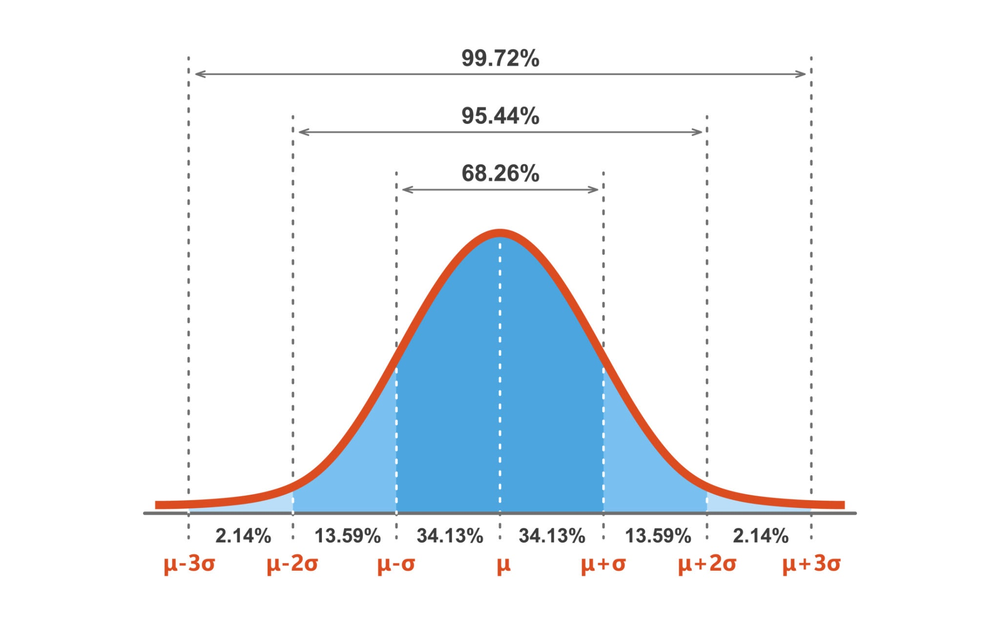

La **media** (μ) determina el centro de la campana, indicando el valor más probable o el promedio de la variable aleatoria. La **desviación estándar** (σ) mide la dispersión o la "anchura" de la campana. Una desviación estándar pequeña indica que los datos están muy agrupados alrededor de la media, resultando en una campana alta y estrecha. Una desviación estándar grande, por el contrario, significa que los datos están más dispersos, generando una campana más baja y ancha.

La expresión matemática de la **función de densidad de probabilidad (fdp)** de la **Distribución Normal** se define a través de sus dos parámetros, la media ($\mu$) y la varianza ($\sigma^2$):

$$
f(x | \mu, \sigma^2) = \frac{1}{\sqrt{2\pi\sigma^2}} e^{-\frac{(x - \mu)^2}{2\sigma^2}}
$$

Donde:

* $x$ es el valor de la variable aleatoria.
* $\mu$ (mu) es la **media** o el valor esperado, que determina el centro de la campana.
* $\sigma^2$ (sigma al cuadrado) es la **varianza**, que mide la dispersión de los datos. La raíz cuadrada de la varianza es $\sigma$ (la **desviación estándar**).
* $\pi$ (pi) y $e$ (la constante de Euler) son constantes matemáticas.
* El término $\frac{1}{\sqrt{2\pi\sigma^2}}$ es el factor de normalización, que asegura que el área total bajo la curva de densidad sea igual a 1.

### Una distribucion ubicua

Sin duda el poder de la distribución normal está relacionado con uno de los resultados más sorprendentes de toda la estadística: el **Teorema Central del Límite**. Este teorema viene a decir que la suma de muchos factores aleatorios e independientes inevitablemente tiende a esta forma normal. En la práctica, **muchos algoritmos y métodos estadísticos dependen de esta “normalidad emergente” para funcionar correctamente**.

Pero ¿qué dice el Teorema Central del Límite? de forma sencilla:

> Si tomamos muchas muestras aleatorias de una misma población, y calculamos la media de cada una de esas muestras, entonces la distribución de esas medias **tiende a ser normal**, **aunque los datos originales no lo sean**, siempre que la muestra tenga un tamaño suficientemente grande.

En otras palabras: la media de muchas muestras se comporta como si viniera de una distribución normal. A medida que aumentamos el tamaño de la muestra, **la forma de esa distribución de medias se va aproximando a una campana de Gauss**. Esto es válido **incluso si los datos originales son asimétricos, sesgados o tienen formas raras**.

> **Ejemplo intuitivo: lanzar un dado**
>
> Supongamos que lanzas un dado de 6 caras. Los posibles valores son del 1 al 6, todos igualmente probables. Si representamos su distribución, es completamente **plana**: no tiene forma de campana.
>
> Ahora imagina que lanzamos el dado **3 veces** y calculamos la **media** de esos 3 resultados. Por ejemplo:
>
> * Lanzamientos: 3, 5, 2 → Media: 3.33
> * Lanzamientos: 6, 6, 6 → Media: 6
> * Lanzamientos: 1, 1, 1 → Media: 1
> * Lanzamientos: 2, 3, 4 → Media: 3
>
> Si repetimos este experimento miles de veces y representamos en un histograma todas las medias obtenidas, veremos que los valores **cercanos al 3.5** (la media teórica del dado) son los más frecuentes, y que los valores extremos (1 o 6) son raros.
>
> El histograma empieza a parecer una **campana de Gauss**: más alto en el centro y con colas decrecientes. Si usamos **muestras de 10 lanzamientos** en lugar de 3, la campana será aún más marcada. Eso es el Teorema Central del Límite en acción.

> **Ejemplo: Comprobación visual del TLC**
>
> Aquí tienes la comparación visual del **Teorema Central del Límite (TLC)**:
>
> 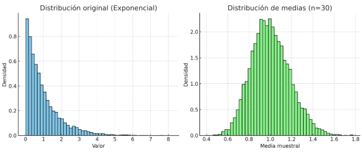
>
> A la izquierda está la **distribución original**, que en este caso es **exponencial** (asimétrica, sesgada hacia la derecha). A la derecha se muestra la **distribución de las medias muestrales** de tamaño $n=30$, la cual se aproxima claramente a una **distribución normal**, incluso cuando la población original no lo era.
>
> Vamos a ver como varía la distribucion de las medias con distintos valores de $n$
>
> 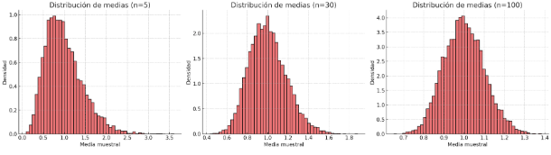
>
> Para $n=5$, la distribución de las medias aún refleja parte de la asimetría de la población original. Si $n=30$, ya empieza a ser bastante simétrica y se aproxima bien a la normal. Por último, para $n=100$, la distribución de las medias es prácticamente normal.
>
> Esto muestra de manera clara cómo **a medida que aumenta el tamaño de la muestra, la distribución de las medias converge hacia una normal**, independientemente de la forma de la distribución original.

#### El papel del Teorema Central del Límite

Cuando trabajamos en estadística no solemos disponer de toda la población, sino únicamente de **muestras** que extraemos de ella. Estas muestras nos sirven para calcular **estadísticos**, siendo la media muestral uno de los más importantes. Sin embargo, cada muestra será diferente, y por tanto cada media también lo será. La pregunta clave es: ¿qué forma tiene la distribución de esas medias si repitiéramos el proceso muchas veces?

Aquí es donde se puede usar el **Teorema Central del Límite**. Este resultado nos asegura que, incluso cuando la población original no sigue una distribución normal, la **distribución de las medias muestrales** tiende a una distribución normal a medida que aumenta el tamaño de la muestra. En otras palabras, aunque la población sea exponencial, uniforme o cualquier otra, si tomamos muestras grandes y calculamos sus medias, esas medias seguirán aproximadamente una campana de Gauss.

La importancia de esta distribución radica en tres hechos fundamentales. En primer lugar, la media de las medias muestrales coincide con la media poblacional, lo que convierte a la media muestral en un **estimador insesgado**. En segundo lugar, la dispersión de esta distribución disminuye conforme crece el tamaño de la muestra, siguiendo la relación:

$$
\sigma_{\bar{X}} = \frac{\sigma}{\sqrt{n}}
$$

donde $\sigma$ es la desviación típica de la población y $n$ el tamaño de la muestra. Esto significa que, al aumentar $n$, nuestras estimaciones se vuelven cada vez más precisas. Finalmente, la aproximación normal de la distribución de medias nos permite aplicar técnicas inferenciales —como intervalos de confianza o contrastes de hipótesis— sin necesidad de conocer la forma exacta de la distribución original.

Gracias al TLC podemos obtener información esencial de la población original **sin necesidad de conocer su distribución completa**. Podemos estimar con fiabilidad la media poblacional y cuantificar la precisión de esa estimación mediante el error estándar. También podemos construir intervalos de confianza y realizar contrastes de hipótesis apoyándonos en la normalidad de la distribución de medias. Sin embargo, lo que no nos ofrece el TLC es la forma exacta de la distribución de los datos individuales, ni nos da directamente información sobre otros parámetros como la varianza o la asimetría, salvo que desarrollemos estimadores específicos para ellos. Tampoco nos permite calcular probabilidades exactas de eventos en la escala original, como por ejemplo $P(X > 10)$, a menos que formulemos un modelo sobre la población.

> **Una intuición sencilla: tiempos de espera en un semáforo**
>
> Supongamos que el tiempo de espera en un semáforo sigue una **distribución uniforme entre 0 y 2 minutos**. Esta distribución es completamente plana y nada parecida a una normal.
>
> Si medimos el tiempo de espera de un solo coche, el resultado puede estar en cualquier valor del intervalo. Sin embargo, si medimos el de **10 coches y calculamos la media**, el valor obtenido tenderá a concentrarse en torno a 1 minuto (la media real de la población). Si repetimos este experimento muchas veces, la distribución de esas medias empieza a parecerse a una campana normal.
>
> Cuando aumentamos el tamaño de la muestra (por ejemplo, 50 coches), la concentración en torno a 1 minuto es aún mayor y la distribución de las medias es prácticamente normal.
>
> Este ejemplo ilustra la potencia del **Teorema Central del Límite**: aunque los datos individuales sigan una distribución no normal (uniforme en este caso), las medias muestrales tienden a distribuirse normalmente. Por eso podemos estimar la media poblacional, calcular intervalos de confianza o realizar contrastes de hipótesis aun sin conocer la distribución original de los datos.

### Por qué importa en Inteligencia Artificial

La **distribución normal** aparece una y otra vez en Inteligencia Artificial, no porque los datos reales lo sean siempre, sino porque su papel es estructural en muchos algoritmos. La normal es sencilla de describir —basta con su media y su desviación estándar— y, al mismo tiempo, flexible para modelar incertidumbre acumulada o fluctuaciones aleatorias. Esta combinación de simplicidad y poder explicativo la convierte en una herramienta universal.

En los modelos de **regresión**, la normalidad de los errores permite formular inferencias claras y calcular intervalos de confianza o contrastes de hipótesis. En los métodos **bayesianos**, la normal es la elección natural como distribución previa o como aproximación para distribuciones complicadas, ya que facilita el cálculo analítico. Incluso en las redes neuronales modernas, la normal aparece como modelo de **ruido gaussiano** para robustecer el entrenamiento o en la **inicialización de pesos**, donde distribuirlos alrededor de una media cero evita que el aprendizaje empiece sesgado y asegura un flujo equilibrado de gradientes.

Lo interesante es que la normal no solo es un supuesto cómodo, sino que refleja un principio profundo: cuando fenómenos complejos se agregan, tienden a comportarse como una normal. Esta regularidad hace que los algoritmos de IA, aunque trabajen sobre datos muy diversos, encuentren en la distribución normal una base sobre la cual generalizar y estabilizar sus predicciones.

Un ejemplo claro se encuentra en el reconocimiento de imágenes. Cada píxel aislado puede estar afectado por múltiples factores —iluminación, ruido del sensor, compresión— que no siguen una distribución simple. Sin embargo, al considerar regiones completas de la imagen, la suma de esas variaciones aleatorias termina aproximándose a un comportamiento gaussiano. Esto justifica que muchos algoritmos asuman ruido normal en los datos y que las técnicas de filtrado, como el suavizado gaussiano, resulten tan eficaces.

En síntesis, la distribución normal funciona como un **lenguaje común de la incertidumbre** en Inteligencia Artificial. Permite simplificar, modelar y generalizar, ofreciendo una base matemática robusta incluso cuando los datos de partida parecen caóticos o irreductiblemente complejos.

> **Ejemplo: reconocimiento de voz**
>
> Imagina un sistema de **reconocimiento de voz**. Cada vez que una persona pronuncia una palabra, el micrófono no capta una señal perfecta. Hay interferencias: un coche que pasa, el eco de la habitación, un ligero ruido eléctrico del dispositivo. Ninguno de estos ruidos tiene una forma de distribución clara por sí mismo: algunos son bruscos, otros intermitentes, otros suaves.
>
> Sin embargo, cuando todos esos ruidos se combinan en la señal que recibe el micrófono, la suma de sus efectos termina pareciéndose a un **ruido gaussiano**. Es decir, la variabilidad global alrededor de la señal original puede representarse de forma aproximada con una **distribución normal centrada en cero**.
>
> Esto tiene una consecuencia práctica directa: los algoritmos de reconocimiento de voz suponen que la señal está acompañada de **ruido gaussiano** y, sobre esa base, aplican filtros y modelos probabilísticos que separan la voz del ruido con gran eficacia. Si el ruido no pudiera aproximarse a una normal, diseñar estos sistemas sería mucho más complicado.
>
> 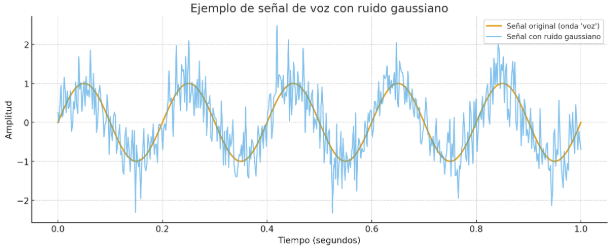
>
> En este gráfico ves la señal original (una onda sinusoidal simple, que representa una “voz limpia”) y la misma señal tras añadir **ruido gaussiano**. Esto refleja cómo los sistemas de reconocimiento de voz reciben la información en condiciones reales.
>
> 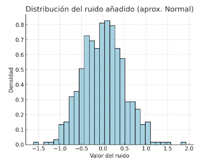
>
> En este **segundo gráfico** aparece el histograma del ruido añadido: su forma en campana muestra cómo el ruido resultante puede modelarse mediante una **distribución normal**, aunque los ruidos individuales que lo generan no lo fueran. De este modo se entiende de manera visual por qué la normal es un **modelo natural de incertidumbre** en IA: simplifica la realidad caótica del ruido y hace posibles los filtros y modelos probabilísticos que usan los sistemas modernos de reconocimiento.

## Distribución Binomial: conteo de éxitos en experimentos discretos

La **Distribución Binomial** aparece siempre que nos interesa contar cuántas veces ocurre un determinado resultado dentro de una secuencia de intentos independientes. Se trata del modelo natural de los **ensayos de Bernoulli**, donde cada prueba solo puede dar dos resultados: éxito o fracaso. El supuesto clave es que el número de intentos $n$ es fijo y que la probabilidad de éxito $p$ se mantiene constante en cada repetición.

En términos sencillos, la binomial responde a preguntas del tipo: *si la probabilidad de que un evento ocurra es $p$, ¿cuál es la probabilidad de observar exactamente $k$ éxitos tras $n$ intentos?* Matemáticamente, la probabilidad se expresa como:

$$
 P(X=k) = \binom{n}{k} p^k (1-p)^{n-k}
$$

donde $X$ es la variable aleatoria que cuenta el número de éxitos.

### La distribución binomial en Inteligencia Artificial

La importancia de esta distribución en IA está directamente ligada a los problemas de **clasificación binaria**, que son los más comunes en la práctica: diagnosticar si un paciente está enfermo o no, decidir si un correo es spam o legítimo, reconocer si una imagen contiene un objeto o no.

Cuando evaluamos un clasificador, solemos hablar de métricas como la **precisión** o la **tasa de error**. Pero estas métricas no son números fijos e inmutables: dependen de la muestra sobre la que se evalúe el modelo. La binomial nos ofrece el marco para cuantificar esta variabilidad. Si un modelo tiene una probabilidad de acierto del $90%$, podemos usar la binomial para calcular la probabilidad de que, en 50 intentos, falle exactamente 5 veces, o al menos 10. Esto no solo aporta una visión más realista del rendimiento, sino que permite construir intervalos de confianza y evaluar la robustez del modelo.

Más allá de la evaluación de clasificadores, la binomial también es esencial en tareas de **muestreo y validación cruzada**. Cada vez que dividimos los datos en conjuntos de entrenamiento y validación, los aciertos que el modelo obtiene en una muestra concreta siguen la lógica de una binomial. De ahí que la estadística binomial sirva para interpretar qué parte del desempeño se debe al azar y qué parte refleja una verdadera capacidad de generalización.

> **Ejemplo:**\
> Imagina un sistema de detección de fraudes en transacciones bancarias. El modelo acierta en un **95% de los casos** al identificar correctamente si una transacción es legítima o fraudulenta. Si analizamos un bloque de **100 transacciones nuevas**, la binomial nos permite calcular la probabilidad de que el sistema falle exactamente en 7 casos, o de que falle en más de 10.
>
> Esto es muy valioso porque transforma una métrica de rendimiento aparentemente estática (95% de precisión) en una **distribución de posibles resultados**. Así podemos responder a preguntas más profundas: ¿qué tan probable es que este modelo falle más de lo aceptable en un lote real de transacciones? ¿qué margen de error podemos esperar en condiciones normales de operación?

En resumen, la **distribución binomial** aporta a la Inteligencia Artificial una forma rigurosa de conectar el rendimiento observado de un modelo con la incertidumbre inherente al muestreo. Nos permite pasar de un número aislado de precisión a un marco probabilístico que explica cómo se comportará un clasificador en distintos escenarios. Esa es la razón por la que, aunque a veces pase desapercibida, la binomial está en el corazón de cómo entendemos y evaluamos los sistemas inteligentes.

> **Distribución de fallos en un clasificador (N=50, P=0.90)**
>
> 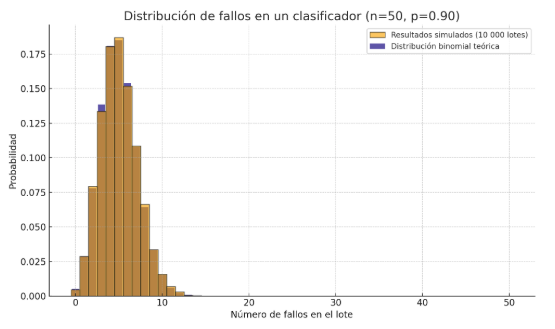
>
> Aquí se muestra la comparación entre la **distribución binomial teórica** (en azul marino) y los **resultados simulados** (en naranja) para un clasificador con un 90% de precisión evaluado en lotes de 50 predicciones.
>
> Se aprecia claramente que la mayor parte de la masa de probabilidad se concentra entre 2 y 7 fallos, con un valor más probable alrededor de 5. Esto refleja que, aunque la tasa de error esperada es del 10%, en cada lote el número real de errores fluctúa. La coincidencia entre la forma teórica y los resultados simulados muestra cómo la distribución binomial describe con precisión la variabilidad del rendimiento del modelo.

## Distribución de Poisson: modelar eventos raros en intervalos

La **Distribución de Poisson** surge de manera natural cuando contamos el número de veces que ocurre un evento en un intervalo fijo de tiempo o de espacio, siempre que se cumplan tres condiciones básicas. En primer lugar, los sucesos deben ser **independientes**, de forma que la ocurrencia de uno no afecte a los demás. En segundo lugar, la probabilidad de que aparezcan varios sucesos en un intervalo muy pequeño debe ser prácticamente nula, lo que refleja la naturaleza de **eventos raros**. Finalmente, la frecuencia promedio de ocurrencia ha de ser estable, es decir, debe existir un valor $\lambda$ que represente el número medio de sucesos esperados por intervalo.

En estas condiciones, el conteo de eventos se distribuye según una distribución de Poisson. Lo interesante es que esta situación **se da de manera espontánea en fenómenos reales**: las llamadas que recibe un *call center* por minuto, los fallos de una máquina en una jornada, los fotones que impactan en un sensor o los accidentes en un cruce concreto. La distribución de Poisson, por tanto, no es una construcción arbitraria, sino el modelo probabilístico que emerge cuando sucesos poco frecuentes se acumulan con una tasa estable en el tiempo o el espacio.

En cuanto a su **forma**, la distribución de Poisson cambia dependiendo del valor de $\lambda$. Cuando $\lambda$ es bajo, la distribución es claramente asimétrica: la mayoría de los intervalos presentan cero o un suceso, y solo ocasionalmente aparecen dos o más. Esto refleja la rareza del fenómeno. Sin embargo, conforme $\lambda$ crece y los sucesos dejan de ser tan excepcionales, la distribución se ensancha y el número de sucesos por intervalo empieza a variar de manera más equilibrada alrededor de la media. En ese régimen, la distribución de Poisson gana simetría y se aproxima a la forma de una campana normal.

> **Ejemplo:**
>
> Si en un cruce se produce en promedio un accidente al mes, la mayoría de los meses no habrá ninguno, algunos meses habrá uno y muy raramente dos o más. El comportamiento es claramente sesgado hacia la derecha. En cambio, si ampliamos la observación a toda una ciudad con un promedio de trescientos accidentes al mes, la distribución ya no se concentra en los valores bajos, sino que se agrupa en torno a 300, con una variabilidad relativamente equilibrada hacia arriba y hacia abajo. En este segundo caso, la distribución de Poisson adquiere una forma prácticamente simétrica, semejante a la normal.
>
> 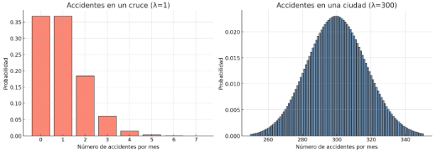
>
> A la izquierda se muestra la distribución de Poisson con $\lambda = 1$, correspondiente a un **cruce peligroso** donde ocurre, en promedio, un accidente al mes. La forma es muy asimétrica: la mayor probabilidad está en cero accidentes y decrece rápidamente a medida que aumenta el número de sucesos. A la derecha aparece la distribución con $\lambda = 300$, que representa una **ciudad entera** con un promedio de 300 accidentes al mes. En este caso la distribución se concentra alrededor de 300, mostrando un patrón mucho más simétrico, muy parecido a una campana normal.
>
> De esta manera se ve cómo la **asimetría inicial de la Poisson se convierte en simetría** cuando la frecuencia promedio de sucesos es alta. 

En síntesis, la **distribución de Poisson emerge de la naturaleza como modelo de conteos de eventos raros** y su **simetría es una propiedad emergente** que depende de la frecuencia promedio: cuanto más frecuentes son los eventos, más simétrica y normalizada se vuelve la distribución.

Recuerda: Lo esencial es que los eventos se producen de manera independiente y aleatoria. Con estas condiciones, la distribución de Poisson nos permite responder preguntas como: ¿cuál es la probabilidad de que lleguen exactamente 12 llamadas en un call center en un minuto si el promedio es de 10? ¿qué tan probable es que una máquina produzca 3 defectos en una hora si la tasa es de 2 defectos por hora?

### La distribución de Poisson en Inteligencia Artificial

En el ámbito de la Inteligencia Artificial, la distribución de Poisson es central en el **modelado de conteos**. Allí donde los algoritmos deben trabajar con frecuencias de sucesos —desde accesos a un servidor, hasta detecciones de anomalías en sensores— la distribución de Poisson ofrece una descripción matemática precisa. En el ejemplo del apartado anterior, el sistema de monitorización puede usar la distribución de Poisson para establecer umbrales: si en un minuto aparecen 40 accesos, un valor muy improbable según el modelo, el sistema puede interpretar que existe una anomalía. Así, la distribución de Poisson convierte una tasa media abstracta en un marco probabilístico para anticipar escenarios normales y detectar desviaciones significativas.

En síntesis, la distribución de Poisson nos permite pasar de un número promedio a una **distribución completa de posibilidades**, algo fundamental para construir algoritmos capaces de gestionar incertidumbre en entornos dinámicos.

En **sistemas de visión por computador**, por ejemplo, puede usarse para estimar cuántos defectos se detectarán en una cadena de montaje en un período de tiempo. En **análisis de tráfico en redes**, modela el número de peticiones entrantes a un servidor por segundo. En **detección de fraudes o ciberataques**, describe el número de intentos anómalos en un intervalo dado, lo que permite fijar umbrales estadísticos para decidir cuándo una frecuencia observada es demasiado alta como para considerarse normal.

Lo relevante es que no se requiere conocer el número de oportunidades para que ocurran los eventos (a diferencia de la binomial), basta con conocer la tasa promedio. Esto simplifica la modelización en situaciones donde el número de intentos es tan grande que resulta inabarcable, pero la frecuencia media es medible.

> **Para reflexionar...**\
> **Si estuvieras construyendo un sistema de detección de intrusos en una red, ¿cuándo tendría más sentido aplicar la Binomial y cuándo la distribución de Poisson?**
> Considera que la Binomial describe un conjunto fijo de intentos (por ejemplo, analizar 100 conexiones e identificar cuántas son maliciosas), mientras que la distribución de Poisson modela la frecuencia con la que saltan las alarmas en intervalos continuos de tiempo (por ejemplo, cuántos intentos de intrusión se detectan en un día).

## Interpretación gráfica de las distribuciones y su utilidad en el análisis de datos

Las distribuciones de probabilidad no son únicamente expresiones matemáticas. Su verdadera potencia se aprecia cuando se representan de manera **gráfica**, porque la forma de la curva revela de inmediato las propiedades esenciales de los datos. La **interpretación visual** de una distribución es una herramienta central tanto en estadística como en Inteligencia Artificial, ya que permite diagnosticar patrones, detectar irregularidades y elegir modelos adecuados.

Al observar una **distribución normal**, la simetría en forma de campana indica que los valores se concentran alrededor de la media y que los extremos son cada vez menos frecuentes. Esta imagen mental justifica el uso de intervalos de confianza, la interpretación de *z-scores* y la práctica de asumir “ruido gaussiano” en muchos algoritmos de aprendizaje automático. La curva normal no solo muestra dónde están los datos más probables, sino también cómo se reparte la incertidumbre en torno al valor central.

En la **binomial**, la interpretación gráfica se realiza mediante barras discretas que indican las probabilidades de obtener cierto número de éxitos en un número fijo de intentos. La altura de cada barra revela la distribución de posibilidades: concentradas alrededor de la media si $p$ es intermedio, o desplazadas hacia los extremos si $p$ es muy bajo o muy alto. Visualizarla permite comprender el comportamiento esperado de un clasificador binario y anticipar qué cantidad de errores es razonable en una evaluación.

La **distribución de Poisson**, representada igualmente con barras, refleja cómo los eventos raros se distribuyen en un intervalo fijo. Cuando la tasa $\lambda$ es pequeña, el gráfico se concentra en los primeros valores y decrece rápidamente, mostrando la rareza del fenómeno. Cuando $\lambda$ es grande, las barras se agrupan de manera más equilibrada alrededor de la media, revelando su transición hacia una forma normal. Esta representación es fundamental en aplicaciones de conteo, como detección de anomalías o análisis de tráfico, ya que permite visualizar qué frecuencias son normales y cuáles constituyen señales de alerta.

### Funciones prácticas en el análisis de datos

Las distribuciones de probabilidad se convierten en herramientas verdaderamente útiles cuando se representan de forma **gráfica**. El trazo de sus curvas o de sus barras revela, de un vistazo, cómo se reparte la probabilidad entre los valores posibles, lo que transforma una fórmula en un instrumento de diagnóstico. Esta lectura visual cumple funciones prácticas muy concretas dentro del análisis de datos y la Inteligencia Artificial.

En primer lugar, permiten **identificar patrones de comportamiento en los datos**. Un histograma con forma de campana sugiere normalidad, mientras que una distribución sesgada hacia la derecha puede indicar variables de tipo temporal o de conteo. Esta primera impresión guía al analista en la selección de modelos adecuados: por ejemplo, usar modelos de regresión lineal si los residuos muestran simetría normal, o modelos de conteo si la forma es claramente asimétrica.

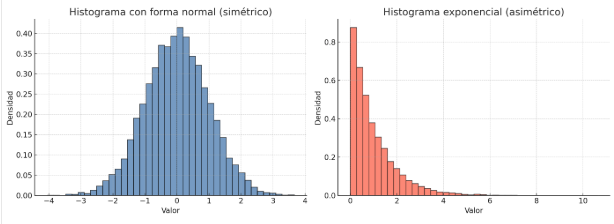

En segundo lugar, las representaciones gráficas son clave para la **detección de anomalías y valores extremos**. En una distribución normal, un valor que cae en la cola más allá de tres desviaciones típicas es inmediatamente identificable como inusual. En una Poisson, una barra de frecuencia que se sale del rango esperado puede señalar un comportamiento anómalo en el tráfico de red o en la producción de defectos de una máquina. La gráfica no solo cuantifica, sino que hace visible lo improbable.

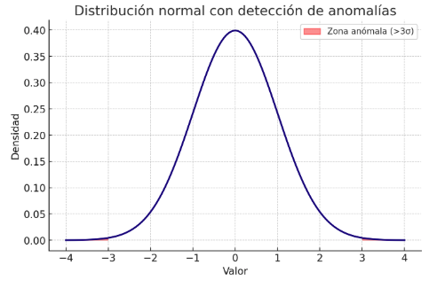

En tercer lugar, facilitan la **comparación entre distribuciones teóricas y datos observados**. Superponer una curva normal sobre un histograma de datos permite evaluar visualmente si el supuesto de normalidad es razonable. Comparar una distribución binomial teórica con los resultados de un clasificador en pruebas repetidas muestra hasta qué punto el modelo se ajusta a la expectativa estadística. En sistemas de monitorización, cotejar la Poisson teórica con la frecuencia real de eventos ayuda a calibrar umbrales de alarma.

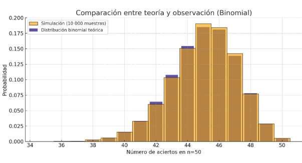

Otra función práctica es la **comunicación de resultados**. En entornos de trabajo con equipos multidisciplinares, no siempre es posible transmitir la complejidad de los cálculos matemáticos, pero un gráfico de distribución muestra de forma inmediata dónde están los valores más probables, cuál es la variabilidad y qué rango de resultados se debe considerar normal. De esta manera, las gráficas sirven de puente entre la teoría estadística y la toma de decisiones en IA aplicada.

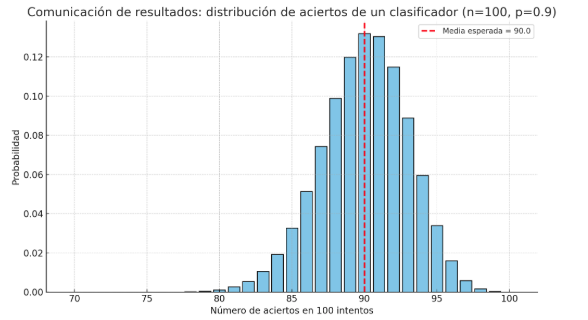

Finalmente, las representaciones gráficas permiten **explorar la dinámica de los datos en distintas escalas**. En el caso de la Poisson, variar el parámetro $\lambda$ muestra cómo un proceso raro y sesgado puede transformarse en uno simétrico y estable. En la binomial, observar la forma de la distribución al aumentar $n$ revela cómo se acerca a una normal. Estas visualizaciones no solo ilustran resultados teóricos, sino que permiten comprender en la práctica por qué las aproximaciones estadísticas (binomial–normal, binomial–Poisson, Poisson–normal) son válidas y útiles en los flujos de trabajo de IA.

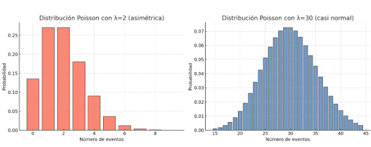

En suma, la interpretación gráfica de las distribuciones no es un adorno visual, sino una herramienta práctica de primer orden. Permite diagnosticar supuestos, detectar anomalías, comparar teoría con observación, comunicar hallazgos y comprender cómo las propiedades estadísticas emergen al cambiar la escala del problema. Todo ello convierte a los gráficos de distribuciones en un recurso indispensable en el análisis de datos y en el diseño de sistemas inteligentes.

