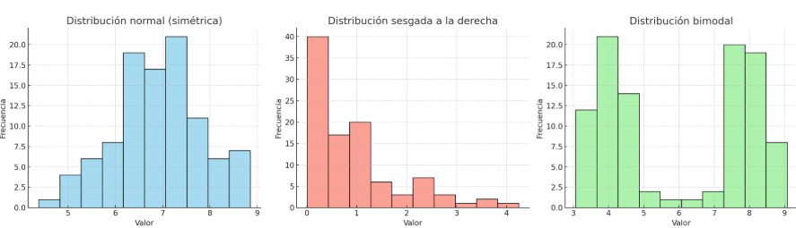
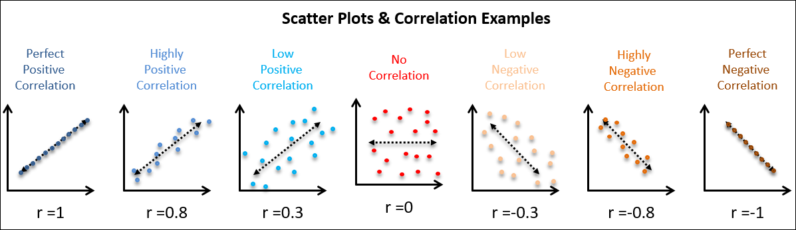
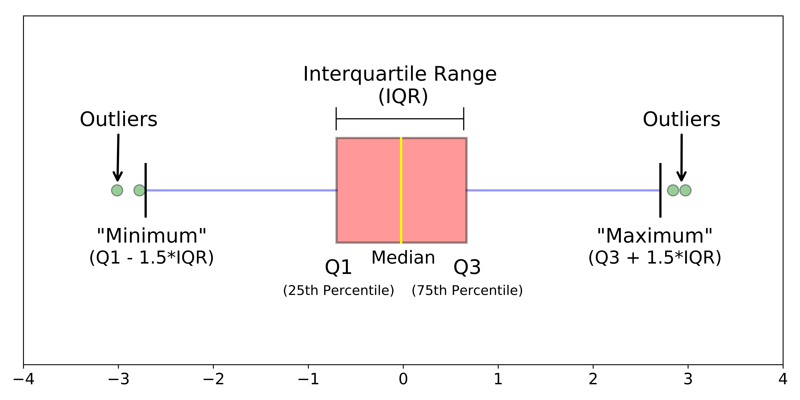
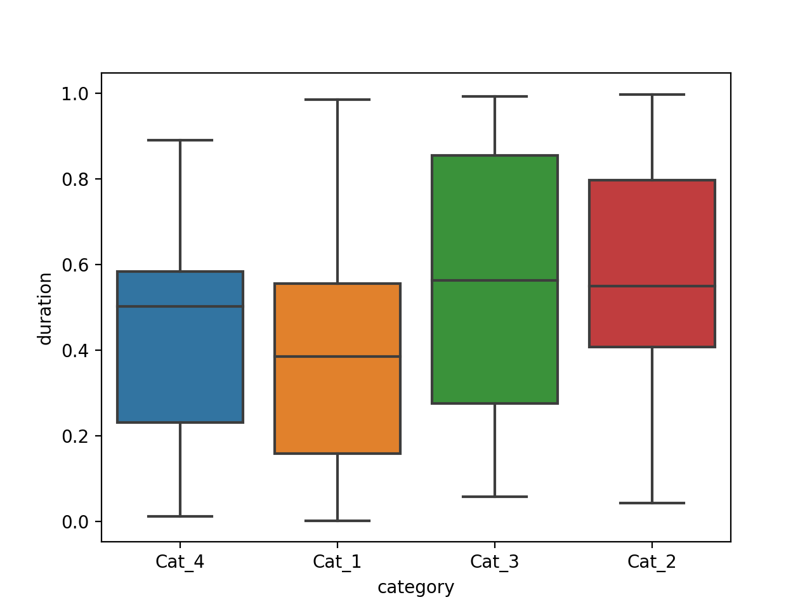
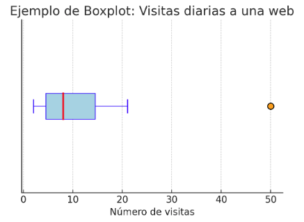

Fundamentos de estadística descriptiva 
===

Concepto general de estadística descriptiva
---

Cuando trabajamos con datos, lo primero que nos encontramos suele ser una colección enorme de números. Pueden ser las calificaciones de una clase, los ingresos de una empresa, las mediciones de sensores o la cantidad de interacciones que recibe una publicación en redes sociales. En bruto, esa información resulta difícil de comprender: una tabla con miles de registros no nos dice nada a simple vista. La mente humana necesita **resúmenes** que nos permitan captar la esencia de los datos sin perdernos en el detalle.

La **estadística descriptiva** nace precisamente para eso. Su objetivo es **condensar la información** en unos pocos números que la representen de manera sintética. Estos valores actúan como una especie de “radiografía” de los datos, ofreciendo al instante una idea de cuál es su centro, cuánta variabilidad presentan o si tienden a concentrarse en torno a ciertos valores. Es lo que llamamos medidas de tendencia central y de dispersión, que veremos más adelante.

La importancia de esta condensación es doble. Por un lado, facilita la comprensión de un conjunto de datos en un vistazo rápido, sin necesidad de recorrer cada elemento uno por uno. Por otro, permite **comparar conjuntos distintos** de manera justa. Si dos grupos de estudiantes tienen calificaciones muy diferentes en número y extensión, podemos usar medidas descriptivas para valorar de forma objetiva cuál es su rendimiento típico y si ambos grupos muestran comportamientos similares o no.

En inteligencia artificial este paso inicial es crucial. Antes de entrenar un modelo, necesitamos conocer la “personalidad” de los datos: si están equilibrados o descompensados, si presentan valores extremos que podrían sesgar las conclusiones, o si hay patrones simples que ya se vislumbran sin necesidad de algoritmos complejos. La estadística descriptiva es, en ese sentido, **la primera capa de inteligencia** aplicada a los datos: nos orienta, nos alerta y nos prepara para decisiones posteriores.

Podemos pensar en ella como la diferencia entre hojear un resumen ejecutivo y leer un informe de cien páginas. El detalle completo siempre está ahí, pero lo que guía la acción es esa síntesis que capta lo fundamental. En el caso de los datos, la estadística descriptiva es ese resumen: un puente entre la complejidad del mundo real y la claridad que necesita la mente —y, por extensión, los modelos de IA— para aprender de él.

> **Para reflexionar…**
>  ¿Hasta qué punto crees que es seguro tomar decisiones basadas únicamente en resúmenes estadísticos? ¿En qué situaciones sería suficiente trabajar con medidas agregadas, y en cuáles podría ocultar detalles importantes que cambian la interpretación de los datos?

Medidas de tendencia central
---

Al enfrentarnos a un conjunto de datos, una de las primeras preguntas que surge es: **¿dónde está el centro?**. En otras palabras, ¿cuál es el valor típico que resume la colección? Las medidas de tendencia central buscan responder a esa cuestión ofreciendo distintos modos de definir lo “central”. Cada una lo hace con una lógica distinta y, por ello, conviene comprender sus matices y cuándo resulta más adecuada.

La **media aritmética** es la más familiar. Se calcula sumando todos los valores y dividiendo entre el número de observaciones. Puede pensarse como el **centro de gravedad** de los datos: si cada dato fuese un peso colocado sobre una línea, la media sería el punto en el que la balanza queda equilibrada. Su popularidad se debe a que aprovecha toda la información disponible y ofrece un valor representativo en muchos contextos. En inteligencia artificial aparece constantemente. El **error cuadrático medio**, una de las funciones de coste más utilizadas, se basa en medir las desviaciones respecto a la media. Sin embargo, la media tiene una debilidad: es muy sensible a valores extremos. Un solo dato anormalmente grande o pequeño puede arrastrar su valor de forma desproporcionada.

Cuando los datos presentan esa clase de valores extremos, la **mediana** ofrece una alternativa más robusta. La mediana es simplemente el valor que queda justo en el centro una vez que los datos están ordenados. Divide al conjunto en dos mitades iguales: la mitad de las observaciones quedan por debajo y la otra mitad por encima. Esa simplicidad le da una gran resistencia frente a valores atípicos. Imagina un grupo de sueldos donde la mayoría de las personas cobran en torno a 1.500 euros, pero hay un directivo con un salario de 100.000. La media subiría bruscamente, dando la impresión de que el salario “típico” es mucho más alto. La mediana, en cambio, seguiría reflejando con fidelidad el valor central de la mayoría. En análisis de datos, usar la mediana en lugar de la media puede mejorar la **robustez** del modelo y evitar que unos pocos valores distorsionen el panorama general.

La tercera medida de tendencia central es la **moda**, el valor que más veces se repite. Aunque puede parecer menos refinada, tiene un papel clave cuando el interés se centra en la **frecuencia**. Es especialmente útil con variables categóricas, donde no tiene sentido calcular medias o medianas. Si recogemos el color de los coches que circulan por una avenida, la moda indica el color más común. En el terreno de la inteligencia artificial, esta idea se conecta con algoritmos de clasificación. Un ejemplo claro es el método de los **vecinos más cercanos (k-NN)**: al clasificar un nuevo dato, el algoritmo mira a los ejemplos más próximos en el conjunto de entrenamiento y asigna la clase más frecuente entre ellos. Es decir, aplica la lógica de la moda en un contexto local.

Cada una de estas medidas responde a una visión distinta de lo que significa ser “típico”. La media busca el equilibrio numérico, la mediana apunta al punto que divide en dos y la moda resalta la frecuencia. En conjunto forman un tríptico que, utilizado con criterio, permite describir con precisión el centro de un conjunto de datos y anticipar cómo estos resúmenes influyen en la construcción de modelos de IA.

> **Para reflexionar…**
>  Si tuvieras que resumir los resultados de un examen para informar a los alumnos, ¿qué medida escogerías? ¿La media, que da un promedio general, la mediana, que refleja la posición central, o la moda, que muestra la nota más repetida? ¿Crees que cada una transmitiría un mensaje distinto sobre el mismo grupo?

### Fórmulas y ejemplos

Las tres medidas de tendencia central —media, mediana y moda— no son solo conceptos intuitivos; también tienen expresiones matemáticas precisas que permiten calcularlas y aplicarlas a problemas de datos. Veamos cada una con más detalle y con ejemplos sencillos que ilustren su papel en el análisis y en la inteligencia artificial.

#### Media aritmética

Si tenemos un conjunto de $n$ observaciones $x_1, x_2, \dots, x_n$, la media aritmética se define como

$$
\bar{x} = \frac{1}{n}\sum_{i=1}^n x_i
$$

Por ejemplo, si las calificaciones de un alumno en cuatro tareas son $[6, 7, 9, 8]$, su media sería

$$
\bar{x} = \frac{6+7+9+8}{4} = 7.5
$$

La interpretación es que, en promedio, el rendimiento del alumno se sitúa en 7.5.

En inteligencia artificial, esta fórmula aparece de manera recurrente. El **Error Cuadrático Medio (MSE)**, que es una de las funciones de coste más utilizadas, no es más que la media de los errores al cuadrado entre las predicciones $\hat{y}_i$ y los valores reales $y_i$:

$$
MSE = \frac{1}{n}\sum_{i=1}^n (\hat{y}_i - y_i)^2
$$

Aquí la media actúa como resumen del rendimiento global del modelo sobre todo el conjunto de datos.

#### Mediana

La mediana requiere ordenar los datos de menor a mayor. Si $n$ es impar, la mediana es el valor central; si $n$ es par, se toma la media de los dos valores centrales.

Por ejemplo, con los datos $[5, 7, 8, 9, 12]$, la mediana es $8$, porque es el valor en la tercera posición. Con $[5, 7, 8, 9]$, la mediana se obtiene promediando los dos valores centrales:

$$
\text{Mediana} = \frac{7+8}{2} = 7.5
$$

En IA, la mediana es muy útil en tareas de **preprocesamiento de datos**. Si tenemos valores perdidos en una variable, sustituirlos por la mediana suele ser más robusto que usar la media, porque evita que valores atípicos distorsionen el resultado. También se utiliza en métricas como el **Error Absoluto Mediano (MedAE)**, que mide la desviación típica de las predicciones sin dejarse arrastrar por grandes errores aislados.

### Moda

La moda es el valor más frecuente en el conjunto de datos. Si tenemos $[2, 4, 4, 6, 7, 7, 7, 9]$, la moda es $7$, porque aparece más veces que el resto.

En variables categóricas, como en este ejemplo de conjunto de colores, $[\text{rojo}, \text{azul}, \text{azul}, \text{verde}]$, la moda sería “azul”.

### Comparación y uso en IA

Imaginemos un conjunto de datos que contiene el número de visitas diarias a una página web durante una semana:

$$
[100, 120, 150, 110, 105, 300, 115]
$$

* La **media** es
  $$
  \bar{x} = \frac{100+120+150+110+105+300+115}{7} = 157.14
  $$

* La **mediana**, al ordenar los datos $[100, 105, 110, 115, 120, 150, 300]$, es $115$.

* La **moda** no existe en sentido estricto porque ningún valor se repite, aunque en datos grandes siempre suele aparecer un valor más frecuente.

¿Qué aprendemos? La media está claramente arrastrada hacia arriba por el día con 300 visitas (un valor atípico). La mediana refleja mejor el comportamiento típico de la mayoría de los días. Esto es exactamente lo que ocurre en IA al analizar variables con outliers: según la métrica elegida, el modelo se verá más o menos influido por esos extremos.

> **Para reflexionar…**
> En un sistema de recomendación, ¿crees que sería más útil calcular la media de las calificaciones de un usuario, o la mediana? ¿Qué pasaría si ese usuario tiende a dar puntuaciones extremas (muy bajas o muy altas) que podrían distorsionar la media?

Medidas de dispersión
---

Las medidas de dispersión nos cuentan una parte de la historia que la media, la mediana o la moda no alcanzan a revelar. Saber que la nota media de una clase es un 7 no es lo mismo si casi todos los estudiantes rondan ese valor, o si en realidad hay una mezcla de sobresalientes y suspensos que se compensan. La dispersión mide justamente ese “grado de acuerdo” entre los datos: cuando es baja, los valores son parecidos y describen un comportamiento homogéneo; cuando es alta, los datos se dispersan por todo el rango posible y muestran gran diversidad.

En el contexto de la inteligencia artificial, esta diferencia es clave. Un modelo entrenado con datos muy dispersos afronta más dificultad para encontrar patrones estables, porque cada ejemplo parece distinto del anterior. En cambio, con datos poco dispersos, los patrones son más consistentes y el modelo puede captarlos con más facilidad. Así, entender la dispersión no es solo un ejercicio matemático: es tomar conciencia de cuánto “ruido” y cuánta “regularidad” hay en la información con la que trabajará el algoritmo.

En resumen, las **medidas de dispersión**, nos indican cuánto se alejan los datos de su centro. Estas medidas son la clave para entender la “forma” de los datos más allá de su posición central y resultan fundamentales en inteligencia artificial, porque la dispersión afecta directamente al rendimiento y la estabilidad de los modelos.

### Rango

La medida más sencilla de dispersión es el **rango**, definido como la diferencia entre el valor máximo y el valor mínimo de los datos.

$$
R = \max(x_i) - \min(x_i)
$$

Si las calificaciones de un grupo son $[5,6,7,8,9]$, el rango es $9-5=4$. Si otro grupo tiene $[2,4,8,10]$, el rango es $10-2=8$. Aunque las medias pueden ser similares, el segundo grupo muestra una mayor amplitud de notas.

En IA, el rango puede alertarnos de la **escala de los datos**. Si una característica tiene un rango de 0 a 1000 y otra solo de 0 a 10, la primera dominará en cálculos de distancia o productos escalares. Por eso se suele aplicar **escalado** o normalización antes de entrenar un modelo.

### Varianza y desviación estándar

El rango es útil, pero depende únicamente de dos valores (máximo y mínimo) y no refleja cómo se distribuyen los datos intermedios. Para una visión más completa usamos la **varianza** y la **desviación estándar**, que miden la dispersión respecto a la media.

La varianza se define como la media de los cuadrados de las desviaciones de cada dato respecto a la media:

$$
\sigma^2 = \frac{1}{n}\sum_{i=1}^n (x_i - \bar{x})^2
$$

La desviación estándar es simplemente la raíz cuadrada de la varianza:

$$
\sigma = \sqrt{\frac{1}{n}\sum_{i=1}^n (x_i - \bar{x})^2}
$$

Si tomamos los datos $[6,7,9,8]$ con media $7.5$, la varianza es

$$
\sigma^2 = \frac{(6-7.5)^2 + (7-7.5)^2 + (9-7.5)^2 + (8-7.5)^2}{4} = 1.25
$$

y la desviación estándar es $\sigma = \sqrt{1.25} \approx 1.12$. Esto nos dice que, en promedio, los datos se alejan poco más de una unidad de la media.

En IA, la desviación estándar es clave en procesos de **normalización**: restar la media y dividir entre la desviación estándar convierte una variable en una distribución con media cero y varianza uno. Este paso asegura que todas las características contribuyan de manera equilibrada durante el entrenamiento, evitando que una variable domine a las demás por estar en otra escala.

### Coeficiente de variación

La varianza y la desviación estándar miden dispersión en términos absolutos. Pero ¿cómo comparar la variabilidad de variables medidas en escalas distintas? Para ello usamos el **coeficiente de variación (CV)**, que relaciona la desviación estándar con la media:

$$
CV = \frac{\sigma}{\bar{x}}
$$

El CV permite comparar dispersión relativa. Supongamos dos variables: en un grupo de alumnos, la nota media es $8$ con desviación estándar $1$, mientras que el número de horas de estudio semanales tiene media $20$ y desviación estándar $5$. Aunque en valor absoluto $5$ parece más dispersión que $1$, el CV muestra que, en proporción a la media, las notas tienen un $CV=0.125$ y las horas un $CV=0.25$. Esto indica que el estudio es relativamente más variable entre estudiantes que las calificaciones.

En IA, el coeficiente de variación se conecta con la idea de **estabilidad de los modelos**. En problemas de validación cruzada, comparar la media del rendimiento de un modelo con la variabilidad de ese rendimiento puede ayudarnos a decidir si un modelo es consistente o si depende demasiado de la partición de los datos.

---

> **Para reflexionar…**
> ¿Qué pasaría si entrenas un modelo con una variable que tiene un rango enorme y otra con un rango diminuto? ¿Por qué normalizar los datos (restando la media y dividiendo por la desviación estándar) ayuda a que el entrenamiento sea más equilibrado y estable?

## Medidas de posición

Además de conocer el centro y la dispersión de los datos, también resulta útil saber cómo se distribuyen alrededor de ese centro y en qué lugares se concentran. Las **medidas de posición** permiten responder a esta pregunta dividiendo el conjunto de datos en partes que nos ayuden a describir su forma.

La idea es sencilla: si colocamos todos los datos en orden de menor a mayor, podemos marcar ciertos puntos de referencia que dividen esa secuencia en segmentos. Estos puntos son los **cuartiles** y los **percentiles**.

Los cuartiles dividen los datos en cuatro partes iguales. El primer cuartil (Q1) señala el valor por debajo del cual se encuentra el 25% de los datos. El segundo cuartil coincide con la mediana, que divide al conjunto en dos mitades, y el tercer cuartil (Q3) marca el valor por debajo del cual está el 75% de los datos. Estos cortes nos permiten describir cómo se distribuye la información: si los valores se agrupan mucho en un extremo, los cuartiles quedarán más juntos en esa zona, mientras que si los datos están más dispersos se separarán más.

Los percentiles siguen la misma lógica, pero dividen los datos en cien partes iguales. El percentil 90, por ejemplo, es el valor que deja por debajo al 90% de los datos. Esta medida se utiliza mucho en contextos donde interesa entender los extremos de la distribución. Un ejemplo cercano para un alumno sería el cálculo de notas de admisión: estar en el percentil 95 de una prueba significa haber obtenido mejor resultado que el 95% de los participantes.

Esta idea intuitiva se puede formalizar con el concepto de **cuantil**. Si $X$ es una variable y $F(x)$ su función de distribución acumulada (la proporción de datos $\le x$), el **cuantil de nivel** $p\in(0,1)$ es cualquier valor $q$ tal que
$$
F(q);\ge;p\quad\text{y}\quad F(q^-);\le;p.
$$
En datos finitos, con valores ordenados $x_{(1)}\le \cdots \le x_{(n)}$, el cuantil empírico $Q(p)$ se suele obtener por **posición fraccionaria**: $k=(n+1)p$ y, si $k$ no es entero, se interpola entre $x_{(\lfloor k\rfloor)}$ y $x_{(\lceil k\rceil)}$. Los **cuartiles** son los cuantiles $Q(0{.}25), Q(0{.}50), Q(0{.}75)$; el segundo cuartil coincide con la **mediana**. Los **percentiles** son los cuantiles $Q(p)$ con $p$ expresado en tanto por ciento (p. ej., el percentil 90 es $Q(0{.}90)$).

Vamos a fijar ideas con un ejemplo

> 
>
> Tomemos una lista de “visitas diarias” (ordenada ya de menor a mayor)
> $$
> \boxed{2,\ 3,\ 4,\ 6,\ 7,\ 9,\ 13,\ 15,\ 21,\ 50}\qquad (n=10)
> $$
> La **mediana** es el punto medio entre las posiciones 5 y 6: $Q(0{.}5)=\tfrac{7+9}{2}=8$.
> Para el **primer cuartil**, $k=(n+1),0{.}25=2{.}75$. Interpolamos entre $x_{(2)}=3$ y $x_{(3)}=4$ con fracción $0{.}75$:
> $$
> Q(0{.}25)=3+0{.}75,(4-3)=3{.}75.
> $$
> Para el **tercer cuartil**, $k=(n+1),0{.}75=8{.}25$. Interpolamos entre $x_{(8)}=15$ y $x_{(9)}=21$ con fracción $0{.}25$:
> $$
> Q(0{.}75)=15+0{.}25,(21-15)=16{.}5.
> $$
> El **rango intercuartílico** (IQR) mide la “anchura” de la mitad central:
> $$
> \mathrm{IQR}=Q(0{.}75)-Q(0{.}25)=16{.}5-3{.}75=12{.}75.
> $$
> Con estos números, el **percentil 90** (posición $k=0{.}9\cdot 11=9{.}9$) estará casi en el máximo, muy cerca de $x_{(10)}=50$:
> $$
> Q(0{.}90)\approx x_{(9)} + 0{.}9,(x_{(10)}-x_{(9)}) = 21 + 0{.}9,(50-21)=47{.}1.
> $$
>

> **Para reflexionar…**
> ¿Por qué puede ser más informativo representar los datos con un diagrama de caja que limitarse a dar la media y la desviación estándar? ¿Qué nos dice un boxplot sobre los valores atípicos que una media nunca revelaría?

Representaciones gráficas en EDA
---

Hasta ahora hemos trabajado con números: medias, medianas, desviaciones y cuartiles. Pero los datos, además de resumirse, también se **visualizan**. La representación gráfica es uno de los pilares del análisis exploratorio de datos (EDA), porque permite captar patrones, tendencias y anomalías de un vistazo, mucho antes de aplicar algoritmos complejos.

### Histogramas

Un histograma es una forma sencilla de observar cómo se distribuyen los valores de una variable. Divide el rango de la variable en intervalos (llamados “bins”) y cuenta cuántas observaciones caen en cada uno. El resultado es un gráfico de barras que muestra la **frecuencia** con que aparecen los valores en distintas zonas.

La elección del número de bins no es trivial. Demasiados bins pueden fragmentar la imagen y ocultar la tendencia general, mostrando solo el ruido. Por el contrario, muy pocos bins pueden ocultar características importantes, como bimodalidades, aplanando la distribución en una forma demasiado simplista. Una regla práctica común es la **Regla de Sturges** ($k = \lceil \log_2 n + 1 \rceil$), pero en el análisis exploratorio moderno suele ser más efectivo probar varios anchos de bin para observar qué revelan los datos.

La forma del histograma nos habla directamente de la "personalidad" de la variable:

- **Sesgo a la derecha (positivo):** La cola se extiende hacia valores más altos. Es común en datos como ingresos económicos o tiempos de respuesta a un evento: la mayoría se agrupa a la izquierda, pero unos pocos valores muy altos "arrastran" la media hacia la derecha.
- **Sesgo a la izquierda (negativo):** La cola se extiende hacia valores más bajos. Un ejemplo podría ser la edad de jubilación: la mayoría se concentra en edades altas, con una cola menor hacia jubilaciones más tempranas.
- **Distribución multimodal:** Muestra varios "picos" o modas. Esto suele ser una señal reveladora de que la muestra agrupa varias poblaciones o comportamientos distintos. Por ejemplo, la distribución de velocidades de vehículos en una autopista a lo largo del día podría ser bimodal: un pico para las horas de tráfico fluido y otro para las horas de congestión.

Veamos estas distribuciones gráficamente:

En IA, el histograma es una herramienta de diagnóstico fundamental. Una variable con una distribución muy sesgada puede violar los supuestos de muchos algoritmos (como la regresión lineal, que prefiere normalidad en los errores) y perjudicar su rendimiento. En estos casos, se aplican **transformaciones** (como la logarítmica o la de Box-Cox) para "normalizar" la distribución y conseguir que el modelo aprenda de manera más efectiva y estable. Además, en el preprocesamiento, los histogramas ayudan a detectar **valores faltantes** (si hay un bin anómalo en un valor específico como -1 o 999) y a decidir estrategias de imputación.

Por ejemplo, si representamos en un histograma las visitas diarias a una web, podríamos ver que la mayoría de los días hay entre 5 y 15 visitas, mientras que unos pocos días alcanzan valores más altos. De un vistazo sabríamos si la distribución es simétrica, si tiene sesgo hacia la derecha o la izquierda, o si presenta colas largas que anuncian posibles outliers.

En IA, esta representación es crucial para diagnosticar datos de entrada: una variable con distribución muy sesgada puede necesitar transformaciones (como logaritmos) para mejorar la estabilidad de un modelo.

### Diagramas de dispersión

Si bien un **histograma** nos ofrece una visión sobre la forma y la distribución de una *única* variable, la gran mayoría de los problemas de **Inteligencia Artificial** se centran en la relación entre múltiples variables. Necesitamos saber si el valor de una característica nos ayuda a predecir o entender el valor de otra. Para ello, el **diagrama de dispersión** (*scatter plot*) es la herramienta visual fundamental.

Un diagrama de dispersión mapea las observaciones de dos variables en un plano cartesiano: una variable se coloca en el eje horizontal ($X$) y la otra en el eje vertical ($Y$). Cada punto en el gráfico representa un único registro del conjunto de datos, mostrando simultáneamente sus valores para ambas características. La clave de este tipo de representación no reside en la posición de un único punto, sino en la **forma de la nube de puntos** generada por el conjunto de datos completo. Esta forma es la que revela la naturaleza de la relación, o **correlación**, que existe entre las variables, lo que resulta crucial para la etapa de modelado en IA.

#### Tipos de correlación

El patrón visual en un diagrama de dispersión se puede clasificar principalmente en función de la tendencia de los datos. Se habla de **correlación positiva** cuando los puntos se agrupan en torno a una línea imaginaria que asciende de izquierda a derecha. Esto indica que a medida que aumenta el valor de la variable $X$, el valor de la variable $Y$ también tiende a aumentar. En el contexto de un modelo predictivo, esta observación sugiere que ambas variables son redundantes o que una es un buen predictor de la otra.

Por el contrario, la **correlación negativa** se produce cuando los puntos siguen una trayectoria descendente. En este caso, al aumentar $X$, el valor de $Y$ tiende a disminuir. Esta relación inversa también es muy informativa y puede usarse directamente en modelos de **regresión lineal**. Finalmente, la **ausencia de correlación** se manifiesta cuando los puntos se distribuyen de forma aleatoria sin un patrón claro, asemejándose a una nube difusa. Esto nos indica que las dos variables son estadísticamente independientes, y conocer el valor de una no aporta ninguna información predictiva significativa sobre el valor de la otra.

> **Ejemplo**:
> En un proyecto para predecir el precio de una vivienda, el diagrama de dispersión entre la variable $X$ (metros cuadrados construidos) y la variable $Y$ (precio final) suele mostrar una fuerte correlación positiva. Los puntos forman una banda ascendente, lo que confirma que las variables están relacionadas y que el área es un predictor clave. Por otro lado, la dispersión entre el precio ($Y$) y una variable no relacionada, como la "hora del día de la venta" ($X$), probablemente muestre una nube sin forma, indicando la ausencia de correlación.

#### Detección de patrones complejos

Más allá de la simple linealidad, los diagramas de dispersión permiten detectar estructuras de datos que orientan la elección del algoritmo. Es habitual encontrar **relaciones no lineales** donde los puntos dibujan una curva, una parábola o cualquier otra forma que no es una línea recta. Esto es una señal de que la relación existe, pero requiere un modelo más sofisticado para ser capturada, como pueden ser los **árboles de decisión**, las **redes neuronales** o una **regresión polinómica**, en lugar de una regresión lineal simple.

Otro patrón valioso es la presencia de **clústeres y agrupaciones**, lo que ocurre si los puntos se concentran en varias regiones bien definidas. Esta estructura sugiere la existencia de grupos naturales dentro de los datos y anticipa la posible aplicación de algoritmos de **aprendizaje no supervisado** como *K-Means* o *DBSCAN* para segmentar la población. Es también importante la **identificación visual de *outliers***, o puntos que se encuentran muy alejados de la nube principal o que rompen el patrón general. Su detección es vital, ya que estos valores extremos pueden ejercer una influencia desproporcionada en la estimación de los coeficientes de un modelo lineal, sesgando las conclusiones.

Para comprender la magnitud de la relación lineal observada en el diagrama de dispersión, la estadística nos proporciona el **coeficiente de correlación de Pearson** ($\rho$), que se calcula mediante la siguiente fórmula:

$$
\rho_{X,Y} = \frac{\sum_{i=1}^n (x_i - \bar{x})(y_i - \bar{y})}{\sqrt{\sum_{i=1}^n (x_i - \bar{x})^2}\sqrt{\sum_{i=1}^n (y_i - \bar{y})^2}}
$$
Donde $x_i$ e $y_i$ son los valores observados de las variables $X$ e $Y$, y $\bar{x}$ e $\bar{y}$ son sus respectivas medias. El valor de $\rho$ siempre se sitúa entre $-1$ (correlación negativa perfecta) y $1$ (correlación positiva perfecta), siendo $0$ la ausencia de correlación lineal. Un diagrama de dispersión nos da una idea visual del signo y la magnitud de este coeficiente antes de calcularlo.

> **Para reflexionar...**
>
> **¿Cómo podría un diagrama de dispersión ayudarte a justificar la elección de un modelo de *Machine Learning* sobre otro?**
> *Piensa en dos variables que, al ser representadas, muestran claramente una forma curva (no lineal). ¿Qué le diría esto a un científico de datos sobre el uso de un modelo de Regresión Lineal? Reflexiona sobre cómo la visualización de una relación no lineal te obligaría a considerar modelos como Árboles de Decisión o Redes Neuronales que pueden capturar dependencias más complejas.*

### Boxplots

El diagrama de caja o *boxplot* es una de las representaciones visuales más concisas y potentes en el **Análisis Exploratorio de Datos (EDA)**, especialmente cuando el objetivo es diagnosticar la salud de una variable antes de alimentar un algoritmo de **Inteligencia Artificial**. A diferencia del histograma, que nos muestra la *forma* de la distribución, el *boxplot* condensa la información clave de **posición** y **dispersión** en cinco números fundamentales, ofreciendo una "radiografía" instantánea de la variable.

Su estructura es sencilla, pero cargada de significado estadístico. La **caja central** se extiende desde el primer cuartil ($Q_1$) hasta el tercer cuartil ($Q_3$). Esta área delimita el **Rango Intercuartílico (IQR)**, que contiene exactamente al $\mathbf{50\%}$ central de los datos. La línea que cruza el interior de la caja es la **mediana** ($Q_2$), el valor que divide el conjunto de datos en dos mitades iguales. Al observar la posición de la mediana dentro de la caja, podemos detectar visualmente el **sesgo** de la distribución: si la línea está más cerca de $Q_1$, la distribución está sesgada positivamente (hacia la derecha); si está más cerca de $Q_3$, está sesgada negativamente (hacia la izquierda).

Los **bigotes** (*whiskers*) se extienden desde los extremos de la caja hasta los valores más alejados que aún se consideran normales. Estos bigotes, por lo general, se definen por una regla estándar (la regla de Tukey), que establece su límite en $1.5$ veces el $IQR$. Es decir, el bigote superior no va más allá de $Q_3 + 1.5 \cdot IQR$, y el inferior no más allá de $Q_1 - 1.5 \cdot IQR$. Cualquier punto que caiga fuera de estos bigotes se representa individualmente como un **valor atípico** u *outlier*.

#### Detección de *Outliers* y su impacto en IA

La capacidad del *boxplot* para identificar los *outliers* es, quizás, su contribución más crucial al *Machine Learning*. Estos puntos aislados se consideran datos que se desvían drásticamente de la norma. Si un modelo se entrena con *outliers* sin procesar, puede sufrir una distorsión significativa en sus parámetros, especialmente si se usan algoritmos sensibles a la distancia y las desviaciones cuadráticas, como la **Regresión Lineal** o las **Máquinas de Vectores de Soporte (SVM)**. El *boxplot* nos alerta visualmente de la presencia de estos valores, permitiendo tomar una decisión informada sobre su manejo: eliminarlos, transformarlos o imputarlos.

#### Comparación de distribuciones

Más allá del análisis de una única variable, el poder del *boxplot* se multiplica al dibujar múltiples diagramas en paralelo. Esta visualización, conocida como **boxplots por categoría**, permite comparar rápidamente las distribuciones de una variable numérica a través de diferentes grupos o categorías. Por ejemplo, si un problema de clasificación tiene tres categorías (A, B y C), se pueden generar tres *boxplots* para una característica dada, uno para cada categoría.

Si las cajas se superponen ampliamente, indica que la característica tiene un bajo poder discriminatorio entre las clases. Por el contrario, si las cajas y las medianas están muy separadas, sugiere que esa característica es un **excelente separador** y será altamente valorada por los modelos de clasificación.

> **Ejemplo**:
> En el análisis del rendimiento de un modelo de *Deep Learning*, se puede utilizar un conjunto de *boxplots* para contrastar la distribución de los **errores de predicción** (variable numérica) entre distintas **arquitecturas de red** (variable categórica). Si el *boxplot* de la Arquitectura X muestra una mediana más baja y una caja mucho más compacta que la Arquitectura Y, se concluye que X es más precisa y más consistente en sus errores. Si, además, Y presenta muchos más *outliers* de error, se sabe que Y es más inestable.

> **Ejemplo:**
>
> Aquí tienes un ejemplo de **boxplot** construido a partir de los datos de visitas diarias a una web. La caja azul muestra el rango intercuartílico (Q1–Q3), la línea roja indica la mediana, los “bigotes” marcan el rango sin outliers y el punto naranja representa el valor extremo de 50 visitas, identificado como atípico.
>
> 
>
> Vamos a leer este boxplot paso a paso
>
> 1. **La caja central (azul)** va de $Q1=3.75$ a $Q3=16.5$. Eso significa que la mitad central de los días tiene entre 4 y 17 visitas. Este rango intercuartílico (IQR) refleja el comportamiento más común.
> 2. **La línea roja dentro de la caja** marca la **mediana**, que en este caso es 8. Nos dice que la mitad de los días la web recibe menos de 8 visitas y la otra mitad más.
> 3. **Los bigotes** se extienden desde el mínimo no atípico (2) hasta el máximo no atípico (21). Son los valores que todavía se consideran dentro del rango habitual según la regla de Tukey (1.5 veces el IQR).
> 4. **El punto aislado en naranja** representa el día con 50 visitas. El boxplot lo detecta como **outlier**, porque se aleja demasiado del comportamiento normal. Visualmente, se resalta que es un día excepcional.

> **Para reflexionar...**
>
> **Imagina que observas un *boxplot* donde la mediana está muy cerca de $Q_1$ y el bigote superior es extremadamente largo, con muchos *outliers* en el extremo superior. ¿Qué tipo de transformación sugerirías para esta variable (por ejemplo, en un modelo de Regresión)?**
> *Reflexiona sobre cómo esta visualización revela un **fuerte sesgo positivo**. Piensa en transformaciones matemáticas (como la transformación logarítmica) que se utilizan comúnmente en EDA para reducir la asimetría y mitigar el impacto de los valores extremos.*

### Conexión con la exploración de datasets en IA

La estadística descriptiva nos proporciona la matemática subyacente: los números que definen el centro, la dispersión y la posición de nuestros datos. No obstante, son las **representaciones gráficas** las que convierten esta frialdad numérica en **intuiciones visuales** accionables. El **histograma** se convierte en el escáner de la forma, revelando al instante si una variable se comporta de forma simétrica, si sigue una distribución normal o si presenta un sesgo que podría requerir una transformación. El **diagrama de dispersión** es el detective de las relaciones, desvelando si existe una correlación lineal, una dependencia no lineal o si hay redundancia entre variables, información esencial para seleccionar el tipo de modelo apropiado. Por su parte, el **diagrama de caja (*boxplot*)** ofrece una síntesis rápida y robusta del comportamiento de una variable y de la presencia de anomalías.

Para un científico de datos o un ingeniero de IA, estas visualizaciones no son meros adornos; son **herramientas de diagnóstico temprano** en la fase de **Análisis Exploratorio de Datos (EDA)**. Antes de que un solo dato sea introducido en un algoritmo, estas representaciones permiten anticipar y corregir problemas críticos que podrían comprometer el rendimiento y la estabilidad del modelo.

Es posible detectar escalas muy distintas entre variables, lo que justificaría un proceso de **normalización** o **estandarización**. Se pueden identificar correlaciones fuertes, que en algunos casos podrían causar **multicolinealidad** en modelos de regresión. Y lo más importante, se puede detectar la presencia de **valores atípicos (*outliers*)**, capaces de desestabilizar algoritmos sensibles como los basados en mínimos cuadrados.

Visto así, las visualizaciones estadísticas actúan como los **“rayos X” de los datos**: una exploración preliminar que revela la salud, la estructura interna y los posibles puntos débiles del *dataset* antes de ponerlo en manos de un algoritmo. Este paso asegura que el entrenamiento comience sobre una base de datos limpia y bien comprendida, maximizando las posibilidades de obtener un modelo de IA preciso y robusto.

> **Para reflexionar...**
>
> **Si un modelo de clasificación falla al distinguir dos clases, ¿crees que un diagrama de dispersión entre las variables clave podría mostrar visualmente por qué ocurre esa confusión? ¿Cómo cambiaría tu estrategia de modelado si descubrieras que las clases se solapan fuertemente en el plano de esas variables?**
> *Reflexiona sobre si el problema es la complejidad del modelo o la falta de separación intrínseca de los datos. Piensa en qué implicaciones tendría visualmente el solapamiento de clases para la precisión de cualquier algoritmo, y qué medidas de ingeniería de características podrías considerar.*

## Conexiones de la estadística descriptiva con la Inteligencia Artificial

La estadística descriptiva no es solo una etapa preliminar en el análisis de datos; sus principios fundamentales están integrados de manera profunda en la arquitectura y el funcionamiento de los algoritmos de **Inteligencia Artificial** y **Machine Learning**. Las medidas que hemos estudiado —el centro, la dispersión y la posición— se transforman en elementos operativos, desde las funciones que miden el rendimiento de un modelo hasta los métodos que preparan los datos para el entrenamiento. Comprender esta conexión es esencial para saber *por qué* un algoritmo funciona de una manera y *cómo* debemos preprocesar los datos para maximizar su eficacia.

### Media y el Error Cuadrático Medio (MSE) como función de coste

La **media aritmética** es mucho más que el promedio de un conjunto de valores. En el corazón de muchos problemas de **regresión**, se convierte en el principio básico para cuantificar el error. La función de coste más utilizada en estos contextos es el **Error Cuadrático Medio (MSE)**, que mide la discrepancia entre los valores reales ($y_i$) y las predicciones del modelo ($\hat{y}_i$).

El MSE es, sencillamente, la media de los cuadrados de los errores. Al elevar al cuadrado cada diferencia, la función penaliza de forma desproporcionada los errores grandes o atípicos, lo que tiene un efecto directo en la forma en que el algoritmo ajusta sus parámetros. El objetivo de cualquier modelo basado en MSE es encontrar los pesos que minimicen esta media. Es, en esencia, una aplicación de la estadística descriptiva que define el criterio de éxito para la optimización del modelo.

La fórmula del MSE se expresa de la siguiente manera:

$$
MSE = \frac{1}{n}\sum_{i=1}^n (\hat{y}_i - y_i)^2
$$

En esta ecuación, la media actúa como el **resumen final del rendimiento global** del modelo sobre el conjunto de datos de prueba o entrenamiento. Si el valor del MSE es bajo, significa que el error promedio del modelo es pequeño.

### Desviación estándar en la normalización de datos

La **desviación estándar** ($\sigma$), la medida por excelencia de la dispersión de los datos alrededor de la media, desempeña un papel crucial en el **preprocesamiento de datos**. Muchos algoritmos, en particular aquellos basados en el cálculo de distancias como *K-Means* o *K-Nearest Neighbors (K-NN)*, o los que utilizan optimización por gradiente como las **Redes Neuronales**, funcionan mejor cuando todas las variables están en la misma escala.

Aquí entra en juego la **estandarización** o normalización Z-score. Este proceso transforma una variable para que tenga una media de cero y una desviación estándar de uno. Esto se logra restando la media ($\bar{x}$) a cada punto y dividiendo el resultado por la desviación estándar ($\sigma$).

$$
x' = \frac{x - \bar{x}}{\sigma}
$$

Este paso no solo asegura que ninguna característica domine a las demás simplemente por tener un rango de valores mayor, sino que también facilita la convergencia de los algoritmos de optimización, ya que el espacio de búsqueda se vuelve más equilibrado. Es la desviación estándar la que define la "unidad de medida" de esta transformación, asegurando que la variabilidad intrínseca de la variable se respete durante el escalado.

#### Interpretación del proceso de estandarización (Z-Score)

Intuitivamente, la estandarización nos permite comparar **manzanas con manzanas** al medir cada valor no por su unidad original (euros, metros, segundos), sino por la distancia que tiene respecto a la media de su propia distribución, medida en términos de desviaciones estándar. Un valor estandarizado de $1.5$ significa que ese dato está $1.5$ desviaciones estándar por encima de la media, independientemente de si la variable original medía salarios o temperaturas.

> **Ejemplo**:
> Imagina que tenemos dos características en un *dataset* para predecir el rendimiento de un servidor: el **Tiempo de Respuesta** (media de $200\,\text{ms}$, $\sigma$ de $50\,\text{ms}$) y el **Uso de CPU** (media de $50\%$, $\sigma$ de $10\%$). Un servidor tiene un tiempo de respuesta de $300\,\text{ms}$ y un uso de CPU del $75\%$.
>
> 1.  **Tiempo de Respuesta:** $x'_{\text{TR}} = \frac{300 - 200}{50} = 2$.
> 2.  **Uso de CPU:** $x'_{\text{CPU}} = \frac{75 - 50}{10} = 2.5$.
>
> Tras la estandarización, vemos que el Uso de CPU ($2.5$) está **relativamente más alejado** de su media que el Tiempo de Respuesta ($2.0$). Sin estandarizar, los $300\,\text{ms}$ dominarían el cálculo de distancias sobre el $75\%$, pero la estandarización revela que, en términos de comportamiento *anómalo*, el uso de CPU es el valor más extremo.

#### Estandarización vs. Normalización Min-Max

Mientras que la estandarización cambia la escala basándose en la **media y la desviación estándar** (permitiendo que los *outliers* mantengan su posición relativa y los valores puedan ir más allá de $-1$ o $1$), la **normalización Min-Max** transforma los datos para que todos los valores caigan exactamente dentro de un rango específico, generalmente $[0, 1]$.

La fórmula para la Normalización Min-Max es:

$$
x'' = \frac{x - \min(X)}{\max(X) - \min(X)}
$$

El uso de una u otra técnica depende del algoritmo y de la distribución de los datos. La estandarización es preferible si la variable sigue una distribución aproximadamente normal o si el modelo que se va a usar asume una distribución normal (como la regresión lineal o logística). La normalización Min-Max, por otro lado, es útil cuando se necesitan límites bien definidos (como en algunas redes neuronales que usan funciones de activación acotadas) o cuando la distribución original no importa tanto como la relación lineal entre los límites.

Sin embargo, la estandarización tiende a ser más **resistente a los *outliers*** que la normalización Min-Max. Si un único valor atípico eleva el valor máximo, la normalización Min-Max comprimirá todo el resto de los datos en un rango muy estrecho. La estandarización, aunque también se ve afectada, distribuye el impacto de los *outliers* de forma más suave a través de la media y la desviación estándar.

> **Para reflexionar...**
>
> **Si tienes una variable con diez mil registros entre 0 y 100, pero un único *outlier* en 10,000, ¿qué método de escalado (Estandarización Z-Score o Normalización Min-Max) crees que comprimiría más los datos que no son atípicos? ¿Por qué la elección correcta de escalado es crucial para un modelo que usa una métrica basada en la distancia euclidiana?**
> *Reflexiona sobre cómo el valor máximo influye desproporcionadamente en la fórmula del Min-Max. Piensa en cómo el escalado afecta a la noción de "cercanía" en un espacio multidimensional.*

### Mediana y su robustez frente a *outliers*

Aunque la media es matemáticamente conveniente, ya vimos que es muy susceptible a los valores atípicos (*outliers*). En contraste, la **mediana** ofrece una medida de tendencia central mucho más **robusta**. Esta fortaleza se aprovecha directamente en la etapa de preprocesamiento de datos.

Cuando un conjunto de datos tiene valores perdidos (*missing values*), una técnica común de imputación es rellenar esos huecos con un valor representativo de la variable. Sustituir los valores perdidos por la media puede sesgar drásticamente la distribución si hay *outliers*. Si, por ejemplo, los ingresos promedio se ven inflados por un valor de $1,000,000$, imputar ese valor a los datos perdidos distorsionará la variable.

Al utilizar la mediana para la imputación, nos aseguramos de que el valor central del conjunto de datos, que es resistente a los extremos, sea el que rellene los huecos. Esta técnica, aunque sencilla, es fundamental para construir modelos más estables y resistentes al ruido inicial de los datos. De hecho, métricas como el **Error Absoluto Mediano (MedAE)** se utilizan en lugar del MSE precisamente por esta robustez, ya que se ven menos afectadas por grandes errores puntuales.

### Moda en algoritmos de clasificación (*k*-NN)

La **moda**, que identifica el valor o clase que aparece con mayor frecuencia, encuentra una aplicación directa y elegante en algoritmos de **clasificación** basados en la proximidad. El ejemplo más claro es el algoritmo de los **vecinos más cercanos (*k*-NN)**.

Cuando se utiliza $k$-NN para clasificar una nueva observación, el algoritmo busca los $k$ puntos de entrenamiento más próximos a esa nueva observación. Una vez identificados estos vecinos, el algoritmo asigna a la nueva observación la **clase más frecuente** entre esos $k$ vecinos. En este proceso, el algoritmo está aplicando la lógica de la moda en un contexto local. La decisión final de la clasificación no es un promedio, sino la clase que "gana por mayoría de votos" entre los vecinos inmediatos. Así, la moda se convierte en el mecanismo de decisión subyacente que define la predicción de este popular clasificador.

> **Para reflexionar...**
>
> **Si estuvieras diseñando un modelo para un sistema de detección de intrusiones de red, donde el 99% de las transacciones son normales y el 1% son ataques (*outliers*), ¿sería una buena idea usar el MSE como métrica de rendimiento? ¿Por qué la robustez de la mediana es crucial para la imputación en un escenario donde los valores atípicos (los ataques) son, precisamente, la información más importante que debes detectar?**
> *Reflexiona sobre cómo el MSE tiende a minimizar el error general, ignorando errores en clases pequeñas (como el 1% de ataques), y cómo la mediana ayuda a mantener la integridad de los datos de entrenamiento a pesar de la presencia de valores extremos, que en este caso son los datos valiosos.*

