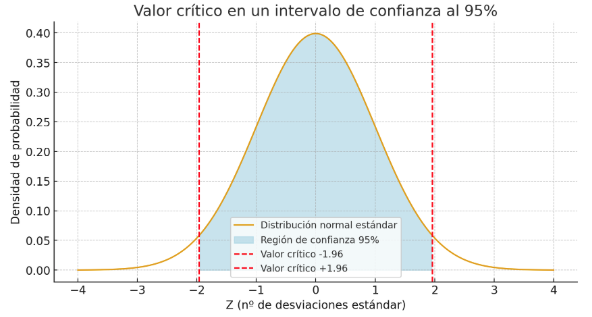
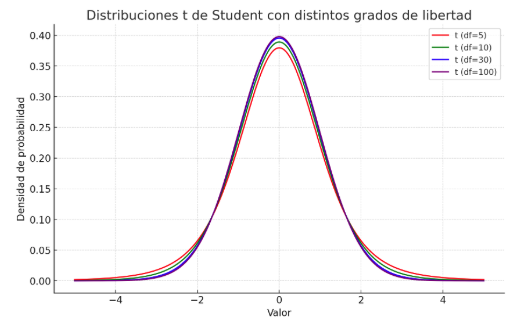
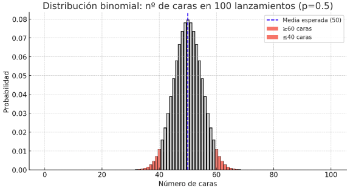
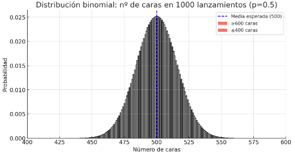
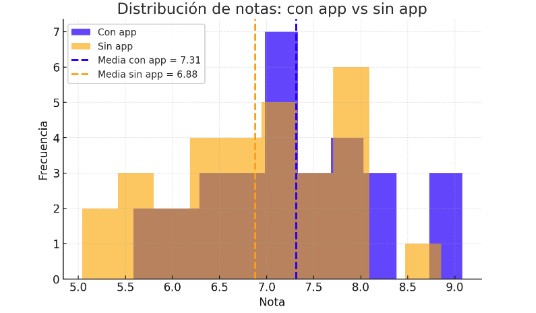
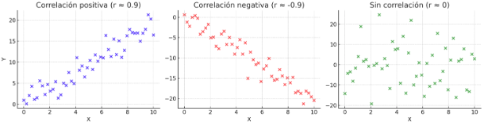
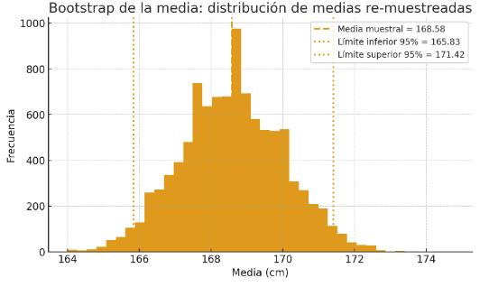

# Estadística inferencial: de la muestra a la población

## Introducción: por qué inferir más allá de los datos observados

En cualquier disciplina que trabaja con datos, ya sea medicina, economía o inteligencia artificial, rara vez tenemos acceso a toda la información posible. Lo que solemos manejar es una **muestra**, es decir, un subconjunto finito de observaciones que obtenemos de una realidad más amplia llamada **población**. La población puede ser tan variada como todos los votantes de un país, todas las imágenes que un sistema de reconocimiento facial podría recibir a lo largo de su vida útil, o todos los correos electrónicos que circularán por una bandeja de entrada. Evidentemente, observar en su totalidad esa población es imposible.

Aquí surge el primer reto: ¿cómo podemos conocer algo sobre la población completa si solo tenemos acceso a una muestra limitada? La respuesta la da la **estadística inferencial**, la rama de la estadística dedicada a **extraer conclusiones generales a partir de datos parciales**. Frente a la estadística descriptiva, que se limita a resumir la información disponible, la inferencia se atreve a dar un paso más: usar las matemáticas y la probabilidad para ir más allá de los datos en mano y estimar características globales.

Para entender la diferencia, pensemos en un ejemplo sencillo. Supongamos que queremos conocer la altura media de todos los estudiantes de un instituto con 500 alumnos. Medir a los 500 sería posible, pero quizá costoso en tiempo y recursos. Lo que normalmente haríamos es tomar una muestra, digamos 30 estudiantes escogidos al azar, medir sus alturas y calcular la media. Esa media muestral es un **estimador** de la media poblacional. Pero la clave no está solo en calcularla, sino en preguntarnos: ¿qué tan cerca está esa media de la verdadera? ¿Qué grado de confianza tenemos en nuestra estimación? ¿Podemos incluso establecer un rango de valores plausibles donde esté la altura media de todos los alumnos?

Ahí está la esencia de la inferencia: no se limita a dar un número, sino que incorpora la **incertidumbre** como parte fundamental del análisis. Los intervalos de confianza y los contrastes de hipótesis son las herramientas que permiten responder estas preguntas.

### Conexión con la inteligencia artificial

En inteligencia artificial esta lógica se repite una y otra vez. Cuando entrenamos un modelo de clasificación con un conjunto de entrenamiento, lo que hacemos en realidad es una forma de inferencia: extraer patrones de una **muestra de datos** para que el modelo pueda aplicarlos después a nuevos ejemplos nunca vistos. Al igual que en estadística, nos preocupa no solo el resultado en los datos observados, sino sobre todo la **capacidad de generalización**.

Un algoritmo que clasifica perfectamente los ejemplos del entrenamiento, pero falla estrepitosamente en datos nuevos, es el equivalente a una muestra engañosa en estadística: nos da conclusiones que no representan bien la realidad. Por eso, conceptos como el **sesgo**, la **varianza**, o la noción de “confianza en una estimación”, son tan importantes en ambos campos. La estadística inferencial nos ofrece el marco formal para entender estas cuestiones y trasladarlas al lenguaje de la IA.

> **Ejemplo:**\
> Imagina que una empresa quiere lanzar una nueva aplicación entre estudiantes universitarios y desea saber qué porcentaje estaría dispuesto a pagar una suscripción mensual. La población son miles de jóvenes en una ciudad, pero la empresa solo puede hacer una encuesta a 100 de ellos.
>
> Si 40 de los encuestados responden que sí pagarían, la proporción muestral es 40/100 = 0.40, es decir, un 40%. Ahora bien, ¿significa esto que exactamente el 40% de toda la población de estudiantes estará dispuesto a pagar? Seguramente no. Lo que podemos decir es que nuestra mejor estimación puntual es 40%, pero además debemos acompañarla de un **intervalo de confianza**, que tal vez vaya del 30% al 50%. Esto significa que, con un nivel de confianza estadístico (por ejemplo, del 95%), el verdadero porcentaje poblacional se encuentra en ese rango.
>
> Este ejemplo refleja bien la diferencia entre **describir lo observado** (la proporción en la muestra) y **hacer inferencia** (extraer conclusiones plausibles sobre toda la población).

> **Para reflexionar**\
> **Si entrenamos un modelo de IA con 1000 imágenes de perros y gatos, y el modelo obtiene un 95% de acierto en esa muestra, ¿qué podemos decir sobre su rendimiento en el mundo real, con millones de imágenes posibles? ¿Es razonable pensar que también acertará en el 95% de los casos, o deberíamos tener un margen de incertidumbre?**\
> *Piensa cómo la lógica de la inferencia estadística, que nos permite pasar de la muestra a la población, es exactamente la misma que necesitamos para evaluar la capacidad de generalización de un modelo de aprendizaje automático.*

## Muestreo y estimación

### Definición

La estadística inferencial comienza siempre con una pregunta fundamental: ¿cómo pasamos de la **muestra**, que es lo único que tenemos, a la **población**, que es lo que realmente queremos conocer? La población es el conjunto de todos los individuos u observaciones de interés. Puede ser enorme o incluso inabarcable: todos los pacientes de un hospital, todas las publicaciones de una red social o todos los píxeles que forman las imágenes que entrenan una red neuronal. Frente a ella, la muestra es un subconjunto limitado y accesible que tratamos como espejo de la realidad.

El modo en que se selecciona la muestra es crucial. Si los elementos se eligen de forma sesgada, las conclusiones quedarán distorsionadas. Por ejemplo, si queremos estudiar la satisfacción de los estudiantes de una universidad y solo encuestamos a los de una única facultad, estaremos midiendo un reflejo parcial y probablemente engañoso. El **muestreo aleatorio**, en cambio, asegura que cada individuo tiene la misma probabilidad de ser seleccionado y ofrece garantías de que la muestra representa con mayor fidelidad a la población.

Un objetivo central de la inferencia es construir **estimadores**, es decir, reglas matemáticas que permiten, a partir de la muestra, calcular un valor que aproxima al parámetro desconocido de la población. Cuando tomamos la media de una muestra de notas y la usamos como aproximación de la media de todos los estudiantes, estamos construyendo un **estimador puntual**.

La calidad de un estimador no depende solo del valor que arroja en una muestra concreta, sino también de su comportamiento en un número grande de posibles muestras. Dos propiedades resultan esenciales: el **sesgo**, que mide si el estimador tiende a acertar o a desviarse sistemáticamente del valor real, y la **varianza**, que indica cuánto fluctúa de una muestra a otra. Juntas nos permiten definir el error cuadrático medio, que en inteligencia artificial aparecerá bajo otra forma en el dilema entre sesgo y varianza que condiciona la capacidad de generalización de los modelos.

Imaginemos un instituto con 500 alumnos. Queremos conocer la altura media de toda la población, pero solo medimos a 30 elegidos al azar. Si el promedio de esa muestra es 170 cm, ese valor es un estimador puntual de la media poblacional. Pero sabemos que si hubiéramos escogido a otros 30 alumnos, el promedio quizá sería 168 o 172 cm. El resultado depende del azar del muestreo, y por eso nunca basta con dar un número aislado.

### Intervalos de confianza: medir la incertidumbre de una estimación

Se ha comentado que cuando trabajamos con datos, casi nunca conocemos el valor exacto de los parámetros de la población. Por ejemplo, no sabemos con certeza la media real de las notas de todos los estudiantes, o la proporción exacta de aciertos de un modelo de IA en el mundo real. Lo único que tenemos son **muestras**, y a partir de ellas construimos estimaciones.

Hemos visto como un **estimador puntual** nos da un número concreto, como decir que la media de las notas en una muestra de 10 alumnos es $7.2$. Pero ese número no refleja toda la historia: si tomamos otra muestra distinta, quizá obtengamos $7.0$ o $7.4$. Lo que necesitamos es expresar no solo la estimación, sino también el **margen de incertidumbre** que lleva asociado. Ahí es donde entran los **intervalos de confianza**.

Un intervalo de confianza al 95% para un parámetro es un rango de valores calculado a partir de los datos de la muestra, que tiene la propiedad de **contener el valor verdadero del parámetro en el 95% de los casos si repitiésemos el muestreo muchas veces**. Dicho de otro modo, no garantiza que el parámetro esté dentro del intervalo en un experimento particular, pero sí que el procedimiento de construcción del intervalo acierta con una frecuencia determinada en el largo plazo.

Ahora bien, cuando construimos un **intervalo de confianza**, lo que buscamos es algo muy concreto: un rango alrededor de la media de nuestra muestra que sea “lo bastante ancho” como para, con mucha probabilidad, incluir el valor verdadero de la población. El problema es decidir **qué significa “lo bastante ancho”**, y aquí es donde entra el concepto de **valor crítico**.

Imagina que la media de la población es como un blanco de diana. Cada vez que tomamos una muestra y calculamos su media, esa media es como una flecha lanzada hacia el blanco: a veces cae muy cerca del centro, otras un poco más lejos, y en raras ocasiones se va a un extremo. **La distribución normal o la t de Student nos dicen cómo suelen repartirse esas flechas.**

El **valor crítico** no es más que el límite que ponemos para decir: “Voy a abarcar la zona donde caen el 95% de las flechas. Lo que quede fuera, el 5%, lo consideraré demasiado raro.”

En números, esto significa que si usamos un 95% de confianza, los valores críticos son los puntos de corte que dejan un 2.5% de probabilidad en cada cola de la distribución. En la distribución normal, esos puntos están aproximadamente en $-1.96$ y $+1.96$. Dicho con palabras: casi todas las flechas caerán dentro de un rango de unas dos desviaciones estándar alrededor de la media.

Cuando tenemos muestras pequeñas o no conocemos la variabilidad real de la población, usamos la t de Student, que se parece a la normal pero con colas un poco más anchas. En ese caso, el valor crítico es un poco mayor, porque necesitamos cubrir más espacio para estar igual de seguros.

Las siguientes gráficas dan una idea de cómo funcionan los intervalos de confianza en una distribución de media 0 y desviación 1.

En el caso de la distribución normal, usada cuando $n$ es grande (en torno a 300 o más) vemos la región de confianza al 95% en azul

En el caso de que $n$ sea pequeño usaremos la distribución *t-student*, adaptada para el número de observaciones. Vemos que cuando $n$ crece, la distribucion tiende a la normal

En resumen, la idea central es siempre la misma:

Un **intervalo de confianza para la media** se construye tomando la media muestral $\bar X$ y sumándole/restándole un margen. Ese margen es el **factor crítico** multiplicado por el **error estándar**.

En fórmula general sería:

$$
IC_{(1-\alpha)} = \bar X \pm (\text{factor crítico}) \cdot \frac{S}{\sqrt{n}}
$$

El **error estándar** $\tfrac{S}{\sqrt{n}}$ refleja la variabilidad de la media muestral: cuanto mayor es la muestra, más pequeño es este valor.

El **factor crítico** depende de la distribución que usemos para modelar la incertidumbre:

* Si $\sigma$ es conocida o $n$ es grande, usamos la **normal estándar**, y el factor crítico es $z_{1-\alpha/2}$ (por ejemplo, $1.96$ para 95%).
* Si $\sigma$ es desconocida y $n$ es pequeño, usamos la **t de Student**, y el factor crítico es $t_{1-\alpha/2, n-1}$ (ligeramente mayor que 1.96 para reflejar la mayor incertidumbre).

Así que el procedimiento siempre es el mismo: **media muestral ± margen de error**, solo que el margen de error se adapta según el conocimiento que tengamos sobre la variabilidad real y el tamaño de la muestra.

> **Ejemplo:**
> Supongamos que medimos el tiempo medio que tarda en ejecutarse un algoritmo en 25 ejecuciones. La media observada es de $2.1$ segundos y la desviación estándar es $0.5$. Queremos un intervalo de confianza al 95%.
>
> El error estándar es
>
> $$
> \frac{0.5}{\sqrt{25}}=0.1.
> $$
>
> El valor crítico $t_{0.975,24}$ (consultado en tablas) es aproximadamente 2.064. Por tanto, el intervalo es:
>
> $$
> 2.1 \pm 2.064 \cdot 0.1 = 2.1 \pm 0.206.
> $$
>
> El intervalo de confianza resultante es $[1.894, 2.306]$. Esto significa que, aunque no sabemos el tiempo medio real de ejecución en la población, el rango entre 1.89 y 2.31 segundos es altamente plausible según los datos recogidos.
>

En lugar de quedarnos con un único número, el intervalo nos obliga a pensar en términos de **plausibilidad**. Si un modelo de clasificación muestra una precisión del 92% en la muestra, el intervalo de confianza puede decirnos que el verdadero rendimiento poblacional está entre el 89% y el 95%. Esto cambia radicalmente la interpretación: el modelo no tiene una precisión fija e inmutable, sino un rango de valores posibles condicionados por el muestreo.

Además, los intervalos son la base de la conexión con los contrastes de hipótesis. Si el intervalo al 95% para una media no contiene el valor supuesto por $H_0$, decimos que la prueba sería significativa al nivel del 5%. Esto ofrece dos miradas complementarias: el valor p nos dice “qué raro” es lo observado bajo $H_0$, y el intervalo nos dice “qué valores del parámetro son consistentes con los datos”.

> **Para reflexionar...**\
> **Si calculamos la precisión de un clasificador de imágenes con una muestra de 200 ejemplos y obtenemos un 92%, ¿qué transmite más confianza: reportar ese 92% exacto o afirmar que la precisión se encuentra entre el 89% y el 95% con un 95% de confianza?**\
> *Piensa en la diferencia entre presentar un valor único o un rango que refleja la incertidumbre. ¿Cómo cambia la interpretación para alguien que deba decidir si el modelo está listo para usarse en un entorno real?*

### El método bootstrap

El bootstrap es una de las ideas más influyentes de la estadística moderna. Su nombre proviene de la expresión inglesa *pull oneself up by one’s bootstraps*, que significa “salir adelante con tus propios medios”. Y eso es exactamente lo que hace este método: extraer conclusiones de una muestra utilizando únicamente la muestra misma, sin necesidad de fórmulas complicadas ni supuestos fuertes sobre la distribución de los datos.

La idea central es sencilla. Supongamos que tenemos una muestra de tamaño $n$. Lo que hacemos en el bootstrap es generar nuevas muestras, también de tamaño $n$, seleccionando observaciones **con reemplazo** de la muestra original. Esto significa que un mismo dato puede aparecer varias veces en una réplica, mientras que otros pueden quedar fuera. Cada una de estas réplicas se trata como un “nuevo conjunto de datos” y sobre ella se recalcula el estimador de interés (la media, la mediana, una proporción, etc.). Si repetimos el proceso cientos o miles de veces, obtenemos una colección de estimaciones que nos permite aproximar la **distribución del estimador**.

Esa distribución simulada nos da dos cosas muy valiosas: una medida de **variabilidad** (qué tanto fluctúa el estimador entre muestras) y la posibilidad de construir **intervalos de confianza** basados en los percentiles de las réplicas. En otras palabras, el bootstrap sustituye la necesidad de fórmulas exactas por un procedimiento computacional sencillo pero muy potente.

> **Ejemplo**
> Imaginemos que tenemos una muestra pequeña de 10 alumnos con sus notas:
>
> $$
> \{6, 7, 5, 8, 7, 9, 6, 8, 7, 10\}
> $$
>
> La media es 7,3. Si aplicamos el bootstrap, generamos miles de réplicas de 10 notas elegidas al azar con reemplazo de este mismo conjunto. Para cada réplica calculamos la media, y así obtenemos una distribución de medias. A partir de ella podemos calcular, por ejemplo, que el 95% central de esas medias cae entre 6,9 y 7,7. Ese rango se convierte en un intervalo de confianza empírico para la media poblacional.

La fuerza del bootstrap está en que no necesitamos asumir que las notas siguen una distribución normal ni derivar fórmulas para el error estándar: el propio remuestreo nos da la información.

#### El bootstrap en inteligencia artificial

El bootstrap no es solo una curiosidad estadística: se ha convertido en un pilar de la inteligencia artificial moderna.

En **validación de modelos**, cuando los conjuntos de datos son pequeños, el bootstrap se usa para evaluar la estabilidad de un algoritmo. Entrenamos el modelo repetidamente en réplicas del conjunto de entrenamiento y evaluamos cómo cambian sus resultados. Si el desempeño varía demasiado, sabemos que el modelo es inestable y no generaliza bien.

En **ensembles**, el bootstrap es la base del método conocido como *bagging* (Bootstrap Aggregating). La idea es entrenar múltiples modelos sobre réplicas bootstrap del conjunto de datos y luego combinar sus predicciones, generalmente mediante un voto mayoritario o un promedio. Los bosques aleatorios (random forests), uno de los algoritmos más exitosos de la práctica, se construyen exactamente así: cada árbol de decisión se entrena sobre un conjunto bootstrap distinto, y la diversidad entre árboles es la clave de la potencia del modelo.

> **Para reflexionar...**\
> **Si un modelo entrenado en un solo conjunto de datos parece dar buenos resultados, ¿cómo podemos estar seguros de que no está sobreajustado a esa muestra concreta? ¿En qué medida la idea de volver a entrenarlo en múltiples réplicas bootstrap nos ayuda a evaluar su robustez?**\
> *Piensa en cómo el bootstrap actúa como un laboratorio en miniatura: simula qué ocurriría si hubiéramos tenido diferentes muestras, y así nos da una medida de la estabilidad del modelo.*

## Contraste de hipótesis

### Hipótesis nula e hipótesis alternativa

El contraste de hipótesis es una herramienta fundamental de la estadística inferencial y, por extensión, de la inteligencia artificial. Su finalidad es responder a una pregunta muy concreta: ¿los datos que tenemos apoyan o no una afirmación sobre la población? En lugar de decidir basándonos únicamente en lo observado, el contraste ofrece un marco formal que permite separar lo que puede ser simple azar de lo que es evidencia sólida.

La lógica comienza con la formulación de dos hipótesis. La **hipótesis nula** ($H_0$) representa la afirmación inicial que se somete a prueba, mientras que la **hipótesis alternativa** ($H_1$) recoge la posibilidad de que esa afirmación no sea cierta. Así, por ejemplo, si queremos comprobar si una nueva versión de un sistema de recomendación es tan eficaz como la anterior, la hipótesis nula podría ser que “ambas versiones tienen la misma tasa media de aciertos”, y la alternativa que “la nueva versión mejora la tasa de aciertos”.

Una vez formuladas, necesitamos una forma de decidir. Para ello, se construye un **estadístico de prueba** que resume en un solo número la evidencia contenida en los datos frente a $H_0$. Ese número se compara con la distribución teórica que tendría si $H_0$ fuera cierta, lo que nos permite juzgar si el resultado observado es compatible o no con la hipótesis inicial.

#### Hipótesis nula y alternativa: un ejemplo ilustrativo

Para comprender cómo se construyen y se interpretan las hipótesis en un contraste, es útil plantear un escenario sencillo y cercano. Imaginemos que una universidad quiere comprobar si un nuevo método de enseñanza online mejora el rendimiento de los estudiantes en un examen final.

La **hipótesis nula** ($H_0$) es siempre el punto de partida. Representa la situación que se mantiene “por defecto” hasta que haya suficiente evidencia para rechazarla. En este caso, lo más natural es formularla como:

$$
H_0:\ \mu_{\text{nuevo}} = \mu_{\text{tradicional}}
$$

donde $\mu_{\text{nuevo}}$ es la media de las notas con el método online y $\mu_{\text{tradicional}}$ la media con el método clásico. La hipótesis nula afirma que **no hay diferencia real entre los dos métodos**.

La **hipótesis alternativa** ($H_1$), en cambio, expresa lo que nos interesa demostrar. Puede tener varias formas según la pregunta:

* Si queremos comprobar si el método online es mejor, entonces

$$
H_1:\ \mu_{\text{nuevo}} > \mu_{\text{tradicional}}
$$

* Si solo queremos saber si existe alguna diferencia, sin importar el sentido, formulamos una alternativa bilateral:

$$
H_1:\ \mu_{\text{nuevo}} \ne \mu_{\text{tradicional}}
$$

Así, la nula funciona como el “estado de conservación” y la alternativa como la hipótesis de cambio.

> **Ejemplo**\
> Supongamos que con el método tradicional la media histórica de calificaciones es de 6.5 sobre 10. El equipo docente aplica el nuevo método a 50 estudiantes y obtiene una media de 7.0 con desviación típica 0.6. La hipótesis nula sería $H_0:\ \mu=6.5$, mientras que la alternativa podría ser $H_1:\ \mu>6.5$. El contraste nos permitirá evaluar si esa diferencia de 0.5 puntos es simplemente fruto del azar en la muestra o una señal de mejora real.

> **Para reflexionar...**\
> **¿Por qué crees que en estadística se parte siempre de la hipótesis nula y no de la alternativa?**\
> *Piensa en cómo el contraste exige una postura conservadora: primero asumimos que no hay efecto y solo lo rechazamos si los datos aportan evidencia suficiente. Esta lógica evita que demos por ciertos cambios que en realidad podrían deberse al azar.*

### Errores y potencia

Tomar una decisión a partir de datos nunca es infalible. La decisión de aceptar o rechazar la hipótesis nula depende de los datos observados, pero esos datos provienen de una muestra y, por tanto, siempre existe incertidumbre. Para organizar esta situación, se definen dos posibles errores: el de **tipo I** y el de **tipo II**.

El **error de tipo I** ocurre cuando rechazamos la hipótesis nula siendo en realidad cierta. Es como dar por probado un efecto que en realidad no existe. La probabilidad de cometer este error se fija de antemano y se llama **nivel de significación**, habitualmente $\alpha = 0.05$. Esto significa que, incluso si $H_0$ es cierta, aceptamos que en un 5% de los casos podríamos rechazarla por azar.

El **error de tipo II**, en cambio, ocurre cuando no rechazamos la hipótesis nula a pesar de que es falsa. En este caso, dejamos pasar una diferencia real porque la evidencia en los datos no fue suficiente para detectarla. La probabilidad de este error se denota $\beta$, y su complemento ($1-\beta$) se llama **potencia del test**, que mide la capacidad de detectar efectos reales.

> **Ejemplo:**
>
> Imaginemos que estamos desarrollando un detector de spam. Queremos comprobar si un nuevo filtro reduce la proporción de correos no detectados respecto al filtro actual.
>
> - La **hipótesis nula** es que ambos filtros tienen la misma tasa de aciertos ($H_0$).
> - La **hipótesis alternativa** es que el nuevo filtro mejora esa tasa ($H_1$).
>
> Un **error de tipo I** sería concluir que el nuevo filtro es mejor cuando en realidad no lo es. Es como instalar un sistema más complejo y costoso que no aporta ninguna mejora real.
>
> Un **error de tipo II** sería no detectar la mejora cuando en realidad sí existe. En ese caso, dejaríamos pasar la oportunidad de usar un filtro más eficaz y seguiríamos recibiendo más spam de lo necesario.
>
> La clave está en que ambos errores no pueden eliminarse a la vez: si bajamos el nivel de significación (por ejemplo, de 0.05 a 0.01) reducimos la probabilidad de cometer un error de tipo I, pero al mismo tiempo aumentamos la probabilidad de cometer un error de tipo II. Por eso en la práctica hay que equilibrar el nivel de exigencia con la potencia, lo que suele implicar trabajar con muestras suficientemente grandes.
>

> **Para reflexionar...**\
> **Si subimos el nivel de exigencia a $\alpha = 0.01$ para estar muy seguros de que un filtro realmente mejora al anterior, ¿qué riesgo asumimos respecto al error de tipo II?**\
> *Piensa en cómo una prueba demasiado estricta puede hacer que pasemos por alto mejoras reales, mientras que una prueba demasiado laxa puede hacernos aceptar mejoras inexistentes. En IA, este equilibrio es esencial cuando evaluamos y comparamos modelos.*

### El valor p: qué es, cómo se calcula y qué NO significa

El valor p puede entenderse de forma clara si intentamos responder a una pregunta muy concreta. Supongamos que partimos de la hipótesis nula $H_0$, que representa el escenario en el que no hay ningún efecto especial, como si fuera nuestro punto de referencia. Entonces lo que nos preguntamos es: **si ese escenario fuese realmente cierto, ¿qué tan raro sería observar unos datos como los que tenemos?**

La respuesta es precisamente el valor p. Se calcula como la probabilidad de obtener un resultado tan extremo o más que el que observamos, bajo la suposición de que $H_0$ es verdadera. La palabra “extremo” no es trivial. En un contraste bilateral se consideran extremos los resultados que se alejan mucho del valor esperado tanto por encima como por debajo. En un contraste unilateral, en cambio, solo se consideran extremos los resultados que se desvían en una dirección concreta, la que indica la hipótesis alternativa.

Cuando hablamos de **contraste bilateral** y **contraste unilateral** nos estamos refiriendo a la forma en que definimos qué resultados se consideran “extremos” frente a la hipótesis nula. La diferencia es sutil en lo formal, pero muy importante en la práctica.

En un **contraste bilateral**, lo que se quiere comprobar es si existe **cualquier diferencia** con respecto a lo que dice la hipótesis nula, sin importar en qué dirección. El interés está en detectar desviaciones hacia arriba o hacia abajo con respecto al valor esperado. Por eso, en este tipo de contraste, los valores “extremos” son aquellos que se alejan mucho del centro en ambos sentidos. Un ejemplo sencillo sería probar si una moneda es justa. La hipótesis nula sería $H_0: p = 0.5$, y la alternativa $H_1: p \ne 0.5$. Si obtenemos muchos más caras de lo esperado o muchas menos, en ambos casos nos parece sospechoso.

En cambio, en un **contraste unilateral**, la pregunta es más específica: nos interesa saber si la realidad se desvía **en una dirección concreta**. En este caso los resultados extremos solo se consideran en un lado de la distribución. Retomando el ejemplo de la moneda, podríamos querer comprobar si está cargada hacia las caras, con $H_0: p=0.5$ y $H_1: p>0.5$. Si obtenemos más caras de lo habitual, eso es un resultado extremo a favor de la hipótesis alternativa; en cambio, que aparezcan muchas cruces no nos llevaría a rechazar $H_0$, porque no es esa la dirección que nos interesa.

La elección entre un contraste bilateral y uno unilateral depende de la **pregunta inicial**. Si lo que se quiere es comprobar si un nuevo modelo de IA es diferente a otro, el planteamiento natural es bilateral, porque puede rendir mejor o peor. Si lo que interesa es comprobar específicamente si mejora, entonces el contraste será unilateral.

> **Para reflexionar...**\
> **Si comparas un modelo antiguo y uno nuevo de clasificación de imágenes, y el nuevo obtiene un 92% de precisión frente al 90% del antiguo, ¿plantearías un contraste bilateral o unilateral?**\
> *Piensa en cómo cambia la hipótesis alternativa según lo que quieras demostrar: ¿te basta con que el rendimiento sea distinto o quieres evidenciar que es mejor?*

Es importante entender que el valor p **no es un juicio definitivo sobre la verdad o falsedad de la hipótesis nula**, sino un indicador de coherencia entre lo que esperaríamos bajo ese supuesto y lo que realmente hemos observado en la muestra.

Calcular un valor p exige tres ingredientes: una hipótesis nula $H_0$, un **estadístico de prueba** que concentre la evidencia (por ejemplo, una diferencia de medias estandarizada) y la **distribución** de ese estadístico **cuando $H_0$ es cierta**. El valor p se obtiene como el área de cola de esa distribución más allá del valor observado del estadístico.

La regla práctica de decisión es conocida: si $p$ es pequeño, los datos serían raros si $H_0$ fuese verdadera, y tomamos eso como evidencia contra $H_0$. Por costumbre, $p\le 0.05$ se llama “significativo”. Conviene subrayarlo: **un valor p pequeño no dice que $H_0$ sea falsa** ni cuantifica la probabilidad de que lo sea; solo indica que **estos datos** encajan mal con **este modelo nulo**.

#### Ejemplo: el valor p con una moneda

Imagina que queremos comprobar si una moneda es justa, es decir, si tiene la misma probabilidad de dar cara que de dar cruz. Nuestra hipótesis nula $H_0$ es entonces:

$$
H_0: p = 0.5
$$

donde $p$ representa la probabilidad de obtener cara.

Lanzamos la moneda 100 veces y observamos que han salido **60 caras**. A primera vista, podría parecernos sospechoso, porque lo habitual sería ver algo más cercano a 50. La pregunta es: ¿realmente este resultado es una prueba de que la moneda está trucada, o puede ser simplemente fruto del azar?

Aquí es donde entra en juego el **valor p**. Para calcularlo, necesitamos preguntarnos:

**Si la moneda fuera justa, ¿qué probabilidad habría de obtener un resultado tan raro como 60 caras (o más) en 100 lanzamientos?**

Sabemos que el número esperado de caras con una moneda justa es 50. Además, la variabilidad natural del número de caras (lo que llamamos la desviación típica) es de aproximadamente 5. Eso significa que, aunque la moneda sea justa, en la práctica lo normal será obtener resultados en un rango alrededor de 50, por ejemplo 45, 52 o 48.

Ahora bien, obtener 60 caras significa estar a **10 por encima de lo esperado**, lo que equivale a unas **dos desviaciones típicas**. En términos probabilísticos, eso es un suceso poco frecuente.

Si calculamos la probabilidad exacta (o bien usamos una aproximación normal para simplificar), vemos que la probabilidad de obtener 60 o más caras es aproximadamente un **2.3%**. Como el contraste es bilateral —también nos parecería raro obtener solo 40 o menos— debemos duplicar ese valor, lo que nos da un valor p de **0.046**, es decir, un 4.6%.

Esto significa que, incluso si la moneda es justa, existe una pequeña probabilidad (cerca del 5%) de observar un resultado tan extremo como el nuestro solo por azar. Como esta probabilidad es baja, decidimos **rechazar $H_0$** al nivel habitual de significación (5%).

Pero cuidado: rechazar $H_0$ no significa demostrar que la moneda esté trucada con certeza absoluta. Significa que lo que hemos visto es **poco compatible con la hipótesis de que sea justa**.

Para verlo mejor, pensemos en repetir el experimento con 1000 lanzamientos. Supongamos que de nuevo aparece un 60% de caras (600). La desviación típica en este caso ya no es 5, sino casi 16, pero la diferencia entre 600 y lo esperado (500) es de 100. Eso equivale a más de 6 desviaciones típicas de distancia, lo que lo hace extraordinariamente improbable bajo $H_0$. El valor p resultante cae por debajo de una millonésima.

Esto muestra una idea fundamental: **el mismo efecto relativo puede generar más o menos evidencia según el tamaño de la muestra**. Con 100 lanzamientos, un 60% de caras puede parecer sospechoso pero aún posible. Con 1000, ese mismo 60% prácticamente descarta la hipótesis de una moneda justa.

> **Para reflexionar...**\
> **¿Qué crees que ocurriría si, en vez de 100 o 1000 lanzamientos, repitiéramos el experimento con 10 000? ¿Cambiaría el valor p aunque la proporción siguiera siendo la misma?**\
> *Piensa en cómo el tamaño de la muestra influye en la fuerza de la evidencia. Cuantos más datos tenemos, más fácil es detectar pequeñas desviaciones con gran seguridad.*

Esta comparación nos permite entender dos matices muy importantes sobre el valor p. El primero es que **el valor p depende del tamaño de la muestra**. Si contamos con muchos datos, incluso diferencias muy pequeñas respecto a la hipótesis nula pueden dar lugar a valores p extremadamente bajos y aparecer como “significativas”. En cambio, con muestras pequeñas, diferencias que sí son relevantes en la práctica pueden pasar desapercibidas porque el test carece de potencia para detectarlas. Esto quiere decir que el valor p no nos habla directamente de la magnitud de un efecto, sino de cuán improbable resulta bajo el supuesto de $H_0$.

El segundo matiz es justamente ese: **el valor p no mide el tamaño del efecto**. Para conocer la importancia práctica de lo que observamos necesitamos otras herramientas, como calcular la diferencia de medias, proporciones o métricas entre modelos y acompañarlas de su **intervalo de confianza**. Ese intervalo no solo nos da una estimación puntual, sino también un rango de valores plausibles para el parámetro en cuestión.

De hecho, existe una relación directa entre los contrastes y los intervalos de confianza. En problemas habituales, si el **intervalo de confianza al 95%** para un parámetro no incluye el valor que plantea la hipótesis nula, entonces el contraste bilateral al 5% será significativo. La diferencia es de enfoque: el valor p mide la “rareza” del dato bajo $H_0$, mientras que el intervalo nos da un rango de valores compatibles con lo observado.

En inteligencia artificial, esta discusión es especialmente relevante cuando comparamos modelos. Es habitual preguntarse si un aumento en precisión, F1 o AUC refleja una mejora real o si podría explicarse por el azar del muestreo. El valor p puede ayudarnos a responder esa pregunta, pero no debe ser el único criterio. Lo recomendable es acompañarlo siempre de la magnitud de la mejora y de un intervalo de confianza, además de considerar el coste de implementar el nuevo modelo frente al beneficio práctico que aporta.

> **Para reflexionar...**\
> **Si pasas de F1 = 0.910 a F1 = 0.918 con $p=0.03$ gracias a más datos de entrenamiento, ¿es una mejora que merece el cambio de modelo? ¿Y si con el doble de datos obtienes $p<10^{-6}$ para una mejora de solo 0.003?**\
> *Piensa en el equilibrio entre significación estadística, tamaño de efecto y relevancia práctica: el valor p te habla de evidencia contra* $H_0$, *no de utilidad real del cambio.*

Para concluir volvamos a insistir **qué es y qué no es el valor p**. A menudo se interpreta como la probabilidad de que la hipótesis nula sea cierta, es decir, $P(H_0|\text{datos})$, y **esto no es así**. En realidad el valor p mide otra cosa: es la probabilidad de observar unos datos tan extremos como los obtenidos, o incluso más, **suponiendo que la hipótesis nula es cierta**. Matemáticamente, hablamos de $P(\text{datos extremos}|H_0)$.

Esto tiene varias consecuencias importantes. En primer lugar, un valor p pequeño no significa que el efecto observado sea necesariamente grande. Puede que el efecto sea diminuto, pero como hemos visto antes, con un tamaño de muestra lo bastante grande, incluso esas diferencias minúsculas se vuelven “estadísticamente significativas”. Del mismo modo, un valor p grande no demuestra que la hipótesis nula sea verdadera; simplemente indica que los datos observados no se alejan lo suficiente de lo que esperaríamos bajo $H_0$.

También es clave recordar que el valor p depende de cómo definimos lo que entendemos por “extremo”. En un contraste bilateral consideramos resultados alejados en ambos sentidos de la hipótesis nula, mientras que en un contraste unilateral solo nos fijamos en una dirección. Esta elección afecta al valor p y, por tanto, a la conclusión.

Finalmente, el valor p descansa sobre supuestos del modelo: independencia de las observaciones, normalidad de la distribución de los errores o tamaño muestral suficiente. Si esas condiciones no se cumplen, el valor p pierde su significado y puede inducir a conclusiones erróneas.

Por todo ello, el valor p debe verse como **una pieza más dentro de un informe más completo**. En estadística aplicada, y especialmente en inteligencia artificial, no basta con reportar que “el resultado es significativo”. Es necesario acompañarlo de estimaciones puntuales, intervalos de confianza, medidas de tamaño de efecto y, en el contexto de IA, métricas de negocio, robustez del modelo y validaciones cruzadas. Solo de esta manera evitamos que el valor p se convierta en una cifra aislada y damos una visión más realista de la evidencia.

### Ejemplo ilustrativo: comparación de medias

Imaginemos un escenario sencillo. Queremos saber si los estudiantes que usan una nueva app de estudio obtienen mejores calificaciones que los que no la usan. Para ello tomamos dos muestras: 30 estudiantes que usan la app y 30 que no la usan. Las medias observadas son 7.5 en el grupo con la app y 7.0 en el grupo sin la app. La variabilidad en ambos grupos, medida por la desviación estándar, ronda el valor 1.

La hipótesis nula plantea que **no hay diferencia real entre las medias de los dos grupos** ($H_0: \mu_1 = \mu_2$). La hipótesis alternativa sostiene que **la app mejora las notas** ($H_1: \mu_1 > \mu_2$).

El razonamiento del contraste consiste en comparar la diferencia observada de medias (0.5 puntos) con lo que cabría esperar por azar debido a la variabilidad de los datos. Para ello construimos un **estadístico de prueba**, que en este caso es aproximadamente

$$
t = \frac{\bar{X}_1 - \bar{X}_2}{SE}
$$

donde $\bar{X}_1 - \bar{X}_2$ es la diferencia de medias y $SE$ es el **error estándar de la diferencia**, una medida que combina la dispersión de ambos grupos y su tamaño muestral. Si la diferencia entre medias es grande comparada con el error estándar, el estadístico $t$ será alto y nos llevará a rechazar la hipótesis nula.

Supongamos que el cálculo nos da $t = 2.1$. Con 58 grados de libertad, el valor crítico de una t de Student a un nivel del 5% es aproximadamente 1.67 en un contraste unilateral. Como 2.1 es mayor que 1.67, concluimos que la diferencia observada es lo bastante grande para rechazar la hipótesis nula al 5%. Dicho en palabras: los datos aportan evidencia de que la app mejora las calificaciones.

Este ejemplo aclara algo importante: el resultado no depende solo de la diferencia de medias, sino también de la variabilidad y del tamaño muestral. Si en lugar de 30 estudiantes por grupo solo tuviéramos 5, la misma diferencia de medias (0.5) se volvería menos concluyente porque el error estándar sería mayor. En cambio, con muestras muy grandes, diferencias incluso menores podrían resultar “significativas”.

El razonamiento es exactamente el mismo que se aplica en la comparación de modelos de IA. Si un algoritmo obtiene un 92% de aciertos y otro un 90%, no basta con mirar esos porcentajes: debemos preguntarnos si la diferencia es real o si podría deberse al azar del muestreo. El contraste de hipótesis ofrece un marco formal para responder a esa pregunta, ayudándonos a distinguir entre una mejora aparente y una mejora estadísticamente respaldada.

> **Para reflexionar...**\
> **Si un modelo de clasificación obtiene una precisión del 92% y otro del 90%, pero ambos fueron evaluados con apenas 200 ejemplos, ¿podemos estar seguros de que el primero es realmente mejor?**\
> *Piensa en cómo el contraste de hipótesis introduce la noción de incertidumbre y nos recuerda que no basta con mirar una diferencia de porcentajes: necesitamos preguntarnos si esa diferencia es estadísticamente significativa y si la muestra es suficiente para confiar en la conclusión.*

## Correlación y dependencia

### El coeficiente de correlación como medida de relación lineal

En estadística, uno de los problemas más habituales es comprender si dos variables se relacionan entre sí. En inteligencia artificial este interés aparece constantemente: ¿cómo se vincula el número de horas de estudio con la nota de un examen?, ¿cómo varía la probabilidad de que un cliente compre un producto según su edad?, ¿existe alguna relación entre el número de “me gusta” en redes sociales y el tiempo de permanencia en la aplicación?

Para medir este tipo de relación lineal utilizamos el **coeficiente de correlación de Pearson**, normalmente representado como $r$. Su valor siempre está entre $-1$ y $1$, lo que nos da un lenguaje muy claro para describir la intensidad y la dirección de la asociación. Cuando $r$ es cercano a 1, significa que existe una **relación lineal positiva fuerte**: cuando una variable aumenta, la otra también lo hace. Cuando $r$ está cerca de $-1$, hablamos de una **relación lineal negativa fuerte**: una variable aumenta mientras la otra disminuye. Por último, valores de $r$ cercanos a 0 indican **ausencia de relación lineal**, aunque esto no descarta que pueda existir algún tipo de asociación no lineal.

La fórmula de cálculo de $r$ muestra esta lógica de forma precisa. Si tenemos dos variables $X$ e $Y$, cada una con $n$ observaciones, el coeficiente de correlación se define como

$$
r = \frac{\text{cov}(X,Y)}{\sigma_X \cdot \sigma_Y}
$$

donde $\text{cov}(X,Y)$ es la **covarianza** entre $X$ e $Y$, y $\sigma_X$, $\sigma_Y$ son las desviaciones estándar de cada variable. La covarianza mide cómo varían las dos variables de manera conjunta: si ambas tienden a desviarse de su media en la misma dirección, la covarianza es positiva; si lo hacen en direcciones opuestas, es negativa. Al dividirla entre las desviaciones estándar, conseguimos una medida normalizada entre −1 y 1, que nos permite comparar relaciones en distintos contextos.

> **Ejemplo**\
> Supongamos que en una clase recogemos las horas de estudio y las notas de cinco estudiantes:
> $X =$ [2, 4, 5, 6, 8] horas de estudio.
> $Y =$ [5, 6, 7, 8, 9] calificaciones.
> A simple vista parece que cuanto más se estudia, mejor es la nota. Si calculamos $r$, obtendríamos un valor cercano a 0.97, lo que refleja una **relación lineal positiva muy fuerte**.

En inteligencia artificial, la correlación se convierte en una primera herramienta para **explorar relaciones entre variables** en datasets. Por ejemplo, antes de entrenar un modelo de predicción de precios de viviendas, calcular las correlaciones entre el precio y atributos como superficie, número de habitaciones o distancia al centro nos da una idea preliminar de qué factores parecen tener mayor impacto.

> **Para reflexionar...**\
> **Si en un conjunto de datos de entrenamiento descubrimos que dos variables tienen una correlación muy alta, ¿qué implicaciones puede tener para un modelo de IA?**\
> *Piensa en la redundancia de información y cómo podría afectar al rendimiento del modelo, ya sea dificultando la interpretación de los parámetros en una regresión o introduciendo problemas de multicolinealidad en algoritmos más complejos.*

A continuación se presenta un gráfico ilustrativo de tres escenarios distintos de correlación: En primer lugar, una **correlación positiva**, en la que los puntos se alinean con una pendiente ascendente e indicando que al aumentar $X$ también aumenta $Y$. En segundo lugar, una **correlación negativa**, en la que los puntos siguen una pendiente descendente de modo que al crecer $X$, $Y$ tiende a disminuir. Por último, un gráfico en el que no se aprecia **correlación**, en el que los puntos aparecen dispersos al azar, sin ninguna tendencia clara.

Este tipo de visualización es muy útil en análisis de datos, porque permite detectar de un vistazo si existe relación lineal entre variables, antes incluso de calcular el coeficiente de correlación.

### Limitaciones: correlación no implica causalidad

El coeficiente de correlación es una herramienta poderosa para detectar patrones lineales entre dos variables, pero su interpretación requiere mucho cuidado. Una correlación alta puede ser un indicio de que existe una relación, pero **no garantiza que una variable cause cambios en la otra**.

En la práctica, es común encontrar **correlaciones espurias**, es decir, asociaciones que aparecen en los datos pero que no tienen un vínculo causal real. Un ejemplo famoso es el de las ventas de helados y los ahogamientos: ambas variables están correlacionadas positivamente, pero la causa común es el calor del verano, no que vender más helados provoque más accidentes.

Este problema es muy relevante en inteligencia artificial. Si un modelo de predicción se entrena con datos donde aparecen correlaciones espurias, puede terminar tomando decisiones equivocadas. Por ejemplo, si en un dataset médico los pacientes de cierta enfermedad son mayoritariamente de un hospital concreto, el algoritmo puede “aprender” a asociar la enfermedad con el hospital en lugar de con los síntomas, confundiendo correlación con causalidad.

Matemáticamente, una correlación elevada significa que dos variables se mueven juntas en promedio, pero no dice nada sobre la dirección de la influencia. Que $X$ y $Y$ estén correlacionados no implica que $X \to Y$ ni que $Y \to X$; también puede existir una **tercera variable oculta** que esté influyendo sobre ambas.

> **Ejemplo**\
> Imaginemos que en un dataset de recomendación de música observamos que la edad de los usuarios está correlacionada con el número de canciones de un cierto género que escuchan. ¿Significa eso que cumplir años causa que alguien escuche más jazz o reguetón? No necesariamente. Puede que lo que realmente influya sea la **cohorte generacional**: haber crecido en un contexto cultural concreto explica tanto la edad como la preferencia musical.

> **Para reflexionar...**\
> **Si un modelo de IA se entrena en un dataset con correlaciones espurias, como la relación entre hospital y enfermedad, ¿qué podría ocurrir cuando se despliegue en un entorno nuevo?**\
> *Piensa en cómo la falta de causalidad puede hacer que el modelo se equivoque sistemáticamente cuando cambian las condiciones del entorno, mostrando la importancia de distinguir entre patrones aparentes y relaciones reales.*

### Independencia condicional: concepto clave en modelos probabilísticos

Hasta ahora hemos hablado de correlación como medida de relación lineal y de sus limitaciones para establecer causalidad. Un concepto más general y potente, especialmente útil en inteligencia artificial, es el de **independencia condicional**.

Decimos que dos eventos o variables $X$ y $Y$ son independientes condicionalmente a una tercera $Z$ cuando, una vez que conocemos la información de $Z$, la relación directa entre $X$ y $Y$ desaparece. Formalmente, esto se escribe como:

$$
P(X \mid Y, Z) = P(X \mid Z).
$$

En otras palabras, si ya sabemos lo que ocurre con $Z$, añadir información sobre $Y$ no cambia nuestra creencia sobre $X$.

Este concepto es crucial en IA porque permite simplificar cálculos complejos y construir modelos más manejables. Un ejemplo cotidiano lo aclara: supongamos que estamos interesados en la relación entre el uso de paraguas y la probabilidad de que las calles estén mojadas. A simple vista, ambas variables parecen estar correlacionadas: cuando hay más paraguas en la calle, también solemos ver el suelo mojado. Sin embargo, si condicionamos a la variable “lluvia”, la relación directa desaparece: dado que sabemos si está lloviendo o no, la información sobre paraguas ya no aporta nada nuevo para predecir si la calle está mojada. El factor clave es la lluvia, y al tenerlo en cuenta, se rompe la conexión aparente entre paraguas y calles mojadas.

Veremos en modelos probabilísticos como las **redes bayesianas**, esta idea se representa gráficamente mediante nodos y flechas. La independencia condicional permite factorizar distribuciones de probabilidad muy complejas en fragmentos más simples, lo que hace posible trabajar con cientos o miles de variables.

También en el aprendizaje por refuerzo, aparece bajo otra forma muy conocida: la **hipótesis de Markov**. Según esta hipótesis, la acción futura de un agente depende únicamente del estado actual del sistema y no de toda la historia pasada. Dicho de otro modo, conocer el estado presente ya contiene toda la información relevante, y condicionando a él, las dependencias con estados previos desaparecen.

> **Ejemplo**\
> Imaginemos un sistema de recomendación de películas. A simple vista puede parecer que la variable “género de la última película vista” y la variable “próxima película elegida” están directamente relacionadas. Pero si añadimos la variable “preferencias generales del usuario”, el vínculo directo desaparece: una vez que sabemos que el usuario en general prefiere la ciencia ficción, tanto la última película vista como la siguiente elección se explican por esa preferencia de fondo.

> **Para reflexionar...**\
> **¿Por qué es tan útil la independencia condicional en IA?**\
> *Piensa en cómo permite descomponer problemas intratables en partes más pequeñas, facilitando el diseño de modelos probabilísticos que serían imposibles de calcular de manera directa.*

## Métodos computacionales en inferencia

Cuando el análisis estadístico clásico se queda corto, ya sea porque los datos son muy complejos, porque trabajamos con muchísimas variables o porque las fórmulas exactas se vuelven impracticables, se suele recurrir a **métodos computacionales**. Estos enfoques no buscan reemplazar a la estadística tradicional, sino ampliarla con herramientas que aprovechan la capacidad de cálculo de los ordenadores. En inteligencia artificial, su importancia es enorme, porque permiten evaluar modelos en condiciones realistas y trabajar en entornos de alta dimensionalidad.

### Validación cruzada como estimación de desempeño en IA

Hemos visto ya como en la estadística clásica, la inferencia tiene un objetivo muy claro: **a partir de una muestra, sacar conclusiones sobre una población**. Calculamos medias, proporciones o diferencias y, mediante intervalos de confianza o contrastes de hipótesis, tratamos de responder a la pregunta fundamental: *¿lo que hemos observado en la muestra refleja lo que ocurre en la población entera?*

Cuando pasamos al terreno de la inteligencia artificial, la pregunta cambia ligeramente, pero la lógica es la misma. Aquí no nos interesa tanto estimar parámetros poblacionales como **evaluar el desempeño de un modelo predictivo**. Dicho en otras palabras: *¿qué tan bien funcionará este algoritmo en datos que todavía no hemos visto?*

La **validación cruzada** es la herramienta que nos permite responder a esa pregunta con el mismo espíritu inferencial que conocimos en estadística. Consiste en dividir los datos disponibles en varias partes, entrenar el modelo en una porción y evaluarlo en la parte restante, rotando este procedimiento varias veces. Al final obtenemos una colección de resultados (precisiones, errores, AUC...), que nos permiten estimar no solo un valor medio de rendimiento, sino también su variabilidad.

La idea es muy similar a la de los intervalos de confianza. Cuando repetimos la validación cruzada, no buscamos un único número, sino una **estimación robusta del desempeño** y un rango dentro del cual es razonable esperar que caiga el verdadero rendimiento en datos nuevos. Así, la validación cruzada puede entenderse como un “muestreo dentro de la muestra”: no conocemos el futuro, pero creamos versiones simuladas del proceso de entrenamiento y prueba para aproximarlo.

> **Ejemplo**\
> Supongamos que entrenamos un modelo para clasificar correos en “spam” o “no spam” con 1000 ejemplos. Si usamos el 80% de los datos para entrenar y el 20% para probar, el resultado depende demasiado de qué 200 correos concretos caen en el conjunto de test. Podría ser que, por azar, justo esos correos fueran más fáciles de clasificar. La validación cruzada evita este sesgo: dividimos el dataset en, por ejemplo, 5 pliegues. Cada pliegue actúa como test una vez, mientras los otros cuatro se usan para entrenar. Al final, tenemos 5 estimaciones y su promedio nos da una visión mucho más estable del rendimiento esperado.

La conexión con la inferencia estadística se hace evidente. Mientras que en los apartados anteriores hemos visto cómo usar una muestra para estimar parámetros poblacionales (la media de notas de todos los estudiantes, la proporción de aciertos de un modelo en el mundo real), aquí aplicamos la misma lógica para estimar el **rendimiento de un modelo en datos no observados**.

En resumen, la validación cruzada es un recordatorio de que en IA no basta con entrenar y medir en una sola muestra. Igual que en estadística no nos conformamos con un número puntual, sino que buscamos intervalos y medidas de incertidumbre, en IA necesitamos un procedimiento que nos permita generalizar. La validación cruzada cumple exactamente esa función: **llevar la lógica de la inferencia al terreno de los modelos predictivos**.

> **Para reflexionar...**\
> **Si un modelo alcanza un 95% de acierto en un único conjunto de test, pero en validación cruzada sus resultados oscilan entre el 85% y el 95%, ¿qué conclusión deberíamos sacar?**\
> *Piensa en cómo la validación cruzada refleja la variabilidad del rendimiento y nos alerta de que un número aislado puede ser engañoso. Lo importante no es solo el valor puntual, sino la consistencia del desempeño en distintas particiones de los datos.*

### Simulaciones y métodos de Monte Carlo para problemas de alta dimensión

En los apartados anteriores hemos visto cómo la inferencia estadística clásica se apoya en fórmulas exactas: la media muestral para estimar la media poblacional, la varianza para estimar la dispersión, los contrastes de hipótesis con distribuciones bien conocidas como la normal o la t de Student. Pero ¿qué ocurre cuando las fórmulas se vuelven intratables, cuando tenemos demasiadas variables, o cuando la distribución real de los datos es demasiado compleja?

Aquí es donde entran en juego los **métodos de simulación**, y entre ellos destaca la familia de los **métodos de Monte Carlo**. La idea es sorprendentemente sencilla: en lugar de buscar una solución analítica exacta, generamos miles o millones de repeticiones aleatorias del problema y usamos los resultados para aproximar las probabilidades, los parámetros o el comportamiento de un modelo.

Podemos pensarlo como un casino matemático. Cada repetición es como una tirada de dados: no nos dice mucho por sí sola, pero al repetir muchas veces obtenemos una imagen clara de cómo se comporta el sistema en promedio. De hecho, el nombre “Monte Carlo” viene de la analogía con el azar de los juegos de casino.

> **Ejemplo**\
> Imagina que queremos calcular la probabilidad de que la media de un examen supere el 7, pero los datos reales no siguen una distribución normal clara. En lugar de recurrir a fórmulas exactas, podemos tomar la muestra disponible y generar muchas simulaciones extrayendo subconjuntos aleatorios (con reemplazo). Al calcular en cada simulación la media y observar cuántas veces supera el 7, obtenemos una estimación aproximada de esa probabilidad.

En inteligencia artificial, los métodos de Monte Carlo son especialmente útiles en tres contextos. El primero es el de los **modelos bayesianos**, donde necesitamos muestrear distribuciones de probabilidad demasiado complicadas para describirlas con una fórmula cerrada. El segundo es el **cálculo de expectativas en problemas de decisión**: un agente puede simular miles de trayectorias posibles de sus acciones para estimar la recompensa futura esperada. El tercero es la **validación de modelos en entornos de alta dimensión**, donde los métodos exactos son imposibles y recurrimos a simulaciones para entender la variabilidad del rendimiento.

Un aspecto importante es que Monte Carlo se conecta directamente con la lógica de la inferencia. Igual que un intervalo de confianza nos dice que un parámetro es “plausible” dentro de un rango, las simulaciones Monte Carlo nos ofrecen un rango de posibles resultados para un modelo o un algoritmo. No buscamos la certeza absoluta, sino una estimación con su margen de incertidumbre, construida a base de repetición y aleatoriedad controlada.

> **Para reflexionar...**\
> **Si entrenamos un modelo de IA y lo evaluamos una sola vez, obtenemos un número. Pero si repetimos el proceso de entrenamiento y evaluación miles de veces con distintas particiones de datos (o con ruido añadido), ¿qué información adicional obtenemos sobre el modelo?**\
> *Piensa en cómo Monte Carlo nos permite no solo estimar el valor esperado del rendimiento, sino también observar su distribución: qué tan estable es, qué variabilidad tiene, y si hay escenarios en los que el modelo falla más de lo esperado.*

#### Ejemplo de método Montecarlo aplicado a la inferencia estadística clásica: Altura de los estudiantes de un instituto

Imagina que quieres estimar la **media poblacional** de una variable (por ejemplo, la altura media de los estudiantes de un instituto), pero solo tienes una **muestra**. Con los métodos tradicionales, calculas la media muestral y, si asumes normalidad, construyes un intervalo de confianza con fórmulas analíticas.

Con un enfoque de Monte Carlo (o más concretamente con **bootstrap**, que es un caso particular), puedes simular el muestreo miles de veces a partir de la muestra original:

1. Tomas una muestra aleatoria con reemplazo del mismo tamaño que la original.
2. Calculas la media de esa muestra simulada.
3. Repites este proceso miles de veces.

El resultado es una **distribución simulada de medias**, que refleja cómo se comportaría el estimador si pudiéramos repetir el muestreo en la población real. A partir de esta distribución, puedes calcular el intervalo de confianza de la media sin necesidad de fórmulas complicadas: basta con quedarte con los percentiles adecuados (por ejemplo, el 2.5% y el 97.5% para un 95% de confianza).

Esto tiene dos ventajas didácticas muy claras:

* Permite visualizar la incertidumbre de la estimación como una distribución, no solo como un número.
* Funciona incluso cuando la distribución de los datos **no es normal**, porque el bootstrap reproduce directamente la variabilidad observada en los datos reales.

Veamos numéricamente lo anterior. Supongamos que tenemos las alturas (en cm) de 10 estudiantes: [160, 162, 165, 167, 168, 170, 171, 172, 175, 178]. La media muestral es 168.8. Con Monte Carlo podemos simular 10 000 nuevas muestras tomadas con reemplazo de estos mismos datos y calcular la media en cada una. La distribución de esas medias nos dirá cuál es el rango razonable de la media poblacional.

El gráfico anterior nos muestra la **media muestral** (168.58 cm) y, debajo, el **intervalo de confianza bootstrap al 95%** para la media: $165.83, 171.42$ cm. El histograma muestra la **distribución de medias re-muestreadas** (10 000 réplicas con reemplazo a partir de la misma muestra). Las líneas verticales marcan la media muestral (discontinua) y los límites del intervalo (punteadas).

> **Para reflexionar...**\
> **¿Qué aporta este enfoque frente al cálculo analítico del intervalo de confianza con la t de Student?**\
> *Piensa en que Monte Carlo no necesita suposiciones fuertes sobre la distribución de la población, y además nos da una visión visual y experimental de la incertidumbre, más cercana a la lógica de la simulación en IA.*

## Conexiones de la estadística inferencial con la inteligencia artificial

Una vez entendidos los fundamentos de la inferencia estadística, es importante dar un paso atrás y preguntarnos: ¿qué aporta todo esto al campo de la Inteligencia Artificial? Puede parecer que calcular medias, intervalos de confianza o contrastes de hipótesis son técnicas alejadas de los algoritmos modernos, pero en realidad forman la base de su **evaluación rigurosa**.

El primer punto clave es que la inferencia nos recuerda que **los resultados de una muestra no son la realidad completa**. En IA, cuando entrenamos y probamos un modelo, siempre lo hacemos con un conjunto limitado de datos. Si un algoritmo acierta en el 92% de los ejemplos de un test, ese 92% no es una verdad absoluta: es una estimación que podría variar con otro conjunto de datos distinto. La inferencia estadística proporciona el marco para **cuantificar esa incertidumbre**, igual que hacíamos con intervalos de confianza o valores p.

Esto conecta directamente con la necesidad de la **validación estadística de resultados**. No basta con reportar un número aislado (como la precisión de un modelo); hay que acompañarlo de información sobre su fiabilidad. ¿Es estable ese resultado o cambia mucho con distintos muestreos? ¿Podemos afirmar con confianza que un modelo es mejor que otro? Igual que en estadística contrastamos hipótesis sobre medias o proporciones, en IA contrastamos hipótesis sobre métricas de modelos.

Otro concepto importante que empieza a vislumbrarse aquí es el **trade-off entre sesgo y varianza**. Aunque entraremos en más detalle más adelante, podemos dar una intuición. El **sesgo** mide la distancia entre lo que predice un modelo y la realidad; un modelo muy simple suele tener mucho sesgo porque no logra captar la complejidad del fenómeno. La **varianza**, en cambio, mide cuánto cambian las predicciones del modelo si entrenamos con distintos datos; un modelo muy flexible puede ajustarse demasiado al azar de la muestra, mostrando gran varianza. La inferencia estadística, al analizar la variabilidad de las estimaciones, es la herramienta que nos permite entender y manejar este equilibrio: ni demasiado rígido (alto sesgo) ni demasiado sensible al azar (alta varianza).

Finalmente, la inferencia es esencial en la **selección y evaluación de modelos**. Cuando comparamos dos algoritmos, lo que realmente hacemos es lo mismo que cuando comparamos medias de dos poblaciones: evaluamos si la diferencia observada refleja una ventaja real o es simplemente fruto del muestreo. La lógica de los intervalos de confianza, los contrastes y los métodos de simulación se traslada directamente a este proceso.

> **Ejemplo**\
> Supongamos que probamos dos modelos de clasificación de imágenes. El primero alcanza un 91% de aciertos en el conjunto de validación y el segundo un 93%. ¿Podemos afirmar que el segundo es mejor? Si esa diferencia se evaluó solo con 200 imágenes, la incertidumbre es grande y quizá no haya evidencia suficiente para preferirlo. Si en cambio se evaluó con 20 000 imágenes, la inferencia nos dirá que la diferencia es muy probablemente real.

> **Para reflexionar...**\
> **¿Qué riesgo corremos si adoptamos un nuevo modelo de IA únicamente porque “funciona mejor en nuestra muestra de datos”, sin usar herramientas de inferencia estadística?**\
> *Piensa en cómo la muestra puede engañarnos y cómo la inferencia nos ayuda a distinguir entre mejoras aparentes y mejoras sólidas, con capacidad de generalización.*

En este capítulo hemos dado un salto fundamental: pasamos de **describir datos** a **sacar conclusiones más allá de la muestra**. Ese es el núcleo de la estadística inferencial. Lo que nos enseñan estas herramientas no es solo a calcular medias o porcentajes, sino a reconocer que toda conclusión basada en datos conlleva **incertidumbre** y que necesitamos un marco para medirla y comunicarla.

Comenzamos diferenciando entre **población y muestra**. Como en IA nunca tenemos todos los datos posibles del mundo, sino apenas una fracción, la muestra se convierte en nuestro punto de partida. De ahí surge la necesidad de **estimadores** que traduzcan los datos observados en una aproximación de los parámetros poblacionales. Vimos que esos estimadores no son números exactos, sino valores con una variabilidad natural, y que los **intervalos de confianza** nos permiten expresar esa incertidumbre en forma de rangos plausibles.

El siguiente paso fue introducir el **contraste de hipótesis**. Aquí no nos basta con estimar, sino que queremos **decidir** si hay evidencia suficiente para aceptar o rechazar una idea concreta. Con el ejemplo de la moneda justa, aprendimos que el **valor p** no mide la verdad o falsedad de una hipótesis, sino la rareza de los datos observados bajo la hipótesis nula. También vimos que el resultado depende del tamaño de la muestra y de cómo definimos el contraste (unilateral o bilateral), lo que obliga a ser cuidadosos en la interpretación.

La inferencia se amplía con los **métodos computacionales**, como el **bootstrap** o las **simulaciones Monte Carlo**, que reproducen miles de veces el proceso de muestreo para construir distribuciones de estimadores. Estas técnicas son especialmente valiosas cuando las fórmulas exactas son inviables o cuando los datos no cumplen bien las condiciones clásicas. Además, establecen un puente muy claro con la inteligencia artificial, donde el muestreo y la simulación son herramientas habituales para estimar rendimientos o explorar espacios de soluciones.

Finalmente, vinculamos todos estos conceptos con la IA. La inferencia estadística es la base de la **validación de resultados de modelos**: sin ella, corremos el riesgo de confundir un efecto del azar con una mejora real. También conecta con la idea del **sesgo-varianza**, que explica por qué un modelo puede equivocarse por ser demasiado rígido o por ajustarse demasiado al ruido de los datos. Y nos ofrece un marco para la **selección de modelos**, donde la pregunta nunca es solo cuál tiene el mayor porcentaje de aciertos en una muestra, sino cuál es más fiable y robusto para generalizar a nuevos datos.

En conclusión, la estadística inferencial es la pieza que nos recuerda constantemente que trabajar con datos significa trabajar con incertidumbre. Y que la diferencia entre un experimento afortunado y una conclusión sólida está en aplicar estas herramientas que nos permiten **razonar más allá de lo observado**. En inteligencia artificial, esa capacidad de inferir y generalizar es lo que separa a los modelos que funcionan solo en el laboratorio de los que realmente pueden desplegarse en el mundo real.

> **Para reflexionar...**\
> **Si el corazón de la IA es aprender de los datos, y la estadística inferencial es el arte de ir más allá de los datos observados, ¿no es acaso la inferencia el lenguaje común que une las matemáticas clásicas con la práctica moderna de los algoritmos de aprendizaje?**

